# 单星部署：核心文献
## 一、总览

| 序号  | 论文                                                                               | 来源 / 年份                | 技术主线               | 直接证据                                    | 对 Ch.5 的用途      |
| --- | -------------------------------------------------------------------------------- | ---------------------- | ------------------ | --------------------------------------- | --------------- |
| 1   | Onboard Deployment of Remote Sensing Foundation Models                           | Remote Sensing, 2026   | 部署综述、硬件分层          | 五层部署 pipeline；6U 功耗/内存约束                | 章节总框架与硬件约束入口    |
| 2   | First On-Orbit Demonstration of a Geospatial Foundation Model                    | arXiv:2512.01181, 2025 | GeoFM 压缩、域适应、在轨推理  | ISS 实验；约 5 W 平台级功耗；约 0.63 GB 峰值内存       | 单星基础模型工程闭环      |
| 3   | Vision-Language Models for Edge Networks                                         | arXiv:2502.07855, 2025 | 边缘 VLM 综述          | 压缩、分布式推理、隐私与硬件 taxonomy                 | 地面边缘方法库和差距分析    |
| 4   | Mitigating Challenges of the Space Environment for Onboard AI                    | arXiv:2404.08399, 2024 | SpIRIT/Loris 星载 AI | Jetson Nano、相机、热控、辐射与文件完整性设计            | COTS 星载 AI 工程约束 |
| 5   | FPGA-Based Neural Network Accelerators for Space Applications                    | arXiv:2504.16173, 2025 | FPGA 加速器综述         | 47 篇研究；数据流、位宽、能耗与辐射缺口                   | 硬件感知映射和研究空白     |
| 6   | Research on Spaceborne Neural Network Accelerator and Its Fault Tolerance Design | Remote Sensing, 2025   | FPGA CNN、选择性容错     | 189.2 GOPS；选择性加固约 15% 资源增量              | 性能-可靠性联合设计案例    |
| 7   | MobileVLM                                                                        | arXiv:2312.16886, 2023 | 小型 VLM、视觉 token 压缩 | 1.4B/2.7B；576→144 token；Orin 实测         | 轻量 VLM 基线       |
| 8   | AWQ                                                                              | MLSys, 2024            | 权重量化               | 激活感知 INT4；TinyChat 边缘加速                 | LLM/VLM 权重压缩    |
| 9   | Q-ViT                                                                            | arXiv:2201.07703, 2022 | ViT 量化感知训练         | 可学习 bit-width/scale；3–4 bit ViT         | 视觉编码器低比特化       |
| 10  | TinyCLIP                                                                         | ICCV, 2023             | 跨模态蒸馏              | affinity mimicking + weight inheritance | 视觉-语言编码器蒸馏      |
| 11  | RemoteTrimmer                                                                    | arXiv:2412.12603, 2024 | 遥感结构化剪枝            | EuroSAT/UCM；通道重要度与自适应微调                 | 遥感域剪枝案例         |
| 12  | LLaVA-UHD                                                                        | ECCV, 2024             | 高分辨率切片、视觉 token 压缩 | 6 倍像素、94% 推理计算量                         | 遥感大图输入压缩        |
| 13  | KIVI                                                                             | ICML, 2024             | KV cache 量化        | 2-bit KV；2.6× 峰值内存降低                    | 自回归解码内存压缩       |
| 14  | PagedAttention / vLLM                                                            | SOSP, 2023             | KV cache 分页管理      | 近零碎片；服务吞吐提升 2–4×                        | 星上多任务缓存调度思路     |
| 15  | MInference 1.0                                                                   | NeurIPS, 2024          | 动态稀疏长上下文预填充        | 三类稀疏模式；最高 10× prefill 加速                | 长序列/多帧稀疏推理      |
| 16  | LayerSkip                                                                        | ACL, 2024              | early exit、自推测解码   | 共享退出头；最高约 2.16× 加速                      | 动态深度与任务分级       |

## 二、技术分类与 Ch.5 对应关系

| Ch.5 子问题 | 核心论文 | 可提取论点 | 星载证据强度 |
| --- | --- | --- | --- |
| 5.1 约束建模与部署 pipeline | Sang、Du、SpIRIT | 从任务、模型优化到硬件和运行时的闭环；功耗、内存、热、辐射、带宽共同约束 | 强：含在轨与任务设计 |
| 5.2 轻量模型与蒸馏 | MobileVLM、TinyCLIP | 小型语言模型、轻量投影器、跨模态蒸馏 | 中：边缘设备验证，未在轨 |
| 5.3 量化 | AWQ、Q-ViT、KIVI | 权重、视觉编码器、KV cache 需要分对象设计 | 中/弱：算法充分，空间验证不足 |
| 5.4 剪枝与稀疏推理 | RemoteTrimmer、MInference | 遥感域结构剪枝；按注意力模式稀疏计算 | 弱：地面 GPU 验证 |
| 5.5 视觉 token 与高分辨率输入 | MobileVLM、LLaVA-UHD | 投影器下采样、切片、重采样器控制视觉 token 数 | 中：与遥感大图高度相关 |
| 5.6 KV cache 与流式执行 | KIVI、PagedAttention | 低比特缓存、分页、共享与动态批处理 | 弱：服务器场景，需要星上改造 |
| 5.7 early exit 与自适应计算 | LayerSkip | 任务难度、剩余能量和时限驱动动态深度 | 弱：尚无星载 VLM 实证 |
| 5.8 硬件感知与可靠性 | FPGA Survey、Shao、SpIRIT | 算子/数据流映射、选择性容错、COTS 保护 | 强：空间硬件直接证据较多 |

---

## 1. Sang et al.：Onboard Deployment of Remote Sensing Foundation Models

- **出处**：Hanbo Sang, Limeng Zhang, Tianrui Chen, Weiwei Guo, Zenghui Zhang. *Remote Sensing*, 18(2):298, 2026. DOI: [10.3390/rs18020298](https://doi.org/10.3390/rs18020298)。
- **任务**：系统梳理遥感基础模型从开发、压缩到星载硬件部署的完整路径。
- **基础模型 / 硬件**：覆盖视觉、语言和多模态 RSFM；比较抗辐射处理器、FPGA、COTS GPU/VPU。
- **训练 / 压缩方式**：量化、剪枝、蒸馏、参数高效微调、算子与硬件协同优化。
- **数据与场景**：面向遥感分类、检测、分割、变化检测和多模态理解等星上任务。
- **输入 / 输出**：多源遥感数据输入；输出任务结果或压缩后的高价值信息。
- **Pipeline**：Data → Model Development → Model Optimization → System → Application，强调模型优化不能脱离功耗、内存、热控、辐射与通信链路。
- **主实验 / 指标**：综述无统一实验；PDF p.12 Table 4 汇总典型平台。文中 6U CubeSat 案例给 AI 留出的预算约为 `≤10 W`，并将内存和算力作为联合筛选条件。
- **硬件证据**：PDF p.12 Table 4 列出 Myriad 2、Coral、Jetson Orin Nano/NX、AGX Xavier、XQR Versal 等。表中规格应回到厂商当前数据手册复核，不能把综述表格视为飞行鉴定。
- **局限**：以可行性和方法分类为主；不同论文的功耗和吞吐测试口径不统一；VLM 的实际在轨证据仍少。
- **对本综述用途**：作为 Ch.5 总框架，但需进一步突出 VLM-first、可靠性关键和 TCM（Task-Constraint-Model）映射。
- **本地 PDF**：[Sang2026](../参考文献/References/Sang2026_Onboard-RSFM-Deployment-Review_RemoteSens18-2-298.pdf)

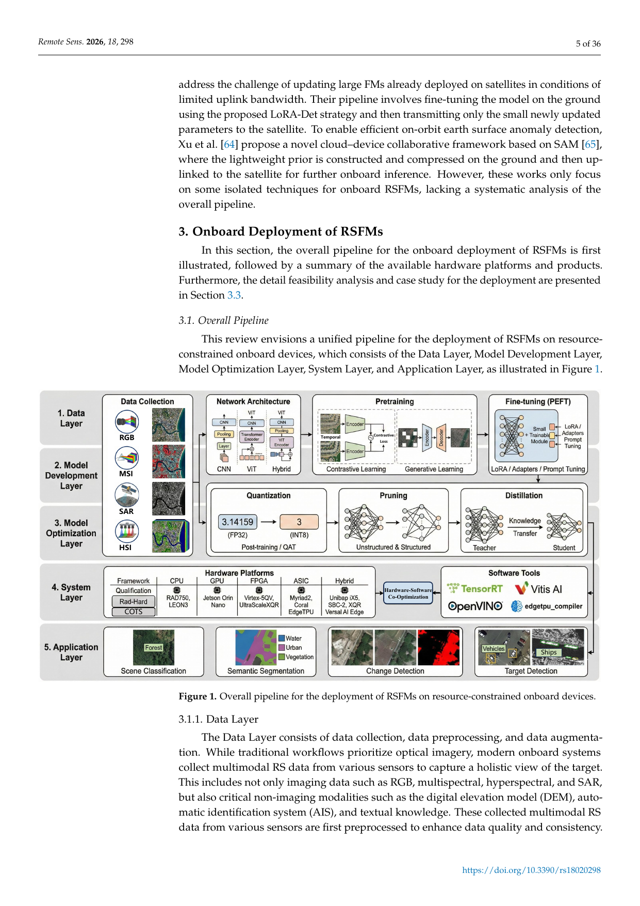

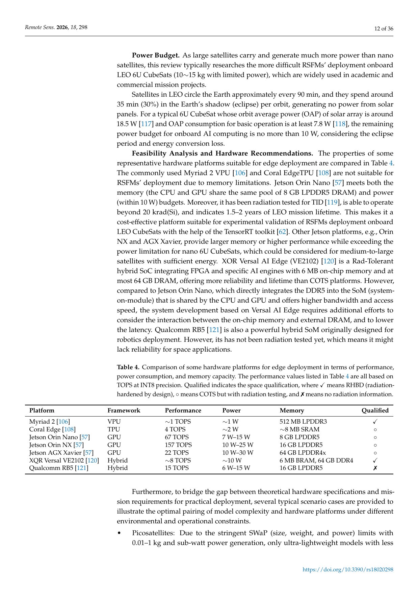

## 2. Du et al.：First On-Orbit Demonstration of a Geospatial Foundation Model

- **出处**：Andrew Du, Roberto Del Prete, Alejandro Mousist, Nick Manser, Fabrice Marre, Andrew Barton, Carl Seubert, Gabriele Meoni, Tat-Jun Chin. arXiv:2512.01181, 2025。
- **任务**：将 ViT 型 GeoFM 压缩并适配到资源受限平台，完成实验室、硬件仿真和 ISS 在轨推理。
- **基础模型 / 硬件**：由 Prithvi-300M 派生紧凑模型，重点模型为 `256-MAE-D`；在 IMAGIN-e/ISS 环境运行。
- **训练 / 压缩方式**：通过知识蒸馏得到紧凑模型，再进行下游任务适配；论文用任务结果说明压缩和域适应必须同时考虑。
- **数据与场景**：五个对地下游任务；在轨部分使用 Kanyini 数据立方体，共 88 个 tile。
- **输入 / 输出**：遥感 tile 输入；输出云等任务预测及中间运行日志。
- **Pipeline**：大模型预训练知识 → 紧凑架构 → 地面任务适配 → 飞行环境验证 → 在轨执行 → 与地面结果一致性检查。
- **主实验 / 指标**：`256-MAE-D` 约为 Prithvi-300M 的 `1/16`，五项任务保持可比性能（PDF p.7 Figure 2）。未做适配时存在显著域偏移，例如 cloud tile accuracy 下降 48.2%、F1 下降 39.9%（PDF p.7）。
- **资源指标**：88 个 tile 的每 tile 时间约 `5.35–5.68 s`，峰值内存约 `632–638 MB`；硬件仿真平均功耗约 `4.94–4.97 W`，HyperScout-2 EM 约 `6.39–6.45 W`（PDF p.13 Table 2）。
- **硬件与运行问题**：ISS 初期曾发生热关断，降低活跃 CPU 核数后稳定；在轨输出与实验室结果一致。
- **局限**：属于 GeoFM 视觉模型，而非完整对话式 VLM；任务和硬件规模有限，不能外推到多轮生成和长上下文。
- **对本综述用途**：Ch.5 最重要的“压缩-适配-硬件-热控-在轨验证”闭环案例。
- **本地 PDF**：[Du2025](../参考文献/References/Du2025_First-On-Orbit-GeoFM_arXiv2512.01181.pdf)

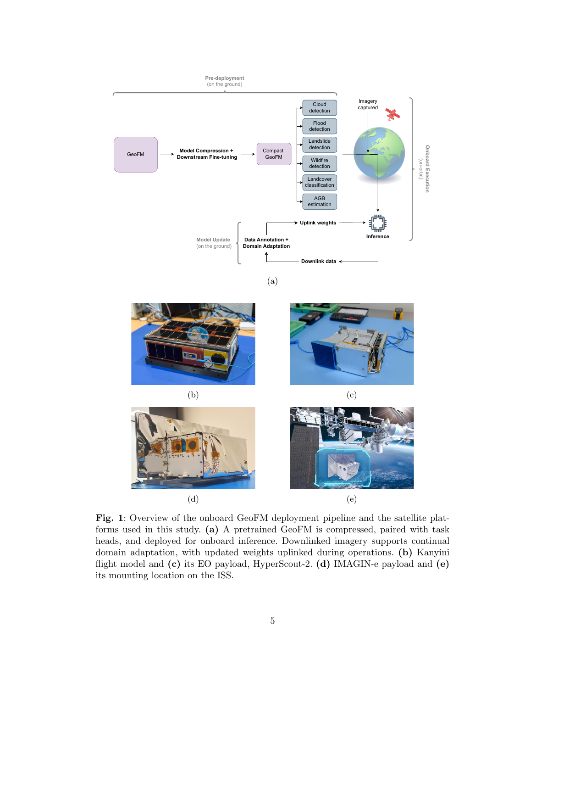

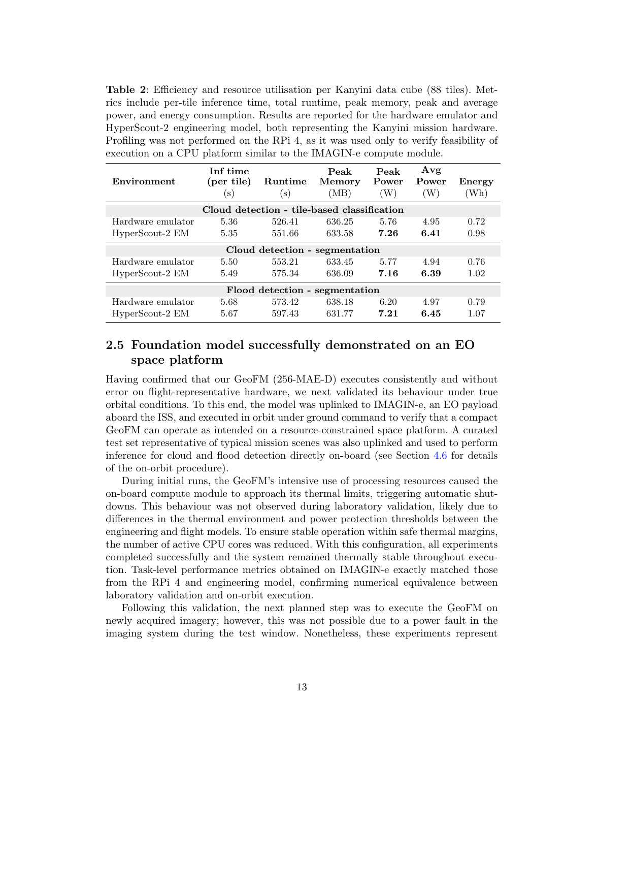

## 3. Sharshar et al.：Vision-Language Models for Edge Networks

- **出处**：Ahmed Sharshar, Latif U. Khan, Waseem Ullah, Mohsen Guizani. arXiv:2502.07855v2, 2025。
- **任务**：综述资源受限边缘网络中的 VLM 架构、训练、压缩、分布式推理、隐私和应用。
- **基础模型 / 硬件**：覆盖 CLIP 类编码器、视觉编码器 + LLM、端云协同和异构边缘设备。
- **训练 / 压缩方式**：剪枝、量化、知识蒸馏、NAS、adapter/prompt tuning、federated dropout。
- **数据与场景**：医疗、环境监测、自动驾驶、视频和智能监控等地面边缘场景。
- **输入 / 输出**：图像/视频与文本输入；输出检索、描述、VQA 或决策。
- **Pipeline**：感知端采集 → 本地编码/压缩 → 端边云切分或本地推理 → 任务输出；可叠加隐私和联邦更新。
- **主实验 / 指标**：综述不提供统一实验。PDF p.11 Figure 6 给出分布式边缘 VLM 架构，p.12 Figure 7 给出压缩技术 taxonomy。
- **硬件**：讨论通用边缘 GPU/NPU/移动设备，但没有辐射、热真空和在轨连续运行验证。
- **局限**：通信拓扑、能量补给和故障模型均以地面边缘网络为主；不能直接替代星载系统证据。
- **对本综述用途**：构建 Ch.5 方法空间，再用空间约束筛除不适用方法，形成“地面成熟、星上缺证”的差距。
- **本地 PDF**：[Sharshar2025](../参考文献/References/Sharshar2025_VLM-Edge-Networks-Survey_arXiv2502.07855.pdf)

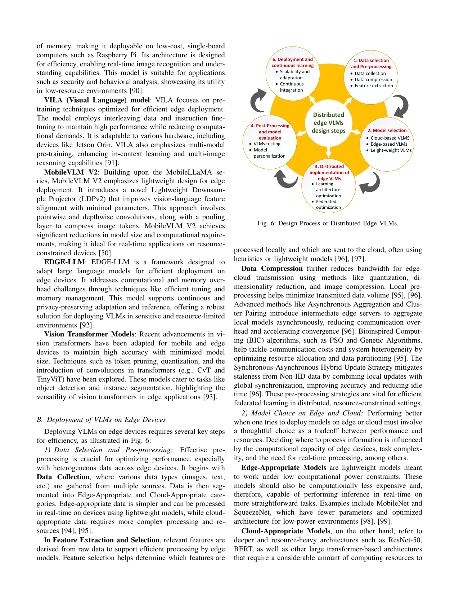

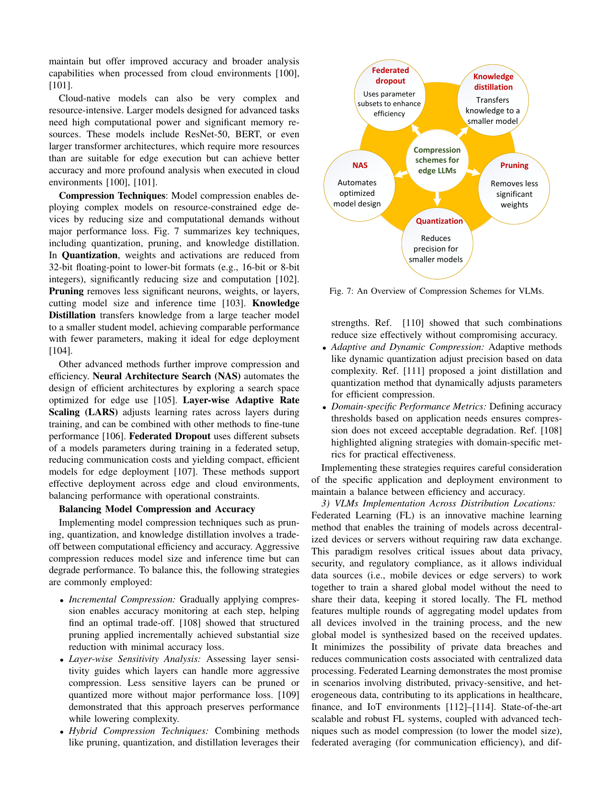

## 4. Ortiz del Castillo et al.：SpIRIT/Loris 星载 AI 设计

- **出处**：Miguel Ortiz del Castillo, Jonathan Morgan, Jack McRobbie, Clint Therakam, Zaher Joukhadar, Robert Mearns, Simon Barraclough, Richard Sinnott, Andrew Woods, Chris Bayliss, Kris Ehinger, Ben Rubinstein, James Bailey, Airlie Chapman, Michele Trenti. arXiv:2404.08399, 2024。
- **任务**：设计可在 CubeSat 空间环境中运行的视觉 AI 与压缩载荷 Loris。
- **基础模型 / 硬件**：Jetson Nano，128-core Maxwell GPU、四核 ARM A57、4 GB LPDDR4、16 GB eMMC；六个可见光相机和三个红外相机（PDF p.3 Table 1）。
- **训练 / 压缩方式**：支持在轨微调和渐进式图像压缩；本文重点是系统保护而非单一模型精度。
- **数据与场景**：可见光、长波红外成像；低下行带宽的纳卫星任务。
- **输入 / 输出**：多相机图像输入；输出 AI 结果、压缩图像和渐进式码流。
- **Pipeline**：相机采集 → camera control board → Jetson AI/压缩 → 本地存储 → UHF/S-band 下传；后台执行热控、看门狗和完整性检查。
- **主实验 / 指标**：设计论文没有统一 AI benchmark。系统约束包括 UHF 约 9.6 kbit/s、S-band 约 2 Mbit/s，以及每天有限过站窗口。
- **可靠性设计**：每 60 s 哈希检查文件，损坏时从备份恢复；约 3 mm 屏蔽面向两年任务 2 krad 目标（PDF p.6）。
- **硬件边界**：Jetson Nano 是经系统级保护使用的 COTS，不是天然 RHBD 器件。
- **局限**：论文主要描述设计和地面验证；应与 SpIRIT 后续在轨结果论文配套使用。
- **对本综述用途**：说明轻量化不能只看 TOPS，文件系统、热控、辐射、相机接口和链路预算同样决定部署可行性。
- **本地 PDF**：[SpIRIT/Loris](../参考文献/References/SpIRIT_Loris_Onboard-AI_arXiv2404.08399.pdf)

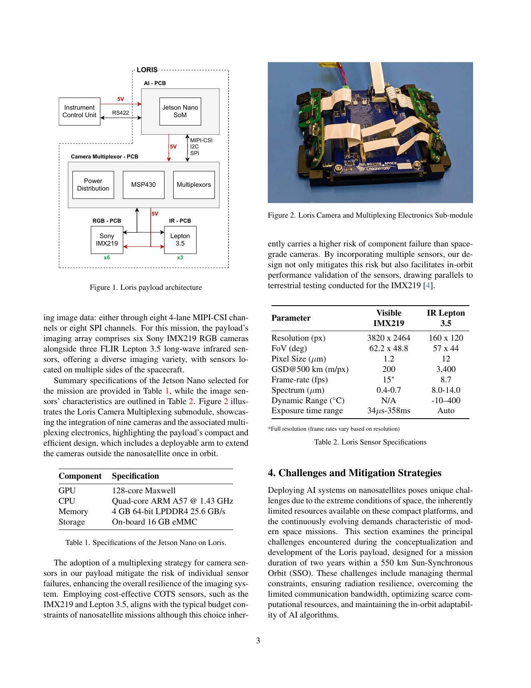

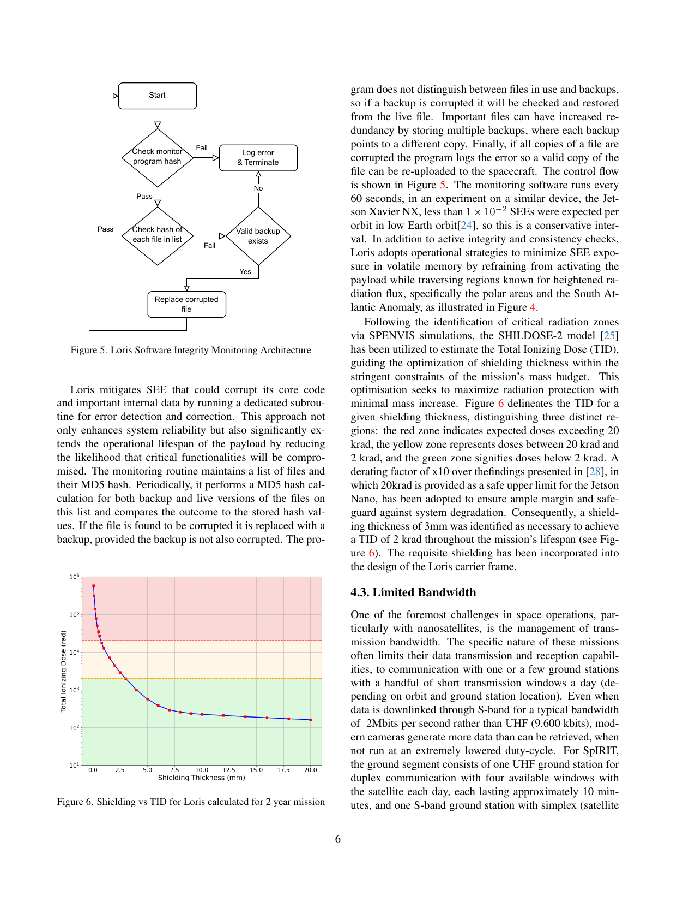

## 5. Antunes and Podobas：FPGA-Based Neural Network Accelerators for Space Applications

- **出处**：Pedro Antunes, Artur Podobas. arXiv:2504.16173, 2025。
- **任务**：综述空间应用中的 FPGA 神经网络加速器，归纳架构、数据流、数值精度、功耗和辐射处理。
- **基础模型 / 硬件**：以 CNN 和分类任务为主，覆盖空间级 FPGA 与 COTS FPGA。
- **训练 / 压缩方式**：多数工作采用定点和量化模型；硬件层采用流水、并行 PE、片上缓存和时间复用。
- **数据与场景**：47 篇研究，覆盖遥感分类、检测、压缩和自主任务。
- **输入 / 输出**：传感器数据或特征输入；输出分类/检测结果。
- **Pipeline**：离线模型训练与量化 → 算子图转换 → 数据流/时间复用架构 → FPGA 映射 → 性能、功耗与可靠性评估。
- **主结论**：8-bit 定点最常见；综述样本中最大报告模型占用约 49.4 MB；CNN 占主导，Transformer 基本未被空间 FPGA 研究覆盖（PDF p.20）。
- **能耗证据**：不少论文仅估计功耗而未实测；运算量与能耗的相关性强于参数量；少数论文真正讨论辐射和 SEE（PDF pp.22–23）。
- **硬件**：适合支撑算子级和存储级硬件感知，而非给出某个统一平台的最终优劣。
- **局限**：研究异质性高，测试板、频率、数据集和功耗口径不一致；VLM/Transformer 是明显空白。
- **对本综述用途**：用于论证 Ch.5 需要从“模型参数量”升级到“算子、访存、数据流、精度与可靠性”的联合度量。
- **本地 PDF**：[Antunes2025](../参考文献/References/Antunes2025_FPGA-NN-Accelerators-Space-Survey_arXiv2504.16173.pdf)

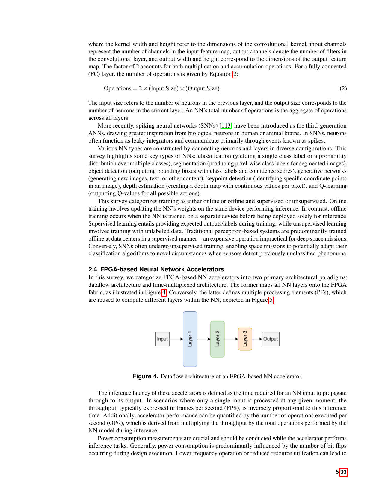

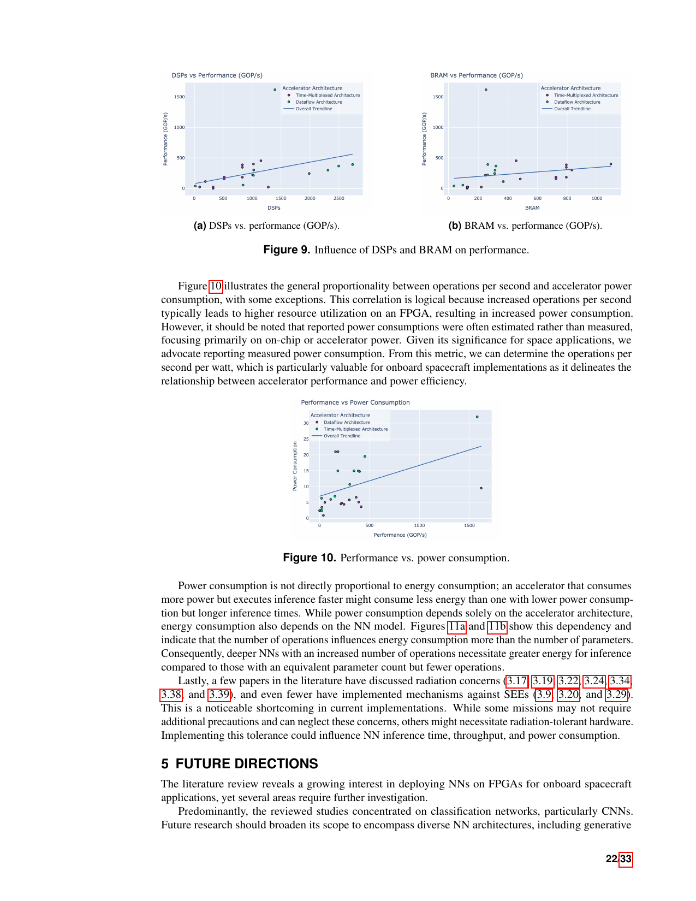

## 6. Shao et al.：Spaceborne Neural Network Accelerator and Fault Tolerance

- **出处**：Yingzhao Shao, Junyi Wang, Xiaodong Han, Yunsong Li, Yaolin Li, Zhanpeng Tao. *Remote Sensing*, 17(1):69, 2025. DOI: [10.3390/rs17010069](https://doi.org/10.3390/rs17010069)。
- **任务**：在 FPGA CNN 加速器上加入面向 SEU 的数据校验与选择性时空三模冗余。
- **基础模型 / 硬件**：VLIW 控制、脉动阵列、片上/片外存储；以 ResNet18 等 CNN 验证。
- **训练 / 压缩方式**：重点不是模型训练，而是敏感模块识别和硬件选择性加固。
- **数据与场景**：图像分类和故障注入，模拟 SEU 累积对计算准确性的影响。
- **输入 / 输出**：图像和权重输入；输出分类结果及错误检测/纠正结果。
- **Pipeline**：CNN 编译 → VLIW 指令 → 脉动阵列执行 → 数据校验 → 敏感模块 TMR → 故障注入与性能评估。
- **主实验 / 指标**：ResNet18 理论 205.6 GOPS、实际 189.2 GOPS、计算资源效率 92%、56 FPS（PDF p.20 Table 3）。
- **容错代价**：baseline `0.0178 s / 4.877 W`；full TMR `0.0453 s / 12.680 W`；选择性方法 `0.0194 s / 6.047 W`（PDF p.23 Table 6）。LUT 从 129,771 增至 143,865，低于 full TMR 的 389,313。
- **可靠性收益**：在错误率 `10^-3` 下，baseline 计算正确率 3.47%，加固后 58.64%（PDF p.23 Table 5）；摘要报告对 SEU 累积容忍度约提升 5 倍、资源增量低于 15%。
- **局限**：CNN 加速器不等于 Transformer/VLM 加速器；故障模型与真实轨道粒子环境仍需任务级验证。
- **对本综述用途**：连接 Ch.5 硬件感知与 Ch.8 可靠性，说明最优设计通常是选择性保护而非全冗余。
- **本地 PDF**：[Shao2025](../参考文献/References/Shao2025_Spaceborne-NN-Accelerator-FaultTolerance_RemoteSens17-1-69.pdf)

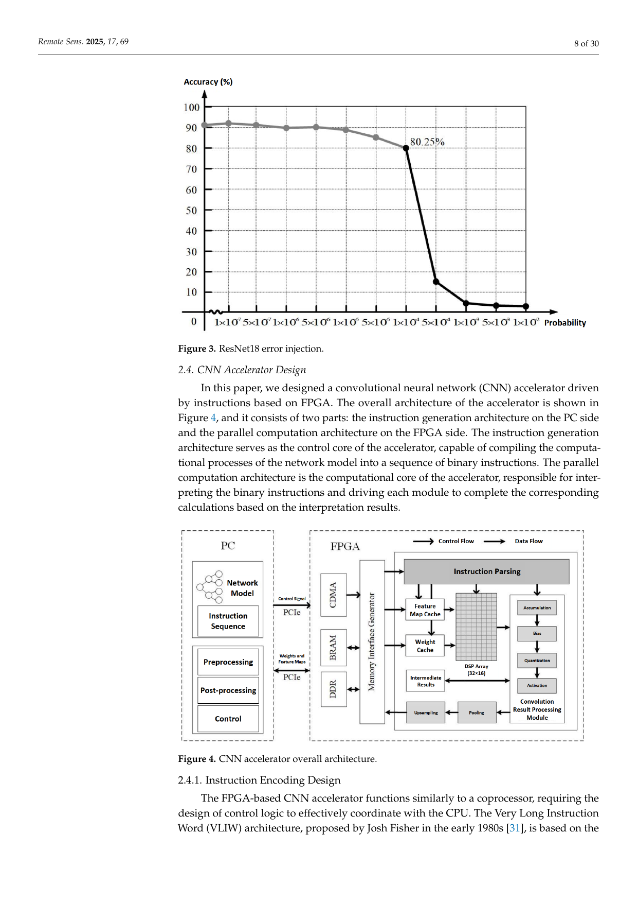

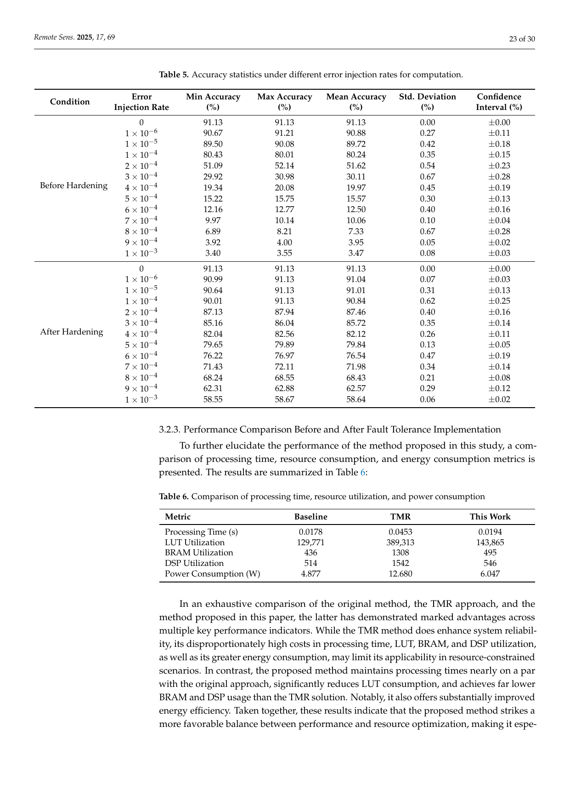

## 7. Chu et al.：MobileVLM

- **出处**：Xiangxiang Chu, Limeng Qiao, Xinyang Lin, Shuang Xu, Yang Yang, Yiming Hu, Fei Wei, Xinyu Zhang, Bo Zhang, Xiaolin Wei, Chunhua Shen. arXiv:2312.16886, 2023。
- **任务**：构建可在移动端运行的 1.4B/2.7B 视觉语言助手。
- **基础模型 / 硬件**：MobileLLaMA、CLIP 式视觉编码器和轻量下采样投影器 LDP；Snapdragon 888 CPU 与 Jetson Orin GPU 实测。
- **训练 / 压缩方式**：语言模型从头训练；多模态对齐与指令微调；支持 LoRA。
- **数据与场景**：通用 VQA、描述、视觉推理和对话 benchmark。
- **输入 / 输出**：单图 + 文本指令；输出自回归文本。
- **Pipeline**：图像 → CLIP encoder → LDP 将视觉 token `576→144` → MobileLLaMA → 文本输出。
- **主实验 / 指标**：4-bit LM 下，1.4B 模型总占用约 1.40 GB；Snapdragon 888 为 21.54 token/s、总时延 18.51 s，Jetson Orin 为 65.27 token/s、总时延 5.14 s（PDF p.9 Table 6）。
- **训练效率**：LoRA 仅更新 LLM 的约 8.87%/7.41% 参数，并保持相近 benchmark 表现（PDF p.8）。
- **硬件边界**：论文中的 Orin 是地面边缘测试；视觉编码器和 projector 仍保留原始精度，整体低比特化尚未闭环。
- **局限**：没有遥感域、热控、辐射和长期运行实验；1.4 GB 仍可能超过小型星载平台可用内存。
- **对本综述用途**：可作为星上 VLM 架构起点，重点借鉴小型 LLM 和视觉 token 下采样，而非直接宣称可飞。
- **本地 PDF**：[MobileVLM](../参考文献/References/Chu2023_MobileVLM_arXiv2312.16886.pdf)

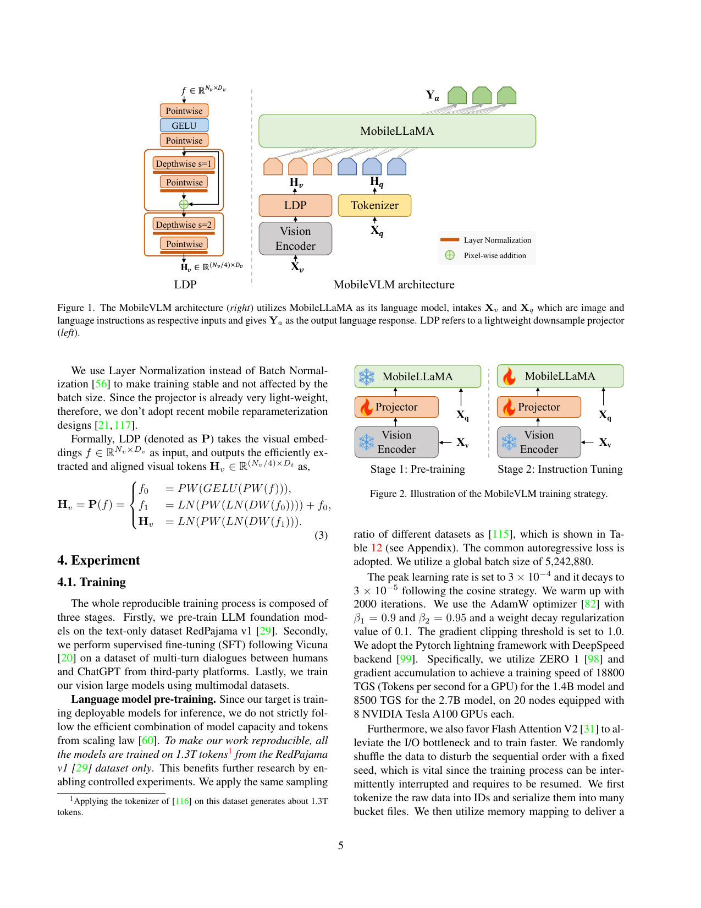

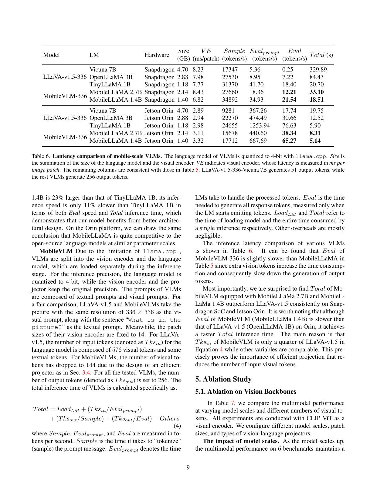

## 8. Lin et al.：AWQ

- **出处**：Ji Lin, Jiaming Tang, Haotian Tang, Shang Yang, Wei-Ming Chen, Wei-Chen Wang, Guangxuan Xiao, Xingyu Dang, Chuang Gan, Song Han. MLSys 2024；arXiv:2306.00978。
- **任务**：在不重训练的前提下，对 LLM 和多模态模型做硬件友好的低比特权重量化。
- **基础模型 / 硬件**：Llama、OPT、VILA、OpenFlamingo 等；TinyChat 在 GPU/移动 GPU 上部署。
- **训练 / 压缩方式**：根据激活统计识别约 1% 的显著权重通道，通过等价缩放降低量化误差；无反向传播或重构。
- **数据与场景**：语言、代码、数学及多模态 benchmark。
- **输入 / 输出**：校准激活用于确定缩放；运行时输入文本/图像并生成文本。
- **Pipeline**：采集激活统计 → 搜索通道缩放 → INT4 group-wise 权重量化 → TinyChat kernel → 推理。
- **主实验 / 指标**：OpenFlamingo INT4-g128 在 COCO 32-shot 上较 FP16 仅下降 1.17 CIDEr，而 RTN 下降 4.57（PDF p.8 Table 6）。VILA 7B/13B 在 11 个 VLM benchmark 上接近 FP16（PDF p.8 Table 7）。
- **硬件指标**：TinyChat 在 Jetson Orin 上相对对比系统约 `1.2–3.0×`，VILA 场景约 3×；桌面 GPU 对 FP16 约 `3.2–3.3×`（PDF p.11）。
- **硬件边界**：需要匹配 INT4 kernel 和内存布局；Orin 实验不是航天鉴定。
- **局限**：只压权重不能解决视觉 token、KV cache 和激活内存；不同 NPU/FPGA 是否支持相同 kernel 需重新验证。
- **对本综述用途**：Ch.5 权重量化主方法，强调“精度保持 + kernel 可落地”必须同时满足。
- **本地 PDF**：[AWQ](../参考文献/References/Lin2023_AWQ_arXiv2306.00978.pdf)

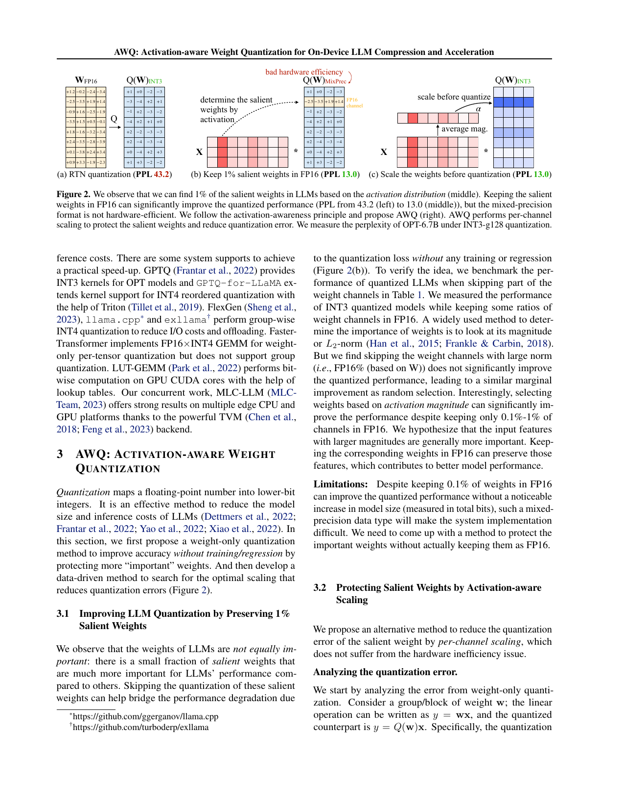

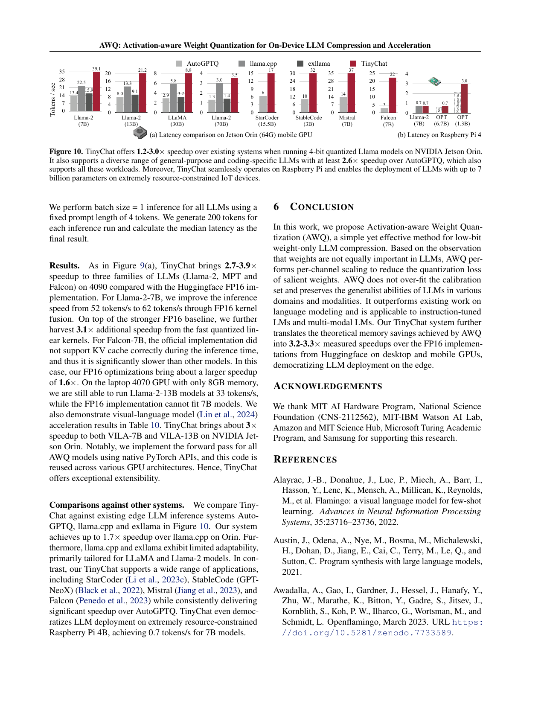

## 9. Li et al.：Q-ViT

- **出处**：Zhexin Li, Tong Yang, Peisong Wang, Jian Cheng. arXiv:2201.07703, 2022。
- **任务**：对 ViT 的权重和激活进行可微量化，并联合搜索各注意力头的 bit-width。
- **基础模型 / 硬件**：DeiT、Swin Transformer；论文主要报告算法结果，没有星载硬件实测。
- **训练 / 压缩方式**：switchable scale + head-wise bit-width；先搜索量化配置，再固定配置进行 diving 训练。
- **数据与场景**：ImageNet 分类。
- **输入 / 输出**：图像输入；输出类别概率。
- **Pipeline**：初始化候选 bit-width/scale → 可微搜索 → 固定位宽配置 → QAT 微调 → 低比特 ViT 推理。
- **主实验 / 指标**：DeiT-T 4-bit 为 72.79%，FP 为 72.86%；3-bit 为 69.62%，高于 LSQ+ 的 68.09%。DeiT-S 4-bit 为 80.11%，FP 为 79.92%；Swin-T 4-bit 为 80.59%，FP 为 80.90%（PDF p.6 Table 1）。
- **结构观察**：MSA 和 GELU 是量化关键；不同 head 的鲁棒性不同，首尾层通常需要更高精度（PDF p.7）。
- **硬件边界**：混合位宽能否真正省能耗取决于 FPGA/NPU 对低比特和逐 head 调度的支持。
- **局限**：只有分类任务；未覆盖 CLIP 视觉编码器、多模态 projector 和生成式解码。
- **对本综述用途**：用于区分“LLM 权重量化”与“视觉 Transformer 权重/激活量化”，支持分模块精度配置。
- **本地 PDF**：[Q-ViT](../参考文献/References/Li2022_Q-ViT_arXiv2201.07703.pdf)

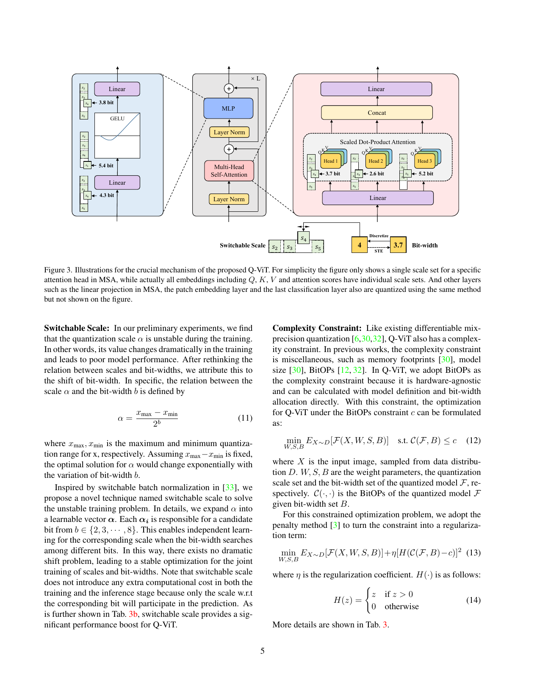

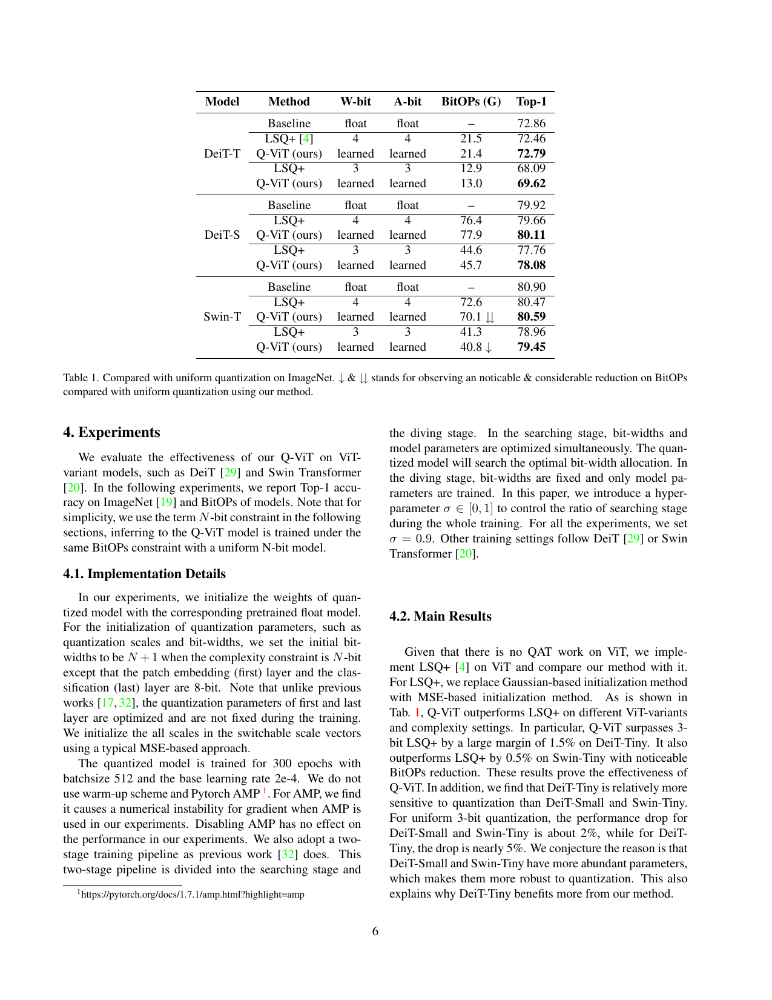

## 10. Wu et al.：TinyCLIP

- **出处**：Kan Wu, Houwen Peng, Zhenghong Zhou, Bin Xiao, Mengchen Liu, Lu Yuan, Hong Xuan, Michael Valenzuela, Xi Chen, Xinggang Wang, Hongyang Chao, Han Hu. ICCV 2023；arXiv:2309.12314。
- **任务**：压缩 CLIP 式视觉-语言双塔模型，同时保持跨模态对齐和零样本迁移能力。
- **基础模型 / 硬件**：OpenCLIP/CLIP 教师与不同规模 TinyCLIP 学生；主要为训练集群和地面 GPU。
- **训练 / 压缩方式**：affinity mimicking 蒸馏跨模态相似度结构；weight inheritance 从教师继承子网络权重；极限压缩时采用多阶段蒸馏。
- **数据与场景**：YFCC-15M 等图文数据；ImageNet 零样本和多项下游任务。
- **输入 / 输出**：图像和文本输入；输出共享嵌入及图文相似度。
- **Pipeline**：教师图文编码 → affinity matrix → 学生模仿跨模态关系 → 继承教师子网络权重 → 渐进蒸馏。
- **主实验 / 指标**：TinyCLIP ViT-8M/16 相对原始 CLIP ViT-B/16 参数少 11.3×、MAC 少 10.3×、吞吐高 5.1×，ImageNet 零样本 41.1% 对 37.6%（PDF p.6 Table 1）。该比较受教师和训练数据差异影响，不能解读为同训练条件下全面超越。
- **训练效率**：weight inheritance 相对从头训练可带来约 `1.4–7.8×` 训练加速（PDF p.8）。
- **硬件边界**：压缩双塔编码器适合星上检索、筛选和 grounding 前端，但未验证生成式 VLM 的完整链路。
- **局限**：不包含 LLM 解码器；无遥感、在轨、热控或辐射实验。
- **对本综述用途**：支撑 VLM-first 的蒸馏讨论，强调蒸馏目标应保持跨模态关系，而非只拟合单模态 logits。
- **本地 PDF**：[TinyCLIP](../参考文献/References/Wu2023_TinyCLIP_arXiv2309.12314.pdf)

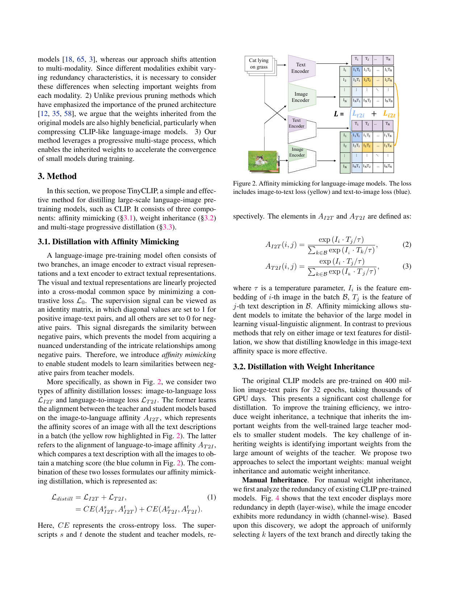

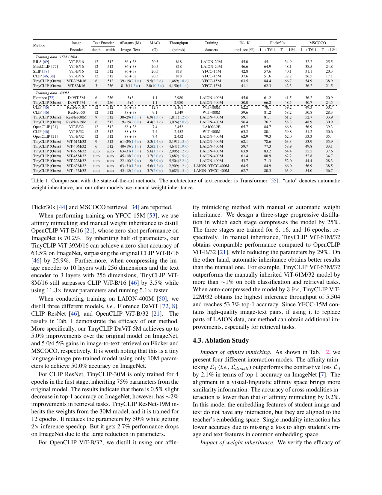

## 11. Zou et al.：RemoteTrimmer

- **出处**：Guangwenjie Zou, Liang Yao, Fan Liu, Chuanyi Zhang, Xin Li, Ning Chen, Shengxiang Xu, Jun Zhou. arXiv:2412.12603, 2024。
- **任务**：针对遥感图像分类进行结构化通道剪枝，降低参数量与 MAC，同时控制精度损失。
- **基础模型 / 硬件**：ResNet18、VGG16；RTX 3090 地面 GPU。
- **训练 / 压缩方式**：Channel Attention Pruning 将 SENet attention 与 BN 缩放因子结合；剪枝后用 Adaptive Mining Loss 微调。
- **数据与场景**：EuroSAT（27,000 图像、10 类）和 UCM（2,100 图像、21 类）。
- **输入 / 输出**：遥感图像输入；输出场景类别。
- **Pipeline**：训练 backbone → 估计通道重要度 → 按目标率结构化剪枝 → 自适应难样本微调 → 评估精度、参数和 MAC。
- **主实验 / 指标**：剪枝率 0.7 时，ResNet18 在 EuroSAT 上由 0.870 提升至 0.922，参数约 1.00M、MAC 约 0.02G，对比 baseline 11.18M/0.15G；UCM 为 0.853 对 0.849（PDF p.3 Table 1）。
- **模型差异**：VGG16 在 EuroSAT 可保持 0.957，但 UCM 为 0.872、低于 baseline 0.903，说明剪枝收益依赖架构和数据规模。
- **硬件边界**：结构化剪枝更容易映射到通用 kernel，但论文没有报告实际嵌入式时延、能耗或星载平台结果。
- **局限**：仅做单模态分类；数据集较小；作者排版中的序号有重复，但 PDF 首页作者名单可确认。
- **对本综述用途**：替代泛化剪枝例子，提供遥感域直接证据；同时提醒 FLOPs 降低不等于实际能耗同比下降。
- **本地 PDF**：[RemoteTrimmer](../参考文献/References/Zou2024_RemoteTrimmer_arXiv2412.12603.pdf)

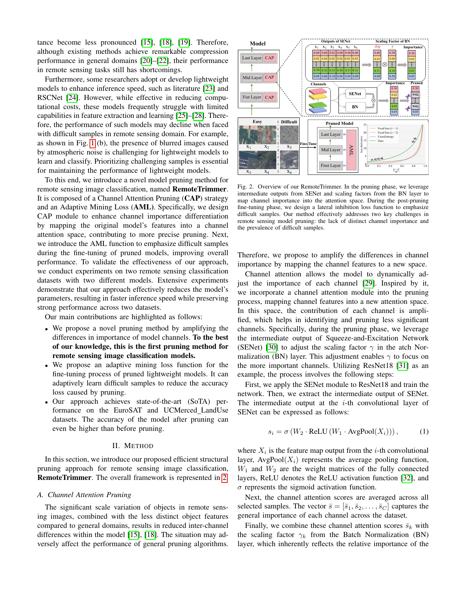

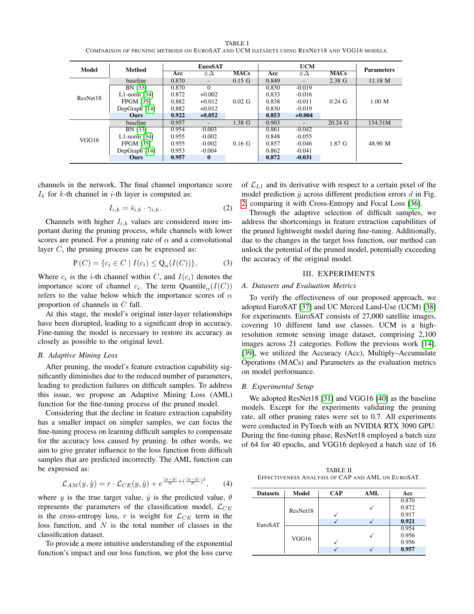

## 12. Xu et al.：LLaVA-UHD

- **出处**：Ruyi Xu, Yuan Yao, Zonghao Guo, Junbo Cui, Zanlin Ni, Chunjiang Ge, Tat-Seng Chua, Zhiyuan Liu, Maosong Sun, Gao Huang. ECCV 2024；arXiv:2403.11703。
- **任务**：让 LMM 高效处理任意长宽比和高分辨率图像。
- **基础模型 / 硬件**：基于 LLaVA-1.5，使用视觉编码器、compression resampler、LLM；训练用 8×A100。
- **训练 / 压缩方式**：图像模块化切片、视觉 token 重采样压缩、空间 schema 组织。
- **数据与场景**：通用高分辨率 VQA、OCR、视觉推理 benchmark。
- **输入 / 输出**：任意长宽比高分辨率图像 + 文本问题；输出文本答案。
- **Pipeline**：原图按长宽比切成可变尺寸 slices → 独立视觉编码 → resampler 压缩 token → spatial schema 串联 → LLM 解码。
- **主实验 / 指标**：支持约 6 倍像素输入，却只使用 LLaVA-1.5 约 94% 的推理计算；TextVQA 提升 6.4 个点（PDF p.1、p.8 Table 1）。
- **计算对比**：672×1008 设置约 14.6 TFLOPs，对比 LLaVA-1.5 336×336 的 15.5 TFLOPs；POPE 89.1 对 85.9（PDF p.8 Table 1）。
- **硬件边界**：切片可能增加视觉编码调用次数和峰值缓存；星上应联合考虑 tile 调度、缓存复用和逐片 early exit。
- **局限**：训练和评估仍是 A100 环境；没有遥感影像、功耗和实际边缘时延。
- **对本综述用途**：遥感影像天然高分辨率和任意长宽比，该方法可支撑“像素预算与 token 预算分离”的设计原则。
- **本地 PDF**：[LLaVA-UHD](../参考文献/References/Xu2024_LLaVA-UHD_arXiv2403.11703.pdf)

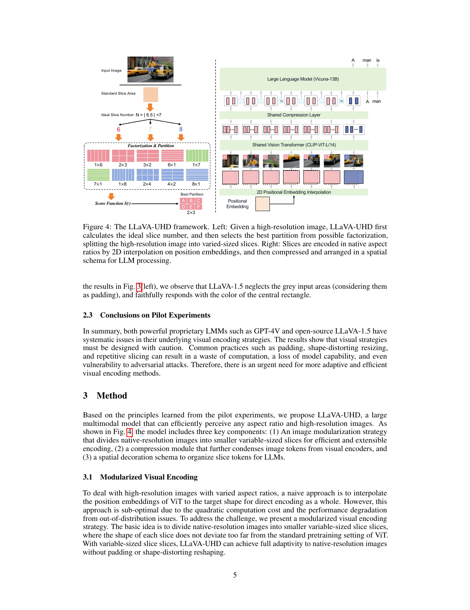

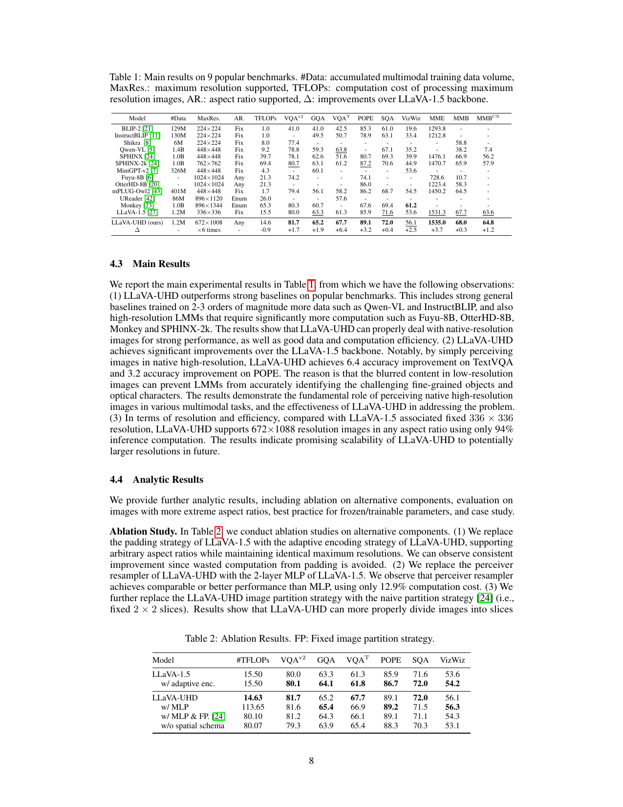

## 13. Liu et al.：KIVI

- **出处**：Zirui Liu, Jiayi Yuan, Hongye Jin, Shaochen (Henry) Zhong, Zhaozhuo Xu, Vladimir Braverman, Beidi Chen, Xia Hu. ICML 2024；arXiv:2402.02750。
- **任务**：通过 2-bit 非对称量化降低 LLM 推理中的 KV cache 内存和带宽瓶颈。
- **基础模型 / 硬件**：Llama、Falcon、Mistral；GPU 服务器推理。
- **训练 / 压缩方式**：无需微调；key 按 channel 量化，value 按 token 量化，并保留小型全精度 residual cache。
- **数据与场景**：语言建模、LongBench 和真实批处理推理。
- **输入 / 输出**：历史 token 的 K/V 张量输入量化缓存；为后续自回归 token 提供注意力状态。
- **Pipeline**：新 token 产生 K/V → 暂存 FP residual → 达到组大小后分别按 channel/token 量化 → 解码时反量化参与 attention。
- **主实验 / 指标**：在质量接近 FP16 的前提下，含权重在内峰值内存降低约 `2.6×`，批大小最高扩大 `4×`，真实推理吞吐提升 `2.35–3.47×`（PDF p.1、p.8）。
- **硬件边界**：收益依赖量化/反量化 kernel 和内存带宽；小 batch、短回答时速度收益可能弱于内存收益。
- **局限**：仅验证文本 LLM；视觉 token 引起的 prefill KV 增长需要另行评估；没有空间硬件结果。
- **对本综述用途**：说明权重量化后 KV cache 会成为新瓶颈，Ch.5 应单列“状态内存”而非只统计模型大小。
- **本地 PDF**：[KIVI](../参考文献/References/Liu2024_KIVI_arXiv2402.02750.pdf)

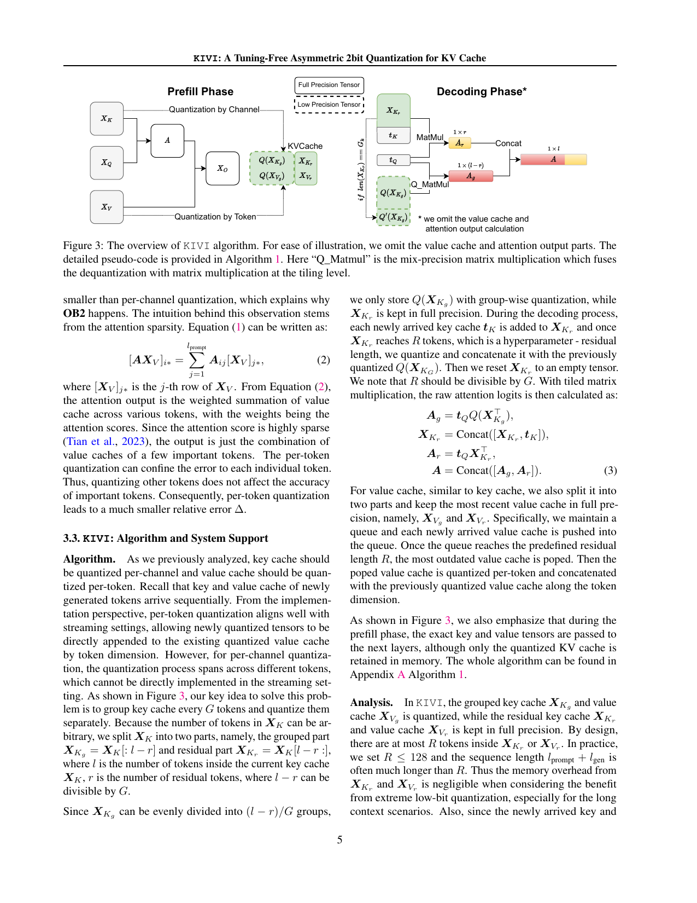

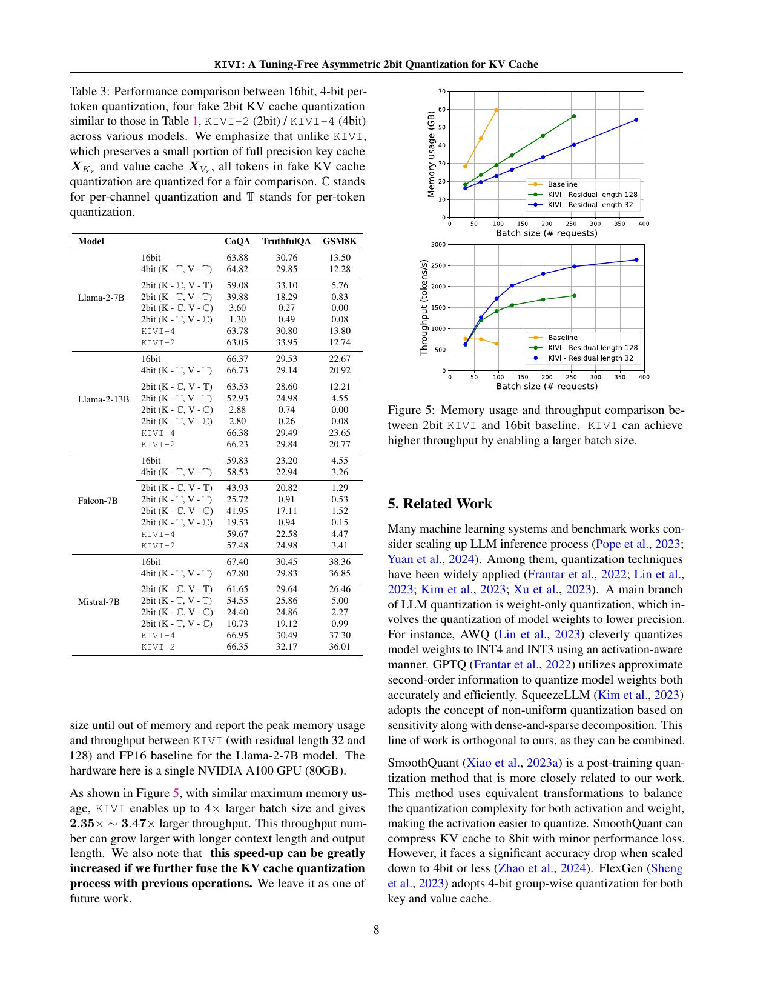

## 14. Kwon et al.：PagedAttention / vLLM

- **出处**：Woosuk Kwon, Zhuohan Li, Siyuan Zhuang, Ying Sheng, Lianmin Zheng, Cody Hao Yu, Joseph E. Gonzalez, Hao Zhang, Ion Stoica. SOSP 2023；arXiv:2309.06180。
- **任务**：解决 LLM 服务中 KV cache 动态增长、碎片和重复存储导致的批处理受限问题。
- **基础模型 / 硬件**：OPT、LLaMA 等；数据中心 GPU。
- **训练 / 压缩方式**：不改训练；借鉴虚拟内存分页，将连续逻辑 KV 映射到非连续物理 block。
- **数据与场景**：翻译、聊天和多候选生成等在线服务负载。
- **输入 / 输出**：请求 token 序列和 KV block；输出生成 token。
- **Pipeline**：请求进入调度器 → 分配逻辑 block → block table 映射物理显存 → PagedAttention 读取 → copy-on-write 共享前缀/分支 → 动态回收。
- **主实验 / 指标**：相同延迟水平下，相对 FasterTransformer/Orca 吞吐提升约 `2–4×`（PDF p.1）。一组实验中 one-shot 翻译约为 Orca Oracle 的 1.67×，five-shot 为 3.58×（PDF p.12）。
- **实现代价**：分页 kernel 单次 attention 延迟增加约 20–26%，但由更大 batch 和更低浪费抵消；默认 block size 为 16 tokens。
- **硬件边界**：星上通常 batch 较小，不应照搬服务吞吐结论；更有价值的是多任务、分时执行和会话恢复时的缓存生命周期管理。
- **局限**：数据中心系统设计，没有功耗、辐射和实时任务优先级模型。
- **对本综述用途**：把 KV cache 优化从“压缩算法”扩展到“运行时内存管理”，支撑流式和多任务推理。
- **本地 PDF**：[PagedAttention/vLLM](../参考文献/References/Kwon2023_PagedAttention-vLLM_arXiv2309.06180.pdf)

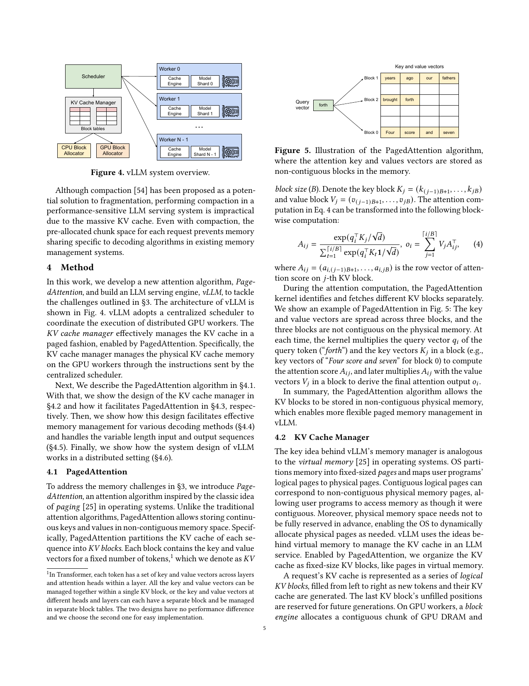

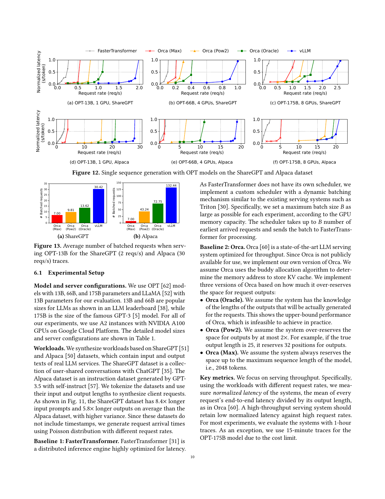

## 15. Jiang et al.：MInference 1.0

- **出处**：Huiqiang Jiang, Yucheng Li, Chengruidong Zhang, Qianhui Wu, Xufang Luo, Surin Ahn, Zhenhua Han, Amir H. Abdi, Dongsheng Li, Chin-Yew Lin, Yuqing Yang, Lili Qiu. NeurIPS 2024；arXiv:2407.02490。
- **任务**：加速百万 token 长上下文 LLM 的 prefill 阶段。
- **基础模型 / 硬件**：Llama-3、Yi、GLM 等长上下文模型；A100 GPU。
- **训练 / 压缩方式**：无需重训练；离线为每个 attention head 指定稀疏模式，在线动态构建索引。
- **数据与场景**：InfiniteBench、RULER、长文问答、代码和检索。
- **输入 / 输出**：长 token 序列输入；输出 prefill 后的 KV 状态和生成结果。
- **Pipeline**：离线 head profiling → 分配 A-shape / Vertical-Slash / Block-Sparse → 在线生成 sparse index → 定制 GPU kernel → 稀疏 prefill。
- **主实验 / 指标**：论文指出 8B 模型在单张 A100 上处理 1M token 密集 prefill 约需 30 min；MInference 最高加速约 `10×`，无需改预训练（PDF p.1）。
- **精度证据**：InfiniteBench 上匹配或超过密集 attention；RULER 中 Llama-3 平均 87.0，对密集 84.4（PDF p.7 Table 2）。
- **硬件边界**：依赖 GPU 稀疏 kernel；星载 NPU/FPGA 需要重新设计索引生成、稀疏访存和最坏时延保证。
- **局限**：百万 token 服务器场景远大于典型星上会话；没有 VLM 视觉 token 或实时能耗评估。
- **对本综述用途**：为多帧、多 tile、长任务日志的稀疏 prefill 提供方法原型，但应作为前瞻方向而非已成熟星载方案。
- **本地 PDF**：[MInference](../参考文献/References/Jiang2024_MInference-1.0_arXiv2407.02490.pdf)

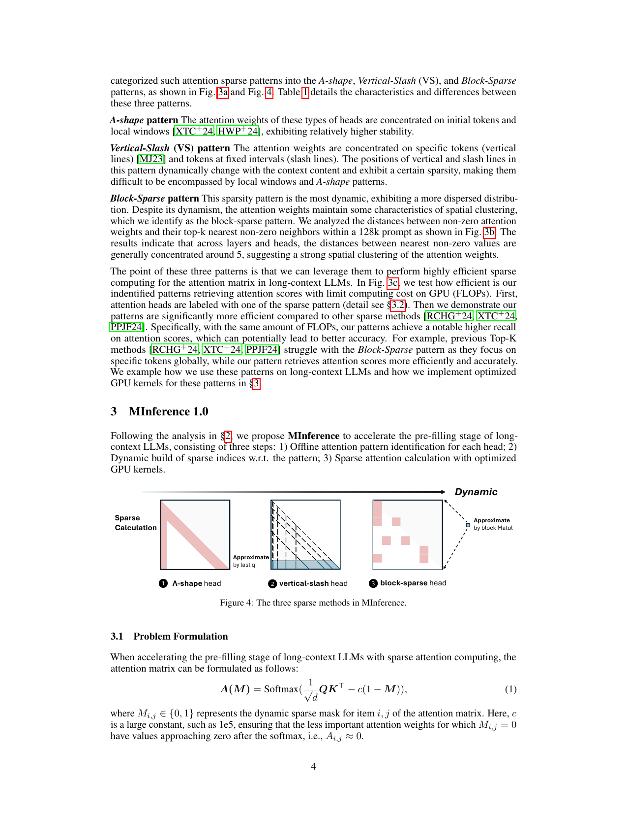

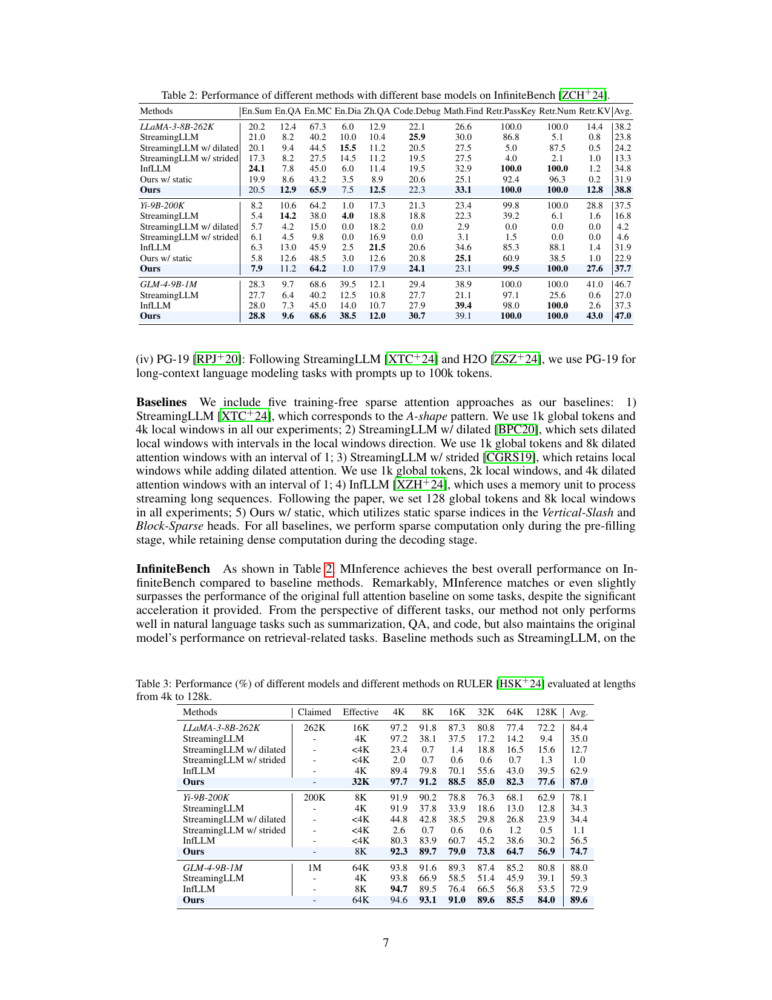

## 16. Elhoushi et al.：LayerSkip

- **出处**：Mostafa Elhoushi, Akshat Shrivastava, Diana Liskovich, Basil Hosmer, Bram Wasti, Liangzhen Lai, Anas Mahmoud, Bilge Acun, Saurabh Agrawal, Ahmed Roman, Ahmed A. Aly, Beidi Chen, Carole Jean-Wu. ACL 2024；arXiv:2404.16710。
- **任务**：通过训练时 layer dropout 和共享 early-exit loss，使同一 LLM 支持提前退出与自推测解码。
- **基础模型 / 硬件**：多种 Llama 规模；GPU 推理。
- **训练 / 压缩方式**：浅层较低、深层较高的 layer dropout；所有层共享输出头并接受 early-exit loss。
- **数据与场景**：CNN/DM 摘要、代码生成、TOPv2 语义解析等。
- **输入 / 输出**：文本 prompt 输入；中间层先产生草稿 token，剩余层验证和纠正。
- **Pipeline**：训练可退出模型 → 推理时浅层 draft → 深层 verify → 接受连续正确 token → 复用 KV/query cache → 继续解码。
- **主实验 / 指标**：最高加速约为 CNN/DM `2.16×`、代码 `1.82×`、TOPv2 `2.0×`（PDF p.1；详细结果见 p.16 Tables 3–6）。
- **内存特点**：draft 与 verify 使用同一模型，无额外草稿模型；可共享计算和激活，内存低于双模型 speculative decoding。
- **硬件边界**：需要按该训练配方得到的模型；退出层选择应结合 deadline、能量和置信度，而不是固定追求最大速度。
- **局限**：文本 LLM 为主；没有 VLM、多模态对齐退化、空间硬件或任务风险实验。
- **对本综述用途**：形成“任务风险/剩余资源驱动动态深度”的议程，适合紧急检测与低优先级描述采用不同退出策略。
- **本地 PDF**：[LayerSkip](../参考文献/References/Elhoushi2024_LayerSkip_arXiv2404.16710.pdf)

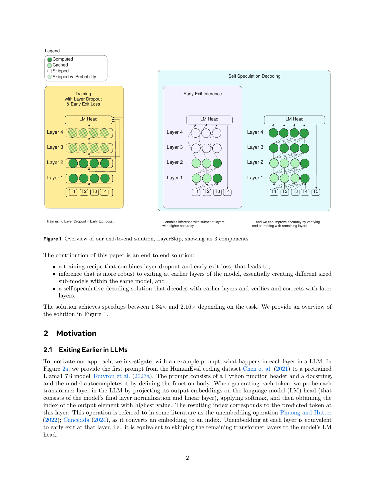

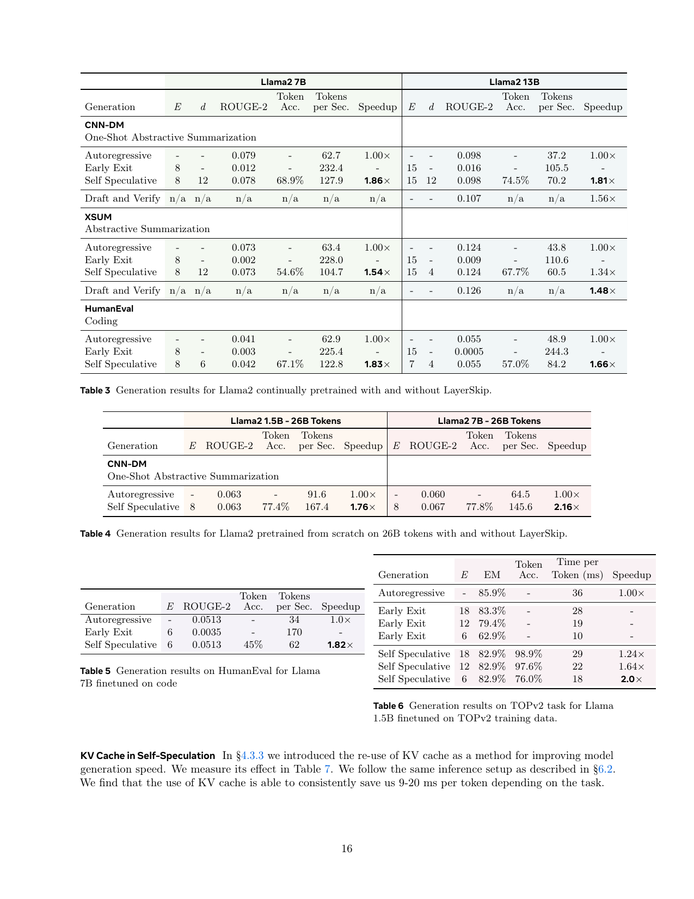

---

## 三、技术横向矩阵

| 技术 | 代表论文 | 压缩对象 | 是否改训练 | 主要收益 | 星上迁移关键点 | 当前证据 |
| --- | --- | --- | --- | --- | --- | --- |
| 权重量化 | AWQ | LLM/VLM 权重 | 否 | 模型内存、带宽、kernel 速度 | INT4 指令和 kernel；辐射错误对低比特权重的影响 | Jetson/桌面 |
| ViT 量化 | Q-ViT | 视觉编码器权重与激活 | 是，QAT | 视觉前端内存与计算 | 混合位宽硬件支持；首尾层保护 | 地面分类 |
| KV 量化 | KIVI | 解码状态 | 否 | 峰值内存、batch、吞吐 | 短序列收益；反量化能耗；状态错误保护 | 服务器 GPU |
| 结构化剪枝 | RemoteTrimmer | CNN 通道 | 是，剪枝后微调 | 参数与 MAC | 实际时延/能耗复测；迁移到 ViT/VLM | 遥感地面 GPU |
| 跨模态蒸馏 | TinyCLIP | 图文双塔 | 是 | 参数、MAC、训练效率 | 保持跨模态 affinity；遥感教师构建 | 通用图文 |
| 小型 VLM | MobileVLM | LLM + projector | 是 | 端侧可运行、视觉 token 减少 | 全链路量化；遥感适配；内存上限 | Snapdragon/Orin |
| 视觉 token 压缩 | MobileVLM、LLaVA-UHD | 视觉序列 | 是 | prefill、KV 与高分辨率成本 | tile 优先级、空间关系、漏检风险 | 通用 VLM |
| KV 分页 | PagedAttention | 运行时缓存 | 否 | 碎片、共享、并发 | 小 batch、多任务、断点恢复和实时调度 | 数据中心 |
| 动态稀疏 attention | MInference | prefill attention | 否 | 长上下文时延 | 稀疏 kernel、最坏时延、视觉 token 模式 | A100 |
| early exit | LayerSkip | Transformer 深度 | 是 | 动态时延和能耗 | 置信度校准、任务风险、共享退出头可靠性 | GPU 文本任务 |
| 硬件感知映射 | FPGA Survey、Shao | 算子/数据流/冗余 | 视方法而定 | 性能、能效、可靠性 | 访存、精度、TMR、擦洗、热控联合优化 | 空间硬件直接相关 |
| 系统级部署 | Sang、Du、SpIRIT | 全 pipeline | 视任务而定 | 工程可运行性 | 功耗、内存、热、辐射、带宽、恢复 | 含在轨证据 |

### 补充文献（不占 16 篇精读名额）

| 文献 | 补充位置 | 使用方式 | 状态 |
| --- | --- | --- | --- |
| [ToMe: Token Merging](https://arxiv.org/abs/2210.09461) | 视觉 token 压缩 | 与固定下采样、切片重采样比较动态 token merging | 补充候选，未纳入本包 PDF 库 |
| [StreamingLLM](https://arxiv.org/abs/2309.17453) | 流式推理 | attention sink + 固定窗口，比较长时间连续任务 | 补充候选，未纳入本包 PDF 库 |
| [SmoothQuant](https://arxiv.org/abs/2211.10438) | W8A8 量化 | 与 AWQ 的 weight-only 路线比较激活量化 | 补充候选，未纳入本包 PDF 库 |
| [DynamicViT](https://arxiv.org/abs/2106.02034) | 动态 token 剪枝 | 与 RemoteTrimmer 的结构化通道剪枝比较 | 补充候选，未纳入本包 PDF 库 |

## 四、面向单星部署的综合 Pipeline

1. **Task**：先定义任务风险、输出形式和 deadline，例如云筛选、目标告警、图像描述或多轮问答。
2. **Constraint**：建立功耗、内存、热、辐射、可用窗口、下行带宽和任务优先级预算。
3. **Model**：按模块选择压缩对象：视觉编码器、projector、LLM 权重、视觉 token、KV cache 和运行时。
4. **Compile**：将量化位宽、稀疏模式和算子图映射到实际 GPU/NPU/FPGA kernel，实测而非只报告 FLOPs。
5. **Protect**：对权重、激活、KV、文件和关键控制流做选择性 ECC/TMR/校验与恢复。
6. **Schedule**：按任务风险和剩余资源选择分辨率、tile 数、上下文窗口、退出层和下传内容。
7. **Validate**：完成地面精度、板级时延/能耗、热真空/辐射、硬件在环和在轨一致性验证。

## 五、官方硬件资料附录（不计入 16 篇）

| 平台 / 资料 | 可核验信息 | 在本综述中的使用边界 |
| --- | --- | --- |
| [NASA HPSC White Paper](../参考文献/References/NASA_HPSC_Whitepaper_2024.pdf) | 8 个 SiFive X280 应用核、DDR4 带宽和空间处理器路线 | 用于未来高可靠高性能平台，不等同于当前普遍可用星载算力 |
| [NASA SpaceCube v3.0 Mini](../参考文献/References/NASA_SpaceCube-v3-Mini_2019.pdf) | XQRKU060、DDR3、配置擦洗、TMR 等工程设计 | 工程资料；是否实际飞行及具体配置需按任务核验 |
| [KP Labs Leopard DPU 2026 Datasheet](../参考文献/References/KP-Labs_Leopard-DPU_Datasheet_2026.pdf) | 16 GiB DDR4 ECC、冗余存储、5–20 W、TID 指标 | 当前产品资料不能无条件回填历史 Intuition-1 飞行单元 |
| [NVIDIA Jetson / TensorRT](https://developer.nvidia.com/embedded-computing) | COTS 边缘 GPU、低精度 kernel 和部署工具链 | 规格会更新；必须区分地面模组、环境测试和实际在轨任务 |
| [ESA Myriad 2 space qualification case](https://www.esa.int/Enabling_Support/Space_Engineering_Technology/Shaping_the_Future/Newly_Space_Qualified_Myriad_2_Video_Processor_to_Fly_on_CubeSat_Mission) | 质子束 SEE/SEL/TID 表征的 COTS VPU | 表述为经辐照表征的 COTS，不写成 RHBD |

## 六、可直接写入 Ch.5 的结论

1. 单星 VLM 的优化对象不只是参数量，而是 **权重、激活、视觉 token、KV cache、算子数据流和可靠性状态**。
2. 目前最强的空间证据来自 GeoFM/CNN/系统载荷，完整生成式 VLM 的在轨证据仍不足，论文应明确标注证据等级。
3. 量化、剪枝和稀疏方法只有与目标硬件 kernel 对齐并报告板级能耗、峰值内存和最坏时延，才构成硬件感知部署。
4. 遥感高分辨率输入应优先优化视觉 token 和 tile 调度，否则即使 LLM 权重已量化，prefill 与 KV cache 仍可能成为瓶颈。
5. early exit、动态分辨率和上下文窗口应由任务风险、deadline、剩余能量和置信度共同控制，形成 mission-aware adaptive inference。
6. 可靠性不是部署后的附加项。低比特权重、KV cache 和稀疏索引都可能成为新的单点错误源，需要与 Ch.8 联合设计。
