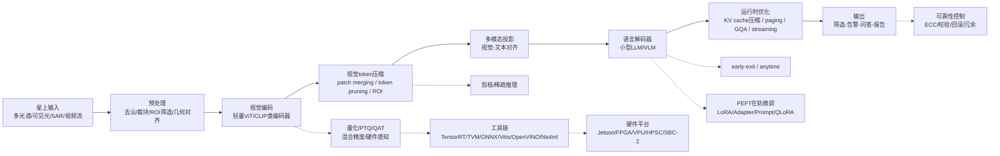

作为核心来源，Sang 等在综述中把遥感基础模型在轨部署问题归纳为两条主线：一条是**架构优化**，另一条是**硬件与软件平台适配**。这意味着，面向低轨算力星座的单星部署，核心目标不是“把更大的 VLM 搬上星”，而是把模型重构成**可飞行、可验证、可恢复、可持续运行**的系统形态。fileciteturn0file0

对单星部署而言，最优先的问题不是参数总量本身，而是**显存峰值、推理带宽、实时功耗与可靠性**。对 VLM 来说，这些瓶颈通常来自三处：一是权重存储，二是高分辨率视觉 token 序列，三是长上下文解码时持续膨胀的 KV cache。对应地，最有效的技术路线并不是单一压缩方法，而是“**权重量化 + 视觉 token 压缩 + KV cache 管理 + 分块/流式推理 + 硬件感知编译**”的联合优化。citeturn0academia0turn0academia3turn1academia0turn1academia3turn11academia1turn11academia2

从优先级上看，建议采用如下排序。**最高优先级**是量化、视觉 token 压缩、KV cache 压缩与分页、以及 tiled/streaming/prefill 分段；这些方法对单星内存与实时性最直接。**第二优先级**是结构化剪枝、PEFT 式在轨微调、以及 early-exit；它们对任务适应和进一步降本有效，但通常需要更多校准与安全策略。**第三优先级**是知识蒸馏、稀疏推理和 MoE；它们潜力很大，但是否能转化为实际星上收益，强依赖离线训练成本与目标硬件是否真正支持稀疏算子。citeturn36academia3turn34academia1turn1academia0turn11academia0turn17academia1turn4academia0turn13academia0turn39academia0turn40view0

同时，端侧多模态模型已经证明“**小模型 + 强工程优化**”是可行路径。MobileVLM 在 Snapdragon 888 CPU 与 Jetson Orin GPU 上分别报告了 21.5 tokens/s 和 65.3 tokens/s 的端侧推理速度；MiniCPM-V 则进一步说明，高性能多模态模型正向手机端和端侧硬件收敛。与此同时，2025 年的在轨 GeoFM 演示表明，**压缩与域适配不是可选项，而是实现可靠飞行验证的必要条件**。citeturn33academia1turn33academia2turn20academia3

## 单星部署问题与总体框架

低轨单星的 VLM 部署约束，本质上是一个**模型——序列——系统**三层协同优化问题。模型层关注参数、精度和结构；序列层关注视觉 token、上下文长度与 KV cache；系统层关注编译器、内存布局、功耗控制、热设计与容错恢复。对遥感场景，这个问题比普通移动端更难，因为输入图像往往更大、尺度跨度更强、小目标更密集，而且在轨链路要求高可靠与长周期稳定运行。fileciteturn0file0 citeturn11academia1turn20academia0turn20academia1

上图反映了一个关键判断：**单星部署不是先选硬件再压模型，也不是先压模型再碰运气上板，而是从输入分块、序列裁剪、精度配置到编译与容错的一体化 pipeline**。从工程收益看，视觉 token 与 KV cache 的治理，常常比单纯再砍几层参数更能带来真实的端到端时延下降。citeturn34academia2turn34academia1turn1academia0turn1academia3turn11academia0turn11academia2

## 技术点

### 量化

量化是把权重、激活、部分缓存状态从 FP16/BF16 压到 INT8、INT4、甚至更低位宽的技术。对单星部署，它是最基础也最直接的降本手段，因为它同时降低**模型存储、显存峰值、内存带宽和部分算力开销**。对 VLM，这一点尤为关键，因为视觉编码器、投影器和解码器对位宽的敏感性并不相同，必须分层处理。citeturn0academia0turn0academia3turn36academia3turn10view0

可行方法上，PTQ 可优先考虑 SmoothQuant、AWQ、APHQ-ViT、VLMQ；QAT 可考虑 Q-ViT、I-ViT 这类针对 ViT/Transformer 非线性环节做专门处理的方法；混合精度与硬件感知量化可参考 HAWQV3 和 Q-ViT 的头级 bit-width 学习思路。对于单星 VLM，建议优先采用“**权重 INT4，激活 INT8，LayerNorm/Softmax/GELU/output head 保持更高精度**”的保守策略；若硬件和编译器足够成熟，再推进更激进的 W4A4 或全整数化。citeturn37academia1turn36academia0turn36academia3turn37academia0turn37academia3

工程实现上，量化校准数据不能只用普通图文样本，必须覆盖**高分辨率遥感、云遮挡、低照度、季节变化、小目标密集区**等典型在轨输入；否则极易出现“桌面指标正常、星上长尾样本崩溃”的问题。部署时还要注意编译器支持：TensorRT 已明确支持 PTQ、QAT、FP8/FP4/INT8/INT4、AWQ、剪枝、稀疏和蒸馏；TVM 则更适合做异构硬件的整数化和算子调优。citeturn10view0turn26view0

已发表依据可优先引用以下原始文献：Ji Lin 等，2023，**AWQ: Activation-aware Weight Quantization for LLM Compression and Acceleration**（arXiv）；Guangxuan Xiao 等，2022/2023，**SmoothQuant: Accurate and Efficient Post-Training Quantization for Large Language Models**（arXiv）；Zhuguanyu Wu 等，2025，**APHQ-ViT: Post-Training Quantization with Average Perturbation Hessian Based Reconstruction for Vision Transformers**（arXiv）。citeturn0academia3turn0academia0turn37academia0

适用场景是几乎所有单星任务，尤其是**固定模型、长周期运行、对功耗与存储敏感**的场景。主要局限在于：超低比特下，视觉 token 与多模态对齐误差会明显放大；而且若目标硬件对低比特算子支持不完整，理论压缩未必会变成真实加速。citeturn37academia3turn10view0

### 视觉 token 压缩

视觉 token 压缩是指在视觉编码器前后，主动减少进入解码器的 patch/token 数量。对遥感 VLM 来说，这一技术几乎与量化同等重要，因为遥感图像天然高分辨率、多尺度、信息密度不均匀，若把所有 patch 平权送入解码器，序列长度会迅速吞噬显存和时延预算。citeturn11academia1turn34academia2turn34academia1

可行路线大致有三类。第一类是**patch merging**，代表是 Swin Transformer 的层级合并；第二类是**token clustering/merging**，代表是 ToMe、TokenLearner；第三类是**任务感知剪裁**，即基于注意力、显著性或指令相关性做 token pruning，代表有 FitPrune、ST³、EfficientLLaVA，以及面向任意分辨率的 LLaVA-UHD。单星部署上，最有价值的不是“单纯删 token”，而是“**先分块、再保 ROI、再压冗余背景**”。citeturn34academia2turn3academia2turn34academia0turn34academia1turn2academia3turn33academia0turn11academia1

工程上，建议保留三类信息：**全局缩略图 token、局部高分辨率 ROI token、以及位置信息/尺度信息**。这是因为遥感任务中小目标、细长目标和边界目标非常常见；如果只做全局 token 剪裁，极容易丢掉舰船、车辆、灾毁建筑等关键证据。适合的实现方式是：先用轻量 detector/规则筛出 ROI，再对背景 patch 做 ToMe/聚类压缩，对高价值 ROI 则尽量延迟压缩。citeturn34academia1turn2academia3turn11academia1

已发表依据可优先引用：Ze Liu 等，2021，**Swin Transformer: Hierarchical Vision Transformer using Shifted Windows**（arXiv）；Daniel Bolya 等，2022/2023，**Token Merging: Your ViT But Faster**（arXiv）；Ruyi Xu 等，2024，**LLaVA-UHD: an LMM Perceiving Any Aspect Ratio and High-Resolution Images**（arXiv）。若需要更贴近 VLM 推理，可补充 Weihao Ye 等，2024，**Fit and Prune**。citeturn34academia2turn3academia2turn11academia1turn34academia1

它尤其适合**大幅面场景分类、云筛选、粗到中粒度问答、长条带影像理解**。局限则在于：对**小目标检测、细粒度定位、边界敏感分割**，过激 token 压缩会快速损伤性能。citeturn34academia1turn2academia3

### KV cache 压缩与注意力头共享

KV cache 压缩是面向自回归解码阶段的核心技术，其目标是降低随输出长度增长而膨胀的键值缓存。对单星 VLM，尤其是带长指令、多轮问答、长图像说明或视频式输入的场景，KV cache 往往会从“次要开销”迅速变成“主瓶颈”。citeturn1academia0turn1academia1turn1academia3

可行方法包括四类：**量化**，如 KIVI；**淘汰/保留策略**，如 H2O 的 heavy-hitter 保留；**分页与内存虚拟化**，如 PagedAttention/vLLM；**结构性减少 KV 头数**，如 MQA 与 GQA。对单星部署而言，最实用的组合通常是“**GQA/MQA + KV 量化 + 分页管理**”：前者从源头减少缓存尺寸，后两者解决长上下文和内存碎片。citeturn1academia0turn1academia1turn1academia3turn15academia0turn4academia1

工程实现时，建议把 KV 预算拆成三层：第一层保留**系统 prompt 和关键视觉 anchor token**；第二层保留最近窗口；第三层针对历史 token 实施量化或淘汰。若使用分页机制，则应预设块大小并避免频繁重分配；若使用 H2O/重点击穿类淘汰策略，应确保重要视觉 token 不被误删。对于短输出、单轮分类任务，KV 优化收益可能小于 token 压缩；但对解释、问答、报告生成，KV 是刚需。citeturn1academia0turn1academia1turn1academia3

已发表依据可优先引用：Zirui Liu 等，2024，**KIVI: A Tuning-Free Asymmetric 2bit Quantization for KV Cache**（arXiv）；Zhenyu Zhang 等，2023，**H2O: Heavy-Hitter Oracle for Efficient Generative Inference of Large Language Models**（arXiv）；Woosuk Kwon 等，2023，**Efficient Memory Management for Large Language Model Serving with PagedAttention**（arXiv）；另可补充 Noam Shazeer，2019，**Fast Transformer Decoding: One Write-Head is All You Need** 与 Joshua Ainslie 等，2023，**GQA**。citeturn1academia0turn1academia1turn1academia3turn15academia0turn4academia1

主要局限在于：缓存压缩对**短序列任务**收益有限；而对视觉依赖强的任务，错误淘汰关键视觉 token 会造成不可逆损伤。citeturn1academia1turn11academia3

### 流式推理、分块与 prefill 分段

流式推理与分块，解决的是“**一张图太大、一个上下文太长，一次吞不下**”的问题。遥感图像的大尺寸、任意长宽比、视频与多时相输入，使它成为单星部署的必需技术，而非可选优化。citeturn11academia1turn11academia2turn11academia3

可行方法包括：图像侧的**tiled inference / modularization**，如 LLaVA-UHD；上下文侧的**prefill 分段与长上下文稀疏预填充**，如 MInference；对连续输入的**streaming attention**，如 StreamingLLM 和 Inf-MLLM。工程上可采用“**全局缩略图 + 滑窗高分块 + 关键块复核**”的三级策略：先用低成本全局视图给出任务路由，再对疑似关键区域进行高精细局部编码。citeturn11academia1turn11academia0turn11academia2turn11academia3

在星上实现时，应显式区分 **prefill 延迟** 与 **decode 延迟**，而不是只看端到端平均时间；因为在大图遥感场景中，prefill 往往占掉主体成本。块与块之间还要做边界重叠，避免因切块造成目标破碎和上下文丢失。对多时相/视频流任务，则可以只保留最近窗口和关键帧摘要，让长序列进入流式缓存。citeturn11academia0turn11academia2turn11academia3

已发表依据可优先引用：Huiqiang Jiang 等，2024，**MInference 1.0**（arXiv）；Guangxuan Xiao 等，2023，**StreamingLLM**（arXiv）；Ruyi Xu 等，2024，**LLaVA-UHD**（arXiv）。citeturn11academia0turn11academia2turn11academia1

适用于**大幅面成像、视频流、长时序遥感问答、灾害连续监测**。局限在于跨块关系建模较弱，且边界区域与细长目标容易受损。citeturn11academia1

### 剪枝

剪枝是去掉不重要的参数、通道、头或 token，以换取更小模型和更低计算。对单星部署，它的重要性低于量化和序列压缩，但若做对了，能带来**真实内核级提速**，尤其是结构化剪枝和 token/patch 剪枝。citeturn13academia2turn38academia0turn38academia3

方法上，可分为**非结构化剪枝**（SparseGPT、Wanda）、**结构化剪枝**（Isomorphic Pruning、OSSCAR、RemoteTrimmer）、以及**token/patch/head 级剪枝**（DynamicViT、A-ViT、Michel 的 head pruning、EfficientLLaVA/ATP-LLaVA）。单星场景应优先选择**编译器和硬件能认识的结构**：通道、块、专家、token，而不是只在论文里漂亮、在芯片上仍按稠密执行的随机稀疏。citeturn38academia2turn13academia2turn38academia0turn38academia3turn3academia0turn15academia2turn38academia1turn33academia0turn14academia3turn31academia1

工程实现建议是：先用量化找底线，再做结构化剪枝；vision projector、首层、末层和输出头剪得最保守；评估时必须看**真实 latency / tokens/s / J-image**，不能只看 FLOPs。对固定任务、固定硬件和固定输入分布，剪枝价值很高；但对于多任务、多场景、多季节变化，过拟合某一分布的剪枝策略可能会在轨失效。citeturn38academia0turn33academia0turn31academia1

已发表依据可优先引用：Elias Frantar 与 Dan Alistarh，2023，**SparseGPT**（arXiv）；Yongming Rao 等，2021，**DynamicViT**（arXiv）；Paul Michel 等，2019，**Are Sixteen Heads Really Better than One?**（arXiv）。若要补充遥感针对性，可加入 Zou 等，2024，**RemoteTrimmer**。citeturn13academia2turn3academia0turn38academia1turn31academia1

### PEFT 与在轨微调策略

虽然单星部署重点在推理，但 PEFT 仍然关键，因为星上环境变化、季节漂移、区域漂移和载荷变化都可能要求小幅更新。而在星上，真正可行的更新方式不可能是全参微调，只能是**参数高效微调**。citeturn17academia1turn18academia2

可行方法包括 **LoRA、Adapter、Prompt/Visual Prompt、QLoRA**，以及面向内存更敏感的 LoRA+、LoRA-FA。对单星部署，推荐采用“**冻结基座 + 小秩 LoRA/Adapter + 量化基座**”的基本模式。若星上资源极端有限，则可退化到 prompt/adapter 更新；若允许一定训练和回传，再考虑 QLoRA。citeturn16academia1turn16academia0turn18academia0turn4academia2turn16academia2turn16academia3

工程上，关键不是“能不能训”，而是“**能不能安全更新**”。建议采用 A/B 版本、校验和、影子验证集、失败回滚、以及只上传 delta 权重包的机制。Pu 与 Xu 的卫星目标检测工作已经直接表明：只更新 12.4% 参数，就能达到接近全量微调的效果；EO 基础模型上的系统评估也显示，PEFT 往往能在更低训练时间和更低显存下达到与全微调相当甚至更好的泛化。citeturn17academia1turn17academia2

已发表依据可优先引用：Edward Hu 等，2021，**LoRA**（arXiv）；Tim Dettmers 等，2023，**QLoRA**（arXiv）；Xinyang Pu 与 Feng Xu，2024，**Low-Rank Adaption on Transformer-based Oriented Object Detector for Satellite Onboard Processing of Remote Sensing Images**（arXiv）；另可补充 Menglin Jia 等，2022，**Visual Prompt Tuning**。citeturn16academia1turn4academia2turn17academia1turn18academia0

适用场景是**区域迁移、季节漂移、传感器漂移、任务小范围新增**。主要局限是：星上标注稀缺、安全验证流程复杂，且 PEFT 本身不解决基模型是否过大这个问题。citeturn17academia2turn17academia1

### early-exit 与 anytime inference

early-exit 让样本在中途层提前输出，从而实现“简单样本少算、困难样本多算”的自适应推理。它对单星部署的意义在于：在真实业务中，并不是每张图都需要完整深推理。比如云层筛选、粗粒度场景分类和大面积阴影判断，常常可以比细粒度问答更早收敛。citeturn15academia1turn4academia0turn15academia2

可行方法包括经典的 BranchyNet、多出口分类头、Transformer 层级退出、以及 LayerSkip 这类结合自推测解码的方案。对 VLM，建议不要一开始就把 early-exit 用在细粒度目标理解上，而是先用于**前置筛选任务**和**低风险问答**。若要落到主模型推理，最好配合置信度阈值与关键任务强制全推理策略。citeturn15academia1turn4academia0turn15academia2

工程上，early-exit 的核心不是加多少出口，而是**阈值如何校准**。星上应使用分任务阈值：告警类、安防类、灾害类任务阈值更保守；资源探索类、摘要类任务可以更激进。已发表依据可优先引用：Mostafa Elhoushi 等，2024，**LayerSkip**（arXiv）；Surat Teerapittayanon 等，2016，**BranchyNet**（arXiv）；Hongxu Yin 等，2021/2022，**A-ViT**（arXiv）。citeturn4academia0turn15academia1turn15academia2

适用场景是**前置筛选、粗粒度识别、简单问答**；局限是对**小目标、复杂推理、边界敏感任务**存在较高误判风险。citeturn4academia0turn15academia2

### 知识蒸馏

知识蒸馏不是部署时优化，而是**部署前重做一个更小的学生模型**。它的价值在于，相比直接压缩一个本来就偏大的模型，蒸馏往往更容易得到“原生小模型”，这对单星部署比事后修补更稳妥。citeturn35academia0turn35academia1turn4academia3

可行路线包括 **logits distillation、feature/hint distillation、attention distillation、跨模态蒸馏**。若面向 VLM，最值得关注的是 TinyCLIP 一类跨模态蒸馏，它直接学习图文对齐空间；若面向任务型学生网络，则可结合 FitNets、Attention Transfer、TinyBERT 式多层蒸馏，或者像 GHOST 那样把蒸馏与量化耦合。citeturn4academia3turn35academia0turn35academia3turn35academia1turn31academia0

工程上，蒸馏更适合在地面完成，然后把学生模型上星。对于遥感场景，应尽量使用**图像—文本对、区域—文本对、任务输出分布**进行联合蒸馏，而不是只蒸 logits。因为单星 VLM最缺的不是语言知识，而是多尺度视觉证据与文本任务之间的对齐质量。citeturn4academia3turn31academia0

已发表依据可优先引用：Kan Wu 等，2023，**TinyCLIP**（arXiv）；Adriana Romero 等，2014，**FitNets**（arXiv）；Xiaoqi Jiao 等，2019/2020，**TinyBERT**（arXiv）；若要补充遥感落地，可引用 Zhang 等，2022/2023，**GHOST**。citeturn4academia3turn35academia0turn35academia1turn31academia0

适用场景是**地面离线压缩、任务定制小模型构建**；局限是前期训练成本高，且教师模型偏差会被学生继承。citeturn4academia3turn35academia1

### 稀疏推理

稀疏推理包括 sparse attention、MoE、N:M 半结构化稀疏等。它的理论潜力很大，但在单星部署中的优先级低于量化与 token/KV 管理，因为它能否换来真实收益，取决于硬件和运行时是否真的支持稀疏算子。citeturn13academia0turn39academia0turn40view0

从方法看，**sparse attention** 可采用 MInference、DFSS；**MoE** 可参考 Switch Transformer 和遥感基础模型中的 MoE 设计；**N:M 稀疏**可参考 2:4 模式与对应硬件支持。对星上系统来说，只有当目标平台具备类似 sparse tensor core、专用 FPGA dataflow、或可控稀疏内核时，稀疏推理才值得上位。否则很容易落入“模型变稀疏了，但运行时仍然按稠密矩阵算”的陷阱。citeturn11academia0turn39academia3turn13academia0turn13academia1turn39academia0turn40view0

工程上，建议把稀疏路线放在**第二阶段平台成熟后**再推进：先确认编译器、库和硬件是否识别 2:4 或 block-sparse；再做训练或后处理。Jetson 这类平台的收益通常不如 A100 这类明确支持 sparse tensor core 的平台确定，而 FPGA/自定义 SoC 则更有共设计空间。citeturn40view0turn10view0turn25view0

已发表依据可优先引用：William Fedus 等，2021，**Switch Transformers**（arXiv）；Aojun Zhou 等，2021，**Learning N:M Fine-grained Structured Sparse Neural Networks From Scratch**（arXiv）；Zhaodong Chen 等，2022，**Dynamic N:M Fine-grained Structured Sparse Attention Mechanism**（arXiv）；硬件支持可引用 NVIDIA 官方 cuSPARSELt 页面。citeturn13academia0turn39academia0turn39academia3turn40view0

适用场景是**支持稀疏内核的 GPU/FPGA，以及需要保留大容量但降低平均算力的任务**。局限是路由开销、内核支持不足、以及星载硬件上的辐照验证仍不充分。citeturn13academia0turn40view0

## 硬件平台、工具链与可靠性

从平台看，当前单星部署更现实的路线分成三类。第一类是**COTS 边缘 GPU 路线**，典型代表是 Jetson。NVIDIA 官方页面显示，Jetson AGX Orin 系列可达 **275 TOPS、15–60 W**，Orin NX 可达 **157 TOPS、10–25 W**，Orin Nano 可达 **67 TOPS、7–15 W**。这一路线最适合先做技术验证、快速迭代和软件生态复用，特别适合配合 TensorRT、ONNX、Torch/TensorRT 一类工具链。citeturn6view0turn10view0turn26view1

第二类是**FPGA/Adaptive SoC 路线**。Apache TVM 明确定位为“机器学习编译框架，面向通用部署”；AMD Vitis AI 则强调支持主流深度学习框架，并提供 NPU IP、编译器、运行时和工具，目标是实现高性能和高资源利用率的边缘部署。对星上系统，这一路线的优势是**确定性强、可做固定点化、可与传感器前端/数据流深度绑定**。若再叠加 hls4ml，则可以把轻量网络直接下沉到 HLS/FPGA 实现，最近的工作甚至已经把 hls4ml 扩展到 Microchip PolarFire 这类辐射硬化 FPGA。citeturn26view0turn27view1turn25view0turn43academia7

第三类是**空间验证/高可靠路线**。ESA 说明，经过表征与集成支持后，Myriad 2 VPU 已被集成到多个 CubeSat 任务中；该器件本身具备低功耗和低热包络优势。NASA 的 HPSC 项目则把重点放在**开源 ISA、容错、抗辐射与安全套件**上，并持续推进空间级资格验证。ISS 上的 HPE Spaceborne Computer-2 也已经作为空间边缘计算与 AI/ML 实验平台对外开放。对学术综述写作而言，这些官方资料很重要，因为它们体现了“**可飞行性**”不仅是算力问题，更是资格、容错和生态问题。citeturn26view3turn26view5turn27view4turn27view2turn27view3

工具链方面，**TensorRT** 适合 NVIDIA 平台的量化、稀疏、蒸馏、剪枝和低精度部署；**ONNX** 是跨框架互操作底座；**TVM** 适合异构后端编译与整数化；**Vitis AI** 适合 AMD 自适应 SoC/NPU 系统；**OpenVINO** 强调“write once, deploy anywhere”和较低延迟、较高吞吐、较小模型 footprint；**hls4ml** 则适合超低时延、可综合到 FPGA 的模型。单星部署的建议不是“只选一个框架”，而是**先用 ONNX 统一中间表示，再按目标硬件进入 TensorRT/TVM/Vitis/OpenVINO/hls4ml 分支**。citeturn10view0turn26view0turn26view1turn27view1turn28view0turn25view0

抗辐射与可靠性方面，建议把 **Rad-Hard / Rad-Tolerant / COTS** 视作三种 mission class，而不是简单的“谁更好”。ESA 对 Myriad 2 的表述非常明确：COTS 在 CubeSat 场景下很有吸引力，但用于空间需要充分测试。NASA HPSC 则强调故障容忍与辐射容忍。结合现有空间计算工作，一个更实际的写法是：**LEO 技术验证星可优先 COTS + 系统级缓解；长寿命/高价值链路更偏向 Rad-Tolerant/Rad-Hard；关键任务需要 ECC/EDAC、scrubbing、A/B 镜像、看门狗、CRC 校验、选择性冗余与结果投票等联合机制**。这里的 ECC/scrubbing/回滚属于工程归纳，而不是某一篇论文的单点结论。支持这一判断的代表性证据包括 HPSC 的 fault tolerance/radiation tolerance 表述，以及 2025 年 ARBITER 多核投票与故障恢复研究。citeturn26view3turn27view4turn8academia2

从部署建议看，如果目标是**先做可运行原型**，优先选择 Jetson Orin Nano/NX + TensorRT/ONNX，模型规模控制在 **1B–4B 级端侧 VLM**，配合 INT4/INT8 量化、视觉 token 压缩与 GQA/KV 分页。若目标是**高确定性与更长寿命**，优先考虑 FPGA/Adaptive SoC，把更多工作前移到 visual encoder、ROI 过滤器与 task head，避免把完整大解码器硬塞进星上。若目标是**高可靠空间验证**，则应把 HPSC、Spaceborne Computer-2 一类平台作为验证与基准环境，而不是日常业务默认平台。citeturn33academia1turn33academia2turn10view0turn27view1turn27view4turn27view2

## 评测方案与写作章节草稿

在评测上，建议把指标分成三组。第一组是**任务指标**：场景分类看 Top-1/F1，多标签看 mAP/F1，检测看 mAP，分割看 mIoU/F1，变化检测看 F1/IoU，问答看 EM/accuracy，生成类任务再补充 BLEU/CIDEr。第二组是**系统指标**：模型包大小、峰值显存、prefill 延迟、decode 延迟、tokens/s、images/s、平均功率、峰值功率、J/image 或 J/token、热降频次数、冷启动时延、以及长时间运行稳定性。第三组是**可靠性指标**：域外泛化、光照/季节/传感器变化鲁棒性、软错误注入容错、恢复时间和回滚成功率。对单星部署而言，至少要把“**准确率—时延—能耗—可靠性**”四个维度同时报告。fileciteturn0file0 citeturn33academia1turn27view4turn8academia2

数据集方面，建议覆盖**通用遥感分类、检测、分割、变化检测**四类，再额外加入少量图文/问答任务用于 VLM 评估。分类可选 UCM、AID、EuroSAT、BigEarthNet；检测可选 DOTA、DIOR、NWPU VHR-10 等；变化检测可选 LEVIR-CD、OSCD、DSIFN-CD；若要体现多模态能力，则需加入遥感图文或任务指令集。这里建议优先复用综述中已整理的数据集与任务谱系，以保证综述稿与核心来源一致。fileciteturn0file0

建议的章节标题与每章写作要点草稿如下。

**章节一：低轨单星在轨智能的任务约束与问题定义。** 写作重点是明确星上 VLM 与地面 VLM 的差异：前者受限于功耗、热设计、显存、上行带宽和长期可靠性，目标不是通用聊天，而是对遥感业务链路产生直接价值，如筛选、告警、压缩、摘要与决策支持。应把“高分辨率视觉输入 + 自回归解码 + 严格系统约束”作为问题核心。fileciteturn0file0 citeturn20academia1turn27view4

**章节二：单星 VLM 基线架构与资源剖面。** 先分解视觉编码器、投影器、解码器、KV cache、输入分块与输出生成，再说明哪些部分受参数量控制，哪些部分受序列长度控制。建议强调：在遥感大图场景中，视觉 token 与 prefill 常常先于参数规模成为瓶颈，因此资源剖面必须落到模块和阶段，而不是只给总参数量。citeturn11academia1turn1academia0turn33academia1

**章节三：离线压缩主线。** 依次写量化、剪枝、蒸馏与稀疏推理，突出它们在“减小模型 footprint、降低静态成本、构造小模型”上的不同角色。建议把量化放在核心，把剪枝和蒸馏写成补充路线，把稀疏推理明确定位为“强依赖硬件支持”的条件性收益。citeturn0academia3turn37academia0turn13academia2turn4academia3turn39academia0

**章节四：运行时优化主线。** 重点写视觉 token 压缩、KV cache 压缩、paged memory、streaming/tiled inference、prefill 分段和 early-exit。应强调这是单星部署最容易获得真实推理收益的部分，因为它直接作用于端到端时延、显存峰值和能耗。建议用“序列空间压缩”作为统一概念串联这些方法。citeturn34academia1turn1academia0turn1academia3turn11academia0turn11academia2turn4academia0

**章节五：PEFT 与在轨适配。** 尽管本报告聚焦单星部署，这一章仍应保留，因为真实卫星长期运行必然面临域漂移和任务漂移。建议把 LoRA/Adapter/Prompt/QLoRA 放在“可上行的小更新包”语境下讨论，而不是泛泛而谈微调性能；同时强调影子验证、校验与回滚机制。citeturn16academia1turn4academia2turn17academia1turn18academia0

**章节六：硬件平台、工具链与可靠性评测。** 这一章建议以 Jetson/FPGA/VPU/HPSC 为主平台，以 TensorRT/TVM/ONNX/Vitis/OpenVINO/hls4ml 为主工具链，再补充 COTS 与 Rad-Hard/Rad-Tolerant 的任务适配关系。最后给出统一 benchmark 模板：准确率、峰值内存、功耗、J/image、延迟、鲁棒性与故障恢复。citeturn6view0turn10view0turn26view0turn27view1turn28view0turn25view0turn27view4

## 检索策略、核心参考文献与开放问题

优先检索数据库与来源，建议按以下顺序进行。**第一优先级**是原始论文与官方技术页面：arXiv、NeurIPS/ICML/ICLR/CVPR/ICCV/ACL 官方论文页面，以及 NVIDIA、AMD、Intel、Google Coral、NASA、ESA、HPE 的官方文档。这一层负责“方法是否原创、硬件规格是否官方”。**第二优先级**是 IEEE Xplore、ACM Digital Library、Springer/Elsevier 期刊与会议正式版，负责系统、嵌入式、遥感和空间电子正式出版物。**第三优先级**是 Remote Sensing、TGRS、ISPRS、GRSL 等遥感期刊与综述，用来补全 EO 特定任务、数据集和落地背景。citeturn10view0turn26view0turn26view1turn27view1turn27view4

建议优先使用以下关键词组合。  
“satellite onboard VLM deployment / remote sensing foundation model / edge AI in space”；  
“VLM quantization AWQ SmoothQuant Q-ViT APHQ-ViT integer-only”；  
“visual token pruning token merging LLaVA-UHD remote sensing high-resolution”；  
“KV cache quantization eviction paging PagedAttention GQA MQA StreamingLLM”；  
“LoRA QLoRA adapter prompt tuning satellite onboard remote sensing”；  
“radiation tolerant COTS rad-hard HPSC spaceborne computer Myriad Jetson Versal FPGA”。这些组合的优先级依据是：**原创方法优先、官方资料优先、近三年高质量论文优先、遥感专向补充优先**。citeturn0academia3turn37academia0turn34academia1turn1academia3turn16academia1turn27view4

用于支撑本报告论点的核心参考条目，建议按优先级排列如下。

### 综述与空间部署直接证据
- Sang 等，2026，**Onboard Deployment of Remote Sensing Foundation Models**（已上传原文，本文核心来源）。fileciteturn0file0
- Andrew Du 等，2025，**First On-Orbit Demonstration of a Geospatial Foundation Model**（arXiv）。citeturn20academia3
- Ziyue Huang 等，2025，**A Survey on Remote Sensing Foundation Models: From Vision to Multimodality**（arXiv）。citeturn20academia0
- Siqi Lu 等，2024，**Vision Foundation Models in Remote Sensing: A Survey**（arXiv）。citeturn20academia1

### 单星部署最关键原始方法
- Ji Lin 等，2023，**AWQ: Activation-aware Weight Quantization for LLM Compression and Acceleration**（arXiv）。citeturn0academia3
- Guangxuan Xiao 等，2022/2023，**SmoothQuant**（arXiv）。citeturn0academia0
- Zhuguanyu Wu 等，2025，**APHQ-ViT**（arXiv）。citeturn37academia0
- Yongming Rao 等，2021，**DynamicViT**（arXiv）。citeturn3academia0
- Daniel Bolya 等，2022/2023，**Token Merging**（arXiv）。citeturn3academia2
- Ruyi Xu 等，2024，**LLaVA-UHD**（arXiv）。citeturn11academia1
- Zirui Liu 等，2024，**KIVI**（arXiv）。citeturn1academia0
- Woosuk Kwon 等，2023，**PagedAttention / vLLM**（arXiv）。citeturn1academia3
- Guangxuan Xiao 等，2023，**StreamingLLM**（arXiv）。citeturn11academia2
- Huiqiang Jiang 等，2024，**MInference 1.0**（arXiv）。citeturn11academia0
- Edward Hu 等，2021，**LoRA**（arXiv）。citeturn16academia1
- Tim Dettmers 等，2023，**QLoRA**（arXiv）。citeturn4academia2
- Mostafa Elhoushi 等，2024，**LayerSkip**（arXiv）。citeturn4academia0

### 蒸馏、稀疏与遥感针对性方法
- Kan Wu 等，2023，**TinyCLIP**（arXiv）。citeturn4academia3
- Elias Frantar、Dan Alistarh，2023，**SparseGPT**（arXiv）。citeturn13academia2
- William Fedus 等，2021，**Switch Transformers**（arXiv）。citeturn13academia0
- Aojun Zhou 等，2021，**Learning N:M Fine-grained Structured Sparse Neural Networks From Scratch**（arXiv）。citeturn39academia0
- Xinyang Pu、Feng Xu，2024，**LoRA-Det for Satellite Onboard Processing**（arXiv）。citeturn17academia1
- Jiaqing Zhang 等，2022/2023，**GHOST: Guided Hybrid Quantization for Remote Sensing Object Detection**（arXiv）。citeturn31academia0
- Guangwenjie Zou 等，2024，**RemoteTrimmer**（arXiv）。citeturn31academia1

### 平台与官方技术资料
- NVIDIA，**Jetson Embedded Systems Official Page**。citeturn6view0
- NVIDIA，**TensorRT Official Page**。citeturn10view0
- Apache，**TVM Official Page**。citeturn26view0
- ONNX，**Open Neural Network Exchange Official Page**。citeturn26view1
- AMD，**Vitis AI Official Page**。citeturn27view1
- Intel，**OpenVINO Official Page**。citeturn28view0
- ESA，2023，**Newly Space Qualified Myriad 2 Video Processor to Fly on CubeSat Mission**。citeturn26view3
- NASA，2024–2026，**High Performance Spaceflight Computing**。citeturn27view4
- HPE，**Spaceborne Computer-2 Official Page**。citeturn27view2
- fastmachinelearning，**hls4ml Official Repository**；Govorkova 等，2026，**Enabling Low-Latency Machine learning on Radiation-Hard FPGAs with hls4ml**。citeturn25view0turn43academia7

开放问题与局限主要有四点。其一，VLM 专用 PTQ 仍在快速发展，尤其是视觉 token 重要性建模与 Hessian 近似还没有形成统一工程范式。其二，稀疏推理和 MoE 在空间级硬件上的真实收益证据仍然少，很多结果依旧停留在地面 A100/服务器 GPU 生态。其三，当前缺少一个**同时覆盖准确率、时延、功耗、长时稳定性与故障恢复**的单星统一 benchmark。其四，在轨微调的安全验证、回滚和任务级容错，仍远比算法本身更缺乏标准化流程。citeturn37academia3turn40view0turn20academia3turn8academia2turn27view4

综合来看，若目标是尽快形成可写入综述稿、也可转成工程路线图的结论，可以用一句话概括本报告：**面向低轨算力星座的单星 VLM 在轨智能，最有效的技术路线不是单点压缩，而是以量化为底座、以视觉 token 与 KV cache 压缩为主抓手、以分块流式推理和硬件感知编译为落地通道、以 PEFT 和可靠性控制为长期运行保障的全栈协同部署。** fileciteturn0file0 citeturn0academia3turn34academia1turn1academia0turn11academia0turn10view0turn27view4