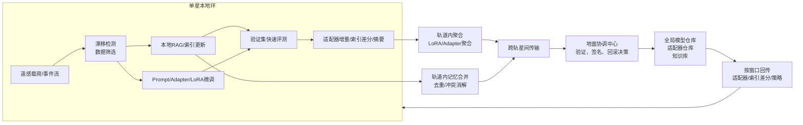

Shi 等的 2025 年综述虽然不是专门讨论“遥感视觉—语言大模型在轨微调”，但它已经给出了低轨星座上大模型训练与推理的关键系统骨架：星地分割、轨道内聚合、星间与星地联合传输、以及在短可见窗口和受限算力下做分布式学习。与此同时，RemoteCLIP、GeoChat、GeoRSMLLM 等工作说明遥感视觉—语言模型已经从基础图文对齐走向区域级对话、视觉 grounding、开放词汇理解和复杂指令；而 CLeaRS 基准进一步显示，RS VLM 在长时程、模态增量和任务增量条件下普遍存在灾难性遗忘，因此“持续适应”已经是系统主问题，而不是附属功能。综合近五年的原始论文，低轨星座上最可行的路线并不是全参数在轨重训，而是“RAG 与外部记忆更新优先，Prompt/Adapter/LoRA 等参数高效微调其次，轨道内分层联邦聚合跟上，最后用辐射感知验证与回滚机制兜底”的渐进式闭环。对工程实现而言，真正决定成败的不是单一任务精度，而是参数量、上行字节数、可见窗口完成率、漂移检测延迟、故障注入鲁棒性和 time-to-accuracy 的联合最优。 fileciteturn0file0 citeturn32view0turn32view1turn33view0turn31view0turn24view0turn20academia1turn25academia0turn16academia1

## 问题界定与工程假设

从公开文献看，遥感 VLM 的能力边界正在快速扩展：RemoteCLIP把遥感图文对齐做到了 foundation model 级别，GeoChat强调高分辨率遥感图像中的小目标、尺度变化和区域级推理需求，GeoRSMLLM则进一步把任务空间扩展到开放词汇、指代表达、复杂条件理解、分割与变化检测等更高层视觉—语言任务。这意味着低轨星座上的“持续适应”不只是更新一个文本头，而是要在视觉编码器、跨模态投影器、语言解码器、检索器、区域 grounding 模块之间做分层更新策略。citeturn32view0turn32view1turn33view0

另一方面，CLeaRS 的直接结论非常重要：当前 RS VLM 大多仍依赖静态训练数据，对新增模态、任务和指令分布的持续适应能力不足；其给出的 long-horizon、modality-incremental、task-incremental 三类协议，实际上已经很接近低轨在轨场景中的“季节变化—地域变化—载荷变化—事件变化”四类真实漂移。基于这一点，本报告把“持续适应：在轨微调”具体化为四个层次：外部知识更新、轻量参数更新、跨星聚合更新、以及可靠发布与回滚。citeturn31view0turn31view1

题设没有给出星座规模、星地/星间链路、单星算力和窗口长度的确定值，因此下表只作为**工程敏感性扫描建议**，不是统一标准。其范围覆盖了 Shi 等文中讨论的“数百 Mbps 到数 Gbps 的 feeder link”和“数 Gbps 到数十 Gbps 的激光星间链路”两个量级，并兼容近年低轨联邦学习与空间算网文献中的“几十到数千颗卫星”研究设定。fileciteturn0file0 citeturn25academia0turn15academia2

| 维度 | 题设状态 | 建议的敏感性扫描 |
|---|---|---|
| 星座规模 | 未指定 | 32 / 128 / 512 / 1024 颗 |
| 单轨参与数 | 未指定 | 8 / 16 / 32 颗 |
| 星地链路速率 | 未指定 | 0.1 / 0.5 / 1 / 5 / 10 Gbps |
| 星间链路速率 | 未指定 | 1 / 5 / 10 / 20 Gbps |
| 单次可见窗口 | 未指定 | 2 / 5 / 10 / 15 min |
| 本地可训练参数占比 | 未指定 | 0.01% / 0.1% / 1% |
| 更新触发方式 | 未指定 | 周期触发 / 漂移触发 / 事件触发 |
| 故障模型 | 未指定 | 无故障 / 软错误注入 / 链路中断 / 异步失配 |

## 星地分割的参考架构

Shi 等的一个核心启发是：在轨持续适应不应默认“把大模型整体搬上星”，而应首先寻找**能在星上放置的最小可训练子模块**，其余部分通过星地分割、轨道内聚合或后移到地面计算中心完成。配合 Satellite Federated Edge Learning 一文中的 FEDMEGA 架构，一个更适合低轨 VLM 的思路是：单星负责漂移监测、样本筛选、RAG 本地更新和小规模 PEFT；轨道内做适配器聚合与记忆合并；跨轨与星地再做全局协调、验证、签名下发与回滚控制。fileciteturn0file0 citeturn25academia0

对遥感 VLM 而言，可以把上图理解为“冻结大基座、在轨更新小模块”的实现蓝图：视觉编码器和语言基座尽量冻结，跨模态投影器、部分高层注意力层、任务头、检索器或软提示作为主要更新对象；当本地算力继续不足时，再退一步做 split learning 或 feature shipping；当链路窗口非常短时，则优先上传适配器增量、索引差分和摘要，而不是原始样本或全量模型。这个框架与 GeoChat 所强调的区域级对话和高分辨率遥感处理需求并不矛盾，反而提供了一个把复杂 VLM 拆成“可在轨演化的小模块”和“应在地面维护的大模块”的系统方法。citeturn32view1turn33view0turn19academia0turn25academia0

## 技术点

下列技术点按“先能跑，再能学，再能稳”的顺序组织；每一点都同时考虑技术可行性、低轨约束和可测评性。fileciteturn0file0 citeturn31view0turn16academia0

### 参数高效微调与星地分割

1) **技术解释与目标**：参数高效微调的目标，是在尽量保留通用能力的同时，把在轨继续学习的计算、显存和通信成本压到可控范围。LoRA通过低秩矩阵增量更新线性层；QLoRA进一步把冻结基座量化到 4-bit 再经 LoRA 回传梯度；Adapter把小瓶颈模块插入层间；Prompt/Prefix 则把更新对象压缩到软提示或连续前缀。LoRA 原始论文报告在 GPT-3 175B 场景中可把可训练参数规模降约 10,000 倍、训练显存降约 3 倍；QLoRA展示了 65B 模型在单张 48GB GPU 上完成微调的可行性；地球观测领域的 PEFT 对比结果也表明，在多个 EO 数据集上，PEFT 往往能接近甚至超过全参数微调，并改善对未见地域的泛化。citeturn24view0turn20academia1turn24view1turn23view0turn24view2turn18academia1  
2) **适用于低轨星座的具体方法与实现路径**：建议把视觉编码器和语言主干默认冻结，仅在跨模态投影器、语言高层块、任务头和区域 grounding 头上施加 LoRA/Adapter；若星上显存更紧，可将文本侧做 QLoRA、视觉侧只放轻量 Adapter 或 head tuning；若任务偏指令风格或格式适配，则优先用 Prompt/Prefix，而不是动主干。Shi 等关于卫星侧只放小型可训练层、地面保留重型编码器的思路，可以直接迁移到遥感 VLM。fileciteturn0file0 citeturn24view0turn20academia1turn24view1turn23view0turn24view2  
3) **关键挑战与工程约束**：遥感图像分辨率高、区域级推理强、跨模态对齐脆弱，这使得“少量参数更新”并不自动等于“稳定更新”；尤其在高分辨率、长上下文或区域级对话场景下，激活和 KV cache 甚至可能比适配器本身更贵。GeoChat 也明确指出，高分辨率遥感影像与多小目标场景需要区域级推理，而这正是部署端最容易超预算的部分。citeturn32view1turn20academia1turn24view0  
4) **可衡量的指标与评估方法**：至少要同时报告 trainable parameter ratio、峰值显存/内存、单轮适配器上行字节数、单位更新能耗、任务指标，以及连续学习指标如 average accuracy 与 forgetting；如果任务覆盖问答、caption、grounding 和变化检测，还应按任务分别给出主指标，而不是只报一个总分。citeturn31view0turn18academia1  
5) **重要参考文献**：Hu et al., *LoRA: Low-Rank Adaptation of Large Language Models*, ICLR 2022；Dettmers et al., *QLoRA: Efficient Finetuning of Quantized LLMs*, 2023；Houlsby et al., *Parameter-Efficient Transfer Learning for NLP*, ICML 2019；Lester et al., *The Power of Scale for Parameter-Efficient Prompt Tuning*, EMNLP 2021，DOI: 10.18653/v1/2021.emnlp-main.243；Li and Liang, *Prefix-Tuning: Optimizing Continuous Prompts for Generation*, ACL 2021，DOI: 10.18653/v1/2021.acl-long.353；Marti-Escofet et al., *Fine-tune Smarter, Not Harder: Parameter-Efficient Fine-Tuning for Geospatial Foundation Models*, 2025。citeturn24view0turn20academia1turn24view1turn23view0turn24view2turn18academia1

### 分层联邦微调与联邦 LoRA

1) **技术解释与目标**：联邦 LoRA 的本质，是让各星只交换少量适配器参数而不交换原始遥感数据，从而把“持续适应”的通信对象从全模型压缩成小增量；分层联邦则进一步把“单星—轨道—地面”的物理层级映射为“本地—轨道内—全局”的优化层级。Shi 等在卫星联邦学习中已经证明，轨道内聚合可以显著减少对低速、间歇星地链路的依赖。fileciteturn0file0 citeturn25academia0  
2) **适用于低轨星座的具体方法与实现路径**：建议采用“三层聚合”：单星本地训练 LoRA/Adapter；轨道内先做 ring all-reduce 或 rank-aware aggregation，形成 orbital adapter；轨道间或星地再做全局合并。若不同卫星资源不同，则不要强行使用同一 LoRA rank；FLoRA、LoRA-A2 和 HAFL 这类工作都表明，异构 rank 或重要性加权比简单零填充平均更稳健。citeturn30academia3turn30academia0turn30academia1turn25academia0  
3) **关键挑战与工程约束**：低轨场景的非 IID 比传统 FL 更严重，因为地域、季节、天气、观测角、传感器模态和事件分布都可能随轨道和时间不一致；此外，LoRA 的低秩分解也并不天然适合直接 FedAvg，近期联邦 LoRA 文献明确指出，朴素聚合会带来数学上的聚合噪声或性能退化。citeturn30academia3turn30academia0turn30academia2  
4) **可衡量的指标与评估方法**：应报告 wall-clock to target accuracy、全局收敛轮数、本地与全局 adapter 大小、每轮平均上传字节数、轨道间公平性、不同 rank 客户端的性能方差，以及在极端异构资源条件下的准确率—通信权衡曲线。citeturn25academia0turn30academia2turn30academia3  
5) **重要参考文献**：Shi et al., *Satellite edge artificial intelligence with large models: architectures and technologies*, *Science China Information Sciences*, 2025，DOI: 10.1007/s11432-024-4425-y；Shi et al., *Satellite Federated Edge Learning: Architecture Design and Convergence Analysis*, 2024；Wang et al., *FLoRA: Federated Fine-Tuning Large Language Models with Heterogeneous Low-Rank Adaptations*, 2024；Kuo et al., *Federated LoRA with Sparse Communication*, 2024；Koo et al., *Towards Robust and Efficient Federated Low-Rank Adaptation with Heterogeneous Clients*, 2024。fileciteturn0file0 citeturn25academia0turn30academia3turn30academia2turn30academia0

### 异步聚合、窗口感知调度与分裂学习

1) **技术解释与目标**：在低轨星座里，“同步一轮联邦学习”常常是最不现实的假设，因为不同卫星与地面的可见窗口错开，轨间连接也随时间变化。异步聚合和窗口感知调度的目标，是让更新过程服从接触计划，而不是要求网络服从优化算法。分裂学习则是在单星算力不够时，把模型切开，把重算部分后移到轨道节点或地面。citeturn19academia0turn25academia0turn25academia2  
2) **适用于低轨星座的具体方法与实现路径**：建议把更新对象划分成三类并按窗口动态切换：窗口极短时只传摘要与索引差分；窗口中等时传 LoRA/Adapter 增量；窗口长且算力不足时启用 split learning，发送中间特征或切分激活。服务器侧或轨道聚合节点则采用 staleness weighting、partial participation 和 contact-plan-aware scheduling，而不是硬性轮同步。fileciteturn0file0 citeturn19academia0turn5academia3turn15academia2  
3) **关键挑战与工程约束**：星地窗口短、星间拓扑变、跨轨链路更动态，这会同时放大 stale update、队列阻塞和全局模型落后问题；如果还叠加 VLM 的高分辨率视觉特征，中间表示可能大于 PEFT 增量，因此 split learning 只有在切分点恰当、压缩有效时才划算。Shi 文中对特征传输负担的讨论恰好说明，中间表示不一定比参数更便宜。fileciteturn0file0 citeturn19academia0turn25academia2  
4) **可衡量的指标与评估方法**：关键指标包括可见窗口内完成率、staleness 分布、deadline miss ratio、链路利用率、切分点前后特征大小、to-target-accuracy 的真实时延，而不只是“训练轮数”。建议在真实或近真实接触计划上评测，而不是静态全连接图。citeturn25academia0turn19academia0turn5academia3  
5) **重要参考文献**：Shi et al., *Satellite edge artificial intelligence with large models: architectures and technologies*, 2025；Shi et al., *Satellite Federated Edge Learning: Architecture Design and Convergence Analysis*, 2024；Lin et al., *Split Learning in 6G Edge Networks*, 2024；Chen et al., *Asynchronous Federated Learning for Sensor Data with Concept Drift*, 2021；Elmahallawy and Luo, *Stitching Satellites to the Edge: Pervasive and Efficient Federated LEO Satellite Learning*, 2024。fileciteturn0file0 citeturn25academia0turn19academia0turn5academia3turn15academia2

### 漂移检测与触发式持续学习

1) **技术解释与目标**：漂移检测的作用不是证明“数据变了”，而是决定“值不值得在轨更新”。在 RS VLM 场景里，漂移可能来自季节变化、地域迁移、灾害事件、载荷更替、模态新增、指令风格变化，甚至只是知识库过期。CLeaRS 明确显示，现有 RS VLM 在长时程和模态/任务增量下普遍存在灾难性遗忘，而 FL under distributed concept drift 的结论则表明，单一全局模型通常不适合处理时空错位发生的漂移。citeturn31view0turn15academia0  
2) **适用于低轨星座的具体方法与实现路径**：建议采用“本地轻量检测 + 轨道级确认 + 联邦聚类更新”的三级触发机制。本地监控可基于 embedding 分布偏移、置信度与校准误差、检索命中率下降、跨星预测分歧、少量延迟标签；轨道级再做 client clustering，区分局部漂移和全局漂移。只有当漂移持续且业务代价足够高时，才从 RAG 升级到 Prompt/Adapter/LoRA。citeturn6academia1turn15academia0turn5academia3turn31view1  
3) **关键挑战与工程约束**：遥感场景大量样本在部署时无标签，因此真正可用的多是弱监督或无监督漂移信号；同时，误报会带来通信和能耗浪费，漏报则导致模型陈旧。还有一个低轨特有难点是“漂移异步”：不同轨道、不同覆盖区、不同载荷看到的变化时间并不同步。citeturn6academia1turn15academia0turn5academia3  
4) **可衡量的指标与评估方法**：建议至少报告漂移检测延迟、误报率、漏报率、触发后恢复时间、漂移后稳态性能、backward transfer、forgetting，以及“每次有效触发带来的收益/成本比”。如果系统采用多模型或多群组策略，还要报告集群纯度或漂移分群质量。citeturn31view0turn15academia0turn6academia1  
5) **重要参考文献**：Bayram et al., *From Concept Drift to Model Degradation: An Overview on Performance-Aware Drift Detectors*, 2022；Jothimurugesan et al., *Federated Learning under Distributed Concept Drift*, 2022；Chen et al., *Asynchronous Federated Learning for Sensor Data with Concept Drift*, 2021；Weng et al., *Continual Vision-Language Learning for Remote Sensing: Benchmarking and Analysis*, 2026；Yuan et al., *Continual Panoptic Perception: Towards Multi-modal Incremental Interpretation of Remote Sensing Images*, 2024。citeturn6academia1turn15academia0turn5academia3turn31view0turn31view1

### RAG 更新、多星记忆合并与参数—非参数协同

1) **技术解释与目标**：RAG 的核心价值，是把“持续适应”的一部分从参数空间转移到外部记忆空间。原始 RAG 论文就直接指出，大模型的 world knowledge 更新和 provenance 仍是开放问题，而检索增强式生成可以把参数记忆与非参数记忆结合起来。对低轨 VLM 来说，这意味着很多“在轨变化”应先视为知识更新问题，而不是权重更新问题。citeturn27view0  
2) **适用于低轨星座的具体方法与实现路径**：建议每颗卫星维护局部区域知识库与向量索引，缓存最近轨道经过区域的地物变化摘要、规则、事件报告和载荷元数据；轨道内再做记忆去重、冲突消解与版本合并；只有当检索召回或 grounded generation 明显下降，或者新概念已经超出索引表达能力时，才升级到 LoRA/Adapter 微调。若需要多星联合又不愿共享原始文本，可参考 parametric adapter 式 FedRAG 路线。citeturn27view1turn26academia3turn32view1  
3) **关键挑战与工程约束**：RAG 在低轨场景的难点不是“能不能检索”，而是“知识何时同步、如何裁剪、如何避免冲突和过期”。如果索引更新快于参数更新，可能出现检索器与生成器不匹配；如果多星摘要互相冲突，还会破坏一致性。对于遥感 VLM，还要处理区域级知识与空间 grounding 的一致性问题。citeturn27view0turn27view1turn32view1  
4) **可衡量的指标与评估方法**：推荐同时报告 Recall@k、MRR、nDCG、grounded answer accuracy、citation accuracy、知识刷新时延、索引大小、冲突率和每次刷新所需上行/下行字节数。与纯参数微调相比，还应比较“恢复事实正确性所需时延”。citeturn27view1turn26academia3  
5) **重要参考文献**：Lewis et al., *Retrieval-Augmented Generation for Knowledge-Intensive NLP Tasks*, NeurIPS 2020，DOI: 10.48550/arXiv.2005.11401；Asai et al., *Self-RAG: Learning to Retrieve, Generate, and Critique through Self-Reflection*, 2023，DOI: 10.48550/arXiv.2310.11511；Liang et al., *FedMosaic: Federated Retrieval-Augmented Generation via Parametric Adapters*, 2026；Kuckreja et al., *GeoChat: Grounded Large Vision-Language Model for Remote Sensing*, 2023，DOI: 10.48550/arXiv.2311.15826。citeturn27view0turn27view1turn26academia3turn32view1

### 通信高效更新与 AirComp coded AirComp

1) **技术解释与目标**：在低轨持续适应里，通信不是配角，而是训练算法的一部分。AirComp 的基本思想是把“先通信再求和”改成“传输中完成聚合”，从而把带宽用在模型聚合本身；而 coded AirComp 或 lattice JSCC 则试图在数字通信框架内保留类似的聚合优势。最新比较研究表明，模拟 AirComp 在带宽受限和大规模终端场景下具有频谱效率优势，但对 CSI 误差更敏感、功率效率更脆弱；数字方案则更稳健，但更容易受到并发上行数量限制。citeturn14academia1turn14academia2turn14academia0  
2) **适用于低轨星座的具体方法与实现路径**：建议把通信对象优先收缩为稀疏 LoRA/Adapter 增量、top-k 梯度、量化摘要与索引差分；在轨道内、短距离、CSI 相对稳定的场景可优先尝试 AirComp 或 coded aggregation；在跨轨与星地回传阶段则以数字通信、网络流调度和 rank-aware 压缩为主。若窗口极短且终端数量多，可将 FLASC 这类“本地稠密、通信稀疏”的 federated LoRA 方法与 AirComp 结合。fileciteturn0file0 citeturn30academia2turn14academia2turn14academia0  
3) **关键挑战与工程约束**：高机动低轨链路的 CSI 获取、跨轨 Doppler、发射功率上限、包丢失和不等长窗口都会直接影响 AirComp 可用性；同时，coded aggregation 一旦与异步更新叠加，解码与同步开销也会增加。因此，通信策略必须窗口感知和链路分层，不能用单一聚合机制覆盖所有链路。citeturn14academia1turn14academia0turn25academia2  
4) **可衡量的指标与评估方法**：建议报告 bytes-to-target-accuracy、聚合 MSE、频谱效率、每比特能耗、窗口内完成率、CSI 误差下的精度退化、以及不同链路层级上模拟与数字方案的切换收益。citeturn14academia0turn14academia2turn30academia2  
5) **重要参考文献**：Shi et al., *Satellite edge artificial intelligence with large models: architectures and technologies*, 2025；Wang et al., *Over-the-Air Computation for 6G: Foundations, Technologies, and Applications*, 2022；Azimi-Abarghouyi and Varshney, *Federated Learning via Lattice Joint Source-Channel Coding*, 2024；Yao et al., *Wireless Federated Learning over Resource-Constrained Networks: Digital versus Analog Transmissions*, 2024；Kuo et al., *Federated LoRA with Sparse Communication*, 2024。fileciteturn0file0 citeturn14academia1turn14academia2turn14academia0turn30academia2

### KV cache 压缩、流式推理与在线校验

1) **技术解释与目标**：严格说，这不是“微调算法”本身，而是让在轨持续适应真正闭环的支撑层。原因很直接：漂移检测、快速验证、任务回放、轨上问答和状态汇报都依赖实时推理，而长上下文 VLM/LLM 在推理时往往受制于 KV cache 存储与首 token 延迟。PagedAttention、H2O、KIVI、SnapKV、DuoAttention 与 speculative decoding 这条线，解决的正是“能不能在小内存、小功耗下做够多次验证”的问题。citeturn9academia2turn8academia1turn11academia0turn8academia0turn11academia3turn9academia0  
2) **适用于低轨星座的具体方法与实现路径**：推荐组合式使用。基础层采用 PagedAttention 式块化缓存管理；内存极紧场景可用 KIVI 之类低比特 KV 量化；长上下文验证或轨上对话可引入 H2O、SnapKV 或 DuoAttention 做选择性保留；任务汇报和摘要生成环节则可加 speculative decoding 压缩时延。对于高分辨率遥感问答和区域级对话，这些优化会显著影响是否能在窗口内完成模型验证。citeturn9academia2turn11academia0turn8academia1turn8academia0turn11academia3turn32view1  
3) **关键挑战与工程约束**：KV 压缩会引入“内存—速度—精度”三方权衡；而遥感 VLM 的图像 token、多区域提示和长文本上下文经常同时存在，导致压缩策略在不同头、不同层和不同模态上的最优配置可能并不一致。若再叠加辐射软错误，缓存和激活本身也可能成为故障源。citeturn11academia0turn11academia3turn16academia1  
4) **可衡量的指标与评估方法**：建议报告首 token 时延、tokens/s、峰值 KV 内存、长上下文任务精度、speculative acceptance rate、窗口内验证完成率，以及压缩前后对下游持续学习决策的一致性影响。citeturn9academia0turn9academia2turn11academia0turn8academia0  
5) **重要参考文献**：Kwon et al., *Efficient Memory Management for Large Language Model Serving with PagedAttention*, 2023；Zhang et al., *H2O: Heavy-Hitter Oracle for Efficient Generative Inference of Large Language Models*, 2023；Liu et al., *KIVI: A Tuning-Free Asymmetric 2bit Quantization for KV Cache*, 2024；Li et al., *SnapKV: LLM Knows What You are Looking for Before Generation*, 2024；Xiao et al., *DuoAttention: Efficient Long-Context LLM Inference with Retrieval and Streaming Heads*, 2024；Leviathan et al., *Fast Inference from Transformers via Speculative Decoding*, 2022。citeturn9academia2turn8academia1turn11academia0turn8academia0turn11academia3turn9academia0

### 辐射可靠性、版本回滚与安全发布

1) **技术解释与目标**：在轨持续适应的最后一道门槛不是“学得动”，而是“发布后不出错”。空间环境中的 COTS 算力硬件会受到 SEU 和 MCU 等辐射诱发故障影响，而针对在轨 ML 的辐射鲁棒性研究目前仍明显不足。换句话说，如果没有版本控制、校验和回滚，再好的在轨微调算法都不应直接上星发布。citeturn16academia0turn16academia1turn29academia1  
2) **适用于低轨星座的具体方法与实现路径**：建议优先发布 Adapter/LoRA 这类小增量而非整模型，并采用 A/B 双版本仓、签名校验、CRC/ECC、影子验证、轨道内多数投票和自动回滚；同时，结合应用感知保护思想，对更敏感的层、缓存和输出头做选择性冗余，而不是对整机做昂贵的全域冗余。citeturn16academia1turn16academia0  
3) **关键挑战与工程约束**：上层 AI 工作流面对的故障并不总是“设备宕机”，更危险的是 silent corruption，即参数、激活或缓存发生静默错误但仍继续输出；这会直接污染联邦聚合和后续版本。GPU4S 的研究也说明，高性能嵌入式 GPU 进入航天很有吸引力，但 harsh environment 仍是实际部署的硬约束。citeturn29academia1turn16academia0turn16academia1  
4) **可衡量的指标与评估方法**：必须加入 fault injection 实验，并报告故障注入后精度下降、检测延迟、误接受率、回滚成功率、恢复时间和连续几个更新周期后的累积误差，而不是只给无故障性能。citeturn16academia0turn16academia1  
5) **重要参考文献**：Lange et al., *Machine Learning in Space: Surveying the Robustness of on-board ML models to Radiation*, 2024；Wang et al., *A Case for Application-Aware Space Radiation Tolerance in Orbital Computing*, 2024；Kosmidis et al., *GPU4S: Embedded GPUs in Space — Latest Project Updates*, 2021；Shi et al., *Satellite edge artificial intelligence with large models: architectures and technologies*, 2025。citeturn16academia0turn16academia1turn29academia1 fileciteturn0file0

## 评测框架与实验设计

现有文献已经很清楚地表明：只用“单任务精度”评估在轨持续适应会严重失真。CLeaRS 提醒我们必须考虑长时程、模态增量和任务增量；卫星 FEEL 文献提醒我们必须考虑接触窗口和真实通信时延；空间辐射研究又提醒我们不能忽略故障注入与恢复。因此，评测框架必须把任务性能、持续学习性能、系统效率、通信效率和可靠性放进同一张成绩单。citeturn31view0turn25academia0turn16academia0turn16academia1

| 评测层面 | 最低限度应报告的指标 |
|---|---|
| 任务性能 | 按任务分别报告 Accuracy / F1 / mAP / CIDEr / BLEU / grounding score / change detection IoU |
| 持续学习 | Average accuracy、Forgetting、Backward transfer、Forward transfer、漂移后恢复时间 |
| 计算与能耗 | 峰值显存/内存、单位更新能耗、time-to-accuracy、首 token 时延、tokens/s |
| 通信 | 单轮上传字节、bytes-to-target-accuracy、窗口内完成率、链路利用率、聚合 MSE |
| 可靠性 | fault injection accuracy drop、回滚成功率、更新校验失败率、恢复时间 |
| 多星协同 | 轨道内/轨道间公平性、staleness 分布、异构 rank 适配效果 |

实验设计上，建议最少做四组主对比：**无更新基线**、**RAG only**、**Prompt/Adapter/Prefix**、**LoRA/QLoRA**，再加上 **联邦 LoRA** 与 **split learning hybrid** 两条系统增强线。任务协议应至少覆盖 long-horizon、modality-incremental、task-incremental 三类顺序；系统协议则应覆盖短窗口、异步聚合、链路抖动、故障注入和异构算力。最终给出的不是“哪个方法总是最好”，而是“在什么链路与算力条件下，哪种更新层级最划算”。citeturn31view0turn19academia0turn25academia0turn24view0turn20academia1turn16academia1

## 开放问题与局限

首先，Shi 等 2025 提供的是“卫星边缘大模型”的系统骨架，而不是面向遥感 VLM 的专门微调方案，因此本文中关于“视觉编码器—投影器—语言头”的更新切分，有一部分属于在该骨架上的合理外推。其次，CLeaRS 非常新，虽然它对 RS VLM 持续学习问题的揭示很重要，但基准生态、复现实验和统一评价仍在形成中。再次，联邦 RAG、联邦 LoRA、KV cache 压缩和辐射鲁棒性这些方向各自发展较快，但真正把它们完整耦合到“低轨遥感 VLM 在轨持续适应”这一统一场景中的公开实证仍然很少。最后，关于具体星座规模、链路预算、单星硬件、故障率和法规约束，题设均未指定，因此报告给出的参数范围是工程扫描建议，而不是工程定值。fileciteturn0file0 citeturn31view0turn26academia1turn30academia3turn16academia0

## 研究与工程建议

1. **先做三层更新栈，而不是一上来就做联邦微调**：默认使用“RAG/索引更新 → Prompt/Adapter → LoRA”，只有当前一层失效时才升级到下一层；这条路线最符合原始 RAG、Self-RAG 和 PEFT 文献的成本—收益关系。citeturn27view0turn27view1turn24view0turn20academia1  
2. **把轨道当作第一聚合单元，而不是把所有卫星直接平铺到地面**：轨道内先聚合、星地后汇总，更贴近 FEDMEGA 和 Shi 等文中反复强调的链路事实。fileciteturn0file0 citeturn25academia0  
3. **把 bytes-to-target-accuracy、time-to-accuracy 和 fault-injection accuracy 设为一等指标**：只报任务精度，会系统性低估通信、异步和辐射问题。citeturn31view0turn25academia0turn16academia0turn16academia1  
4. **首版系统只下发签名适配器、索引差分和策略，不要下发整模型**：小对象更新更适合窗口约束，也更容易做校验、A/B 存储和自动回滚。citeturn24view0turn30academia2turn16academia1  
5. **把 KV cache 压缩和流式推理纳入持续适应闭环**：如果不能在轨快速验证新模型，就无法形成“检测—更新—验证—发布”的真实闭环。citeturn9academia2turn8academia1turn11academia0turn8academia0turn9academia0