# 持续适应：核心文献

## 一、总览

| 序号 | 论文 | 来源 / 年份 | 技术主线 | 直接证据 | 对 Ch.6 的用途 |
| --- | --- | --- | --- | --- | --- |
| 1 | Continual Vision-Language Learning for Remote Sensing (CLeaRS) | arXiv:2604.00820, 2026 | RS-VLM 持续学习基准 | 10 个子集、20.7 万+图文对、三种增量协议 | 定义变化、遗忘与评测入口 |
| 2 | Continual Self-Supervised Learning with MAEs in RS (CoSMAE) | arXiv:2506.21312, 2025 | 无标签持续表征 | 数据 mixup + 模型 mixup 蒸馏；最多 4.94% 提升 | 标签不足时的视觉侧预适应 |
| 3 | LoRA-Det | arXiv:2406.02385, 2024 | 星载遥感检测 PEFT | 更新 12.4% 参数，达到全量微调 97%–100% 性能 | 单星低秩更新与上行增量 |
| 4 | Fine-tune Smarter, Not Harder | arXiv:2504.17397, 2025 | GeoFM PEFT 比较 | 5 个 EO 数据集；PEFT 改善未见区域泛化并降低训练资源 | 选择 Adapter/LoRA 的地面依据 |
| 5 | SpectralGPT PEFT | arXiv:2505.15334, 2025 | 多/高光谱参数高效适配 | KronA+ 约 0.056% 可训练参数、约 0.2 MB 增量 | 新谱段/新载荷下的极小更新 |
| 6 | RS-RAG | arXiv:2504.04988, 2025 | 遥感知识库与检索增强 | 图文统一向量库、检索重排、知识增强 Prompt | 知识变化优先更新记忆层 |
| 7 | SAR-RAG | arXiv:2602.04712, 2026 | SAR 案例记忆 | MLLM + 已知目标样本向量库 | 面向 SAR 的案例检索与解释 |
| 8 | Satellite Federated Fine-Tuning for Foundation Models | arXiv:2504.10403, 2025 | 卫星—地面协同微调 | 卫星嵌入层/任务头、地面骨干；仿真训练时间降至板上完整训练约 33% | 在轨训练不足时的模型拆分约束 |
| 9 | On-board Federated Learning for Satellite Clusters with ISLs | arXiv:2307.08346, 2023 | 星间联邦与增量聚合 | 利用可预测轨道接触；仿真 7× 收敛加速、10× 通信负载降低 | 轨道内聚合的系统原型 |
| 10 | FEDMEGA | arXiv:2404.01875, 2024 | LEO 分层联邦 | 轨内 ring all-reduce + 全局网络流调度 | 轨内先聚合、星地再协调 |
| 11 | AsyncFLEO | arXiv:2212.11522, 2022 | 异步 LEO 联邦 | 分组、模型传播、陈旧度折扣 | 可见窗口错位与 stale update 处理 |
| 12 | SFL-LEO | arXiv:2504.13479, 2025 | 异步 split-federated learning | 断连期局部训练；使用 Starlink 链路测量驱动实验 | 算力不足节点的备选训练路径 |
| 13 | Sparse Incremental Aggregation | arXiv:2501.11385, 2025 | 星间更新压缩 | 稀疏梯度 + 沿轨增量聚合；4×以上带宽效率 | LoRA/Adapter 差分通信设计 |
| 14 | FediLoRA | arXiv:2509.06984, 2025 | 多模态异构联邦 LoRA | dimension-wise aggregation + layer-wise editing | 不同 rank、模态缺失下的聚合 |
| 15 | ILoRA | arXiv:2511.16069, 2025 | 异构 rank LoRA 聚合 | QR 初始化、拼接 QR 聚合、rank-aware 控制变量 | 低秩子空间对齐与 client drift 控制 |
| 16 | GLoRA | arXiv:2605.06733, 2026 | Gauge-aware 联邦 LoRA | 共识子空间 + 共享坐标；支持不同 rank readout | 反对直接平均 LoRA A/B 因子 |

## 二、技术分类与 Ch.6 对应关系

| Ch.6 子问题 | 核心论文 | 可提取论点 | 星载证据强度 |
| --- | --- | --- | --- |
| 6.1 变化建模与更新触发 | CLeaRS、CoSMAE；补充 E4 | 需区分长时程、模态、任务、知识和资源变化；漂移类型决定保留还是遗忘历史样本 | 弱：RS 地面基准和通用 FL |
| 6.2 非参数知识更新 | RS-RAG、SAR-RAG；补充 E2 | 新知识、案例与区域语义先进入向量库/摘要/证据 Prompt，再判断是否改参数 | 弱：地面 RS-VLM |
| 6.3 单星 PEFT | LoRA-Det、GeoFM PEFT、SpectralGPT | 低秩、Kronecker 或局部模块更新能显著缩小参数增量；应按视觉、连接器、语言和任务头分部件预算 | 中：任务面向星载，但未有在轨训练闭环 |
| 6.4 遗忘控制与局部验证 | CLeaRS、CoSMAE；补充 E3、E5 | PEFT 不是遗忘控制本身；需回放/蒸馏/正交或隔离更新，并做新旧任务联合验证 | 弱：地面 RS 或通用模型 |
| 6.5 卫星—星地协同微调 | Satellite FTF、On-board FL、FEDMEGA、AsyncFLEO、SFL-LEO、Sparse IA | 联邦/切分训练必须服从接触窗口、拓扑、链路和计算拆分，不能假设同步 FedAvg | 中：卫星网络架构/仿真，非飞行实证 |
| 6.6 异构 LoRA 与记忆合并 | FediLoRA、ILoRA、GLoRA；补充 E2、E5 | 不同 rank、模态和任务不能朴素平均 A/B 因子；应聚合可对齐的子空间或选择性更新 | 弱：通用联邦实验 |
| 6.7 版本治理与发布 | 补充 E1、E2；工程要求 | 检索库、Prompt、Adapter、基座与聚合状态须独立版本化、验签、灰度和回滚 | 弱：尚无端到端在轨公开验证 |

---

## 1. Weng et al.：CLeaRS

- **出处**：Xingxing Weng et al. *Continual Vision-Language Learning for Remote Sensing: Benchmarking and Analysis*, arXiv:2604.00820, 2026。[原文](https://arxiv.org/abs/2604.00820)
- **任务**：系统评估 RS-VLM 在连续到达的时间、模态与任务变化中的适应和遗忘。
- **基础模型 / 硬件**：比较多种 RS-VLM；未给出星载训练硬件、功耗或热设计。
- **训练 / 更新方式**：将代表性持续学习方法适配到 VLM；关键是比较协议而非提出在轨训练器。
- **数据与场景**：10 个整理子集、20.7 万+图文对，覆盖不同遥感解释任务、传感器模态和应用场景。
- **输入 / 输出**：连续图像—文本/任务流输入；输出各阶段任务表现与遗忘统计。
- **Pipeline**：任务/模态流 → VLM 持续更新 → long-horizon、modality-incremental、task-incremental 三种评测 → 新旧能力分析。
- **主实验 / 指标**：所有评测设置都出现明显灾难性遗忘；既有方法对任务、指令和模态转换的改善有限。
- **硬件证据**：无。不能由该基准推导出在轨训练内存、能耗或窗口可行性。
- **局限**：是地面 RS-VLM benchmark；时间顺序和数据协议仍不能直接等价于具体卫星轨道、云量或能源状态。
- **对本综述用途**：Ch.6 的问题定义与最低评测基线；避免把“类别增量”误当作全部在轨变化。

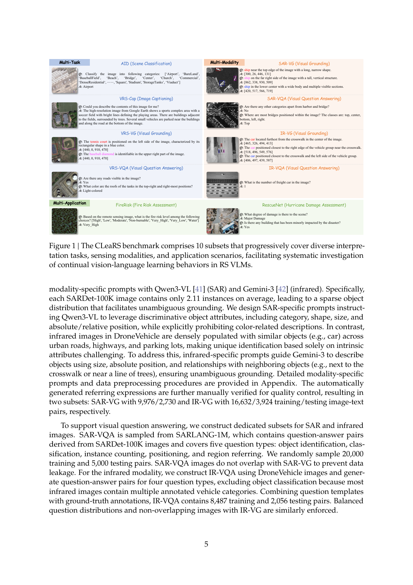

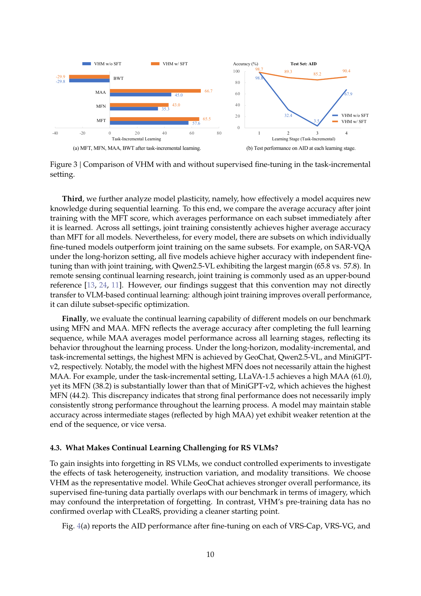

## 2. Möllenbrok et al.：CoSMAE

- **出处**：Lars Möllenbrok, Behnood Rasti, Begüm Demir. *Continual Self-Supervised Learning with Masked Autoencoders in Remote Sensing*, arXiv:2506.21312, 2025。[原文](https://arxiv.org/abs/2506.21312)
- **任务**：在缺少持续人工标签的条件下，使遥感 MAE 学习新观测流而减少遗忘。
- **基础模型 / 硬件**：MAE 视觉表征模型；未涉及语言模块或星载硬件。
- **训练 / 更新方式**：data mixup 保留历史分布联系；model mixup knowledge distillation 通过混合历史/当前模型权重形成教师约束。
- **数据与场景**：连续遥感任务流上的无监督表征学习。
- **输入 / 输出**：当前与历史遥感图像输入；输出更新后的视觉表征与下游任务性能。
- **Pipeline**：无标注观测流 → 当前/历史数据混合 → MAE 更新 + 混合教师蒸馏 → 下游评测。
- **主实验 / 指标**：论文报告相对既有 MAE 持续学习方法最高约 4.94% 的提升。
- **硬件证据**：无训练内存、功耗、热或链路实验。
- **局限**：更新对象是视觉 MAE，而非生成式 VLM；数据混合和教师模型本身也占用星上存储与训练资源。
- **对本综述用途**：支撑“低可信或无标签观测先做视觉侧预适应，可靠监督到位后再触发任务级 PEFT”的两阶段策略。

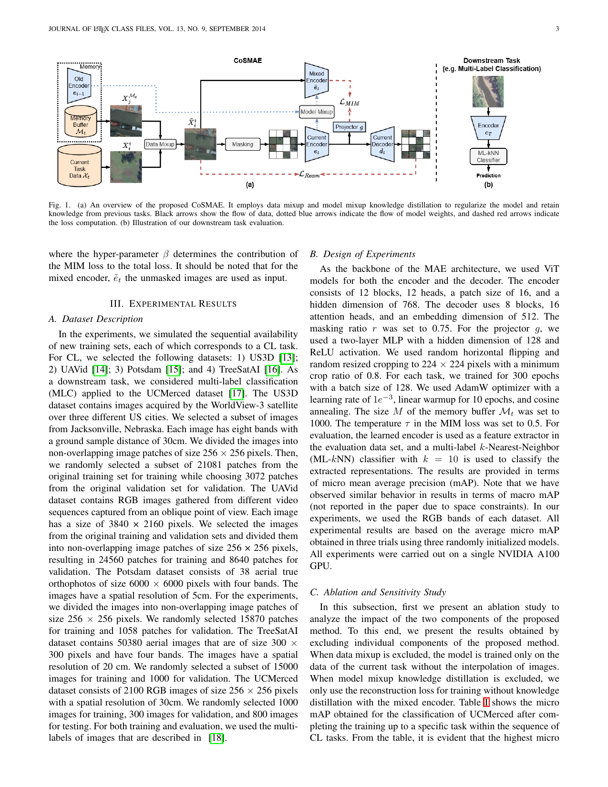

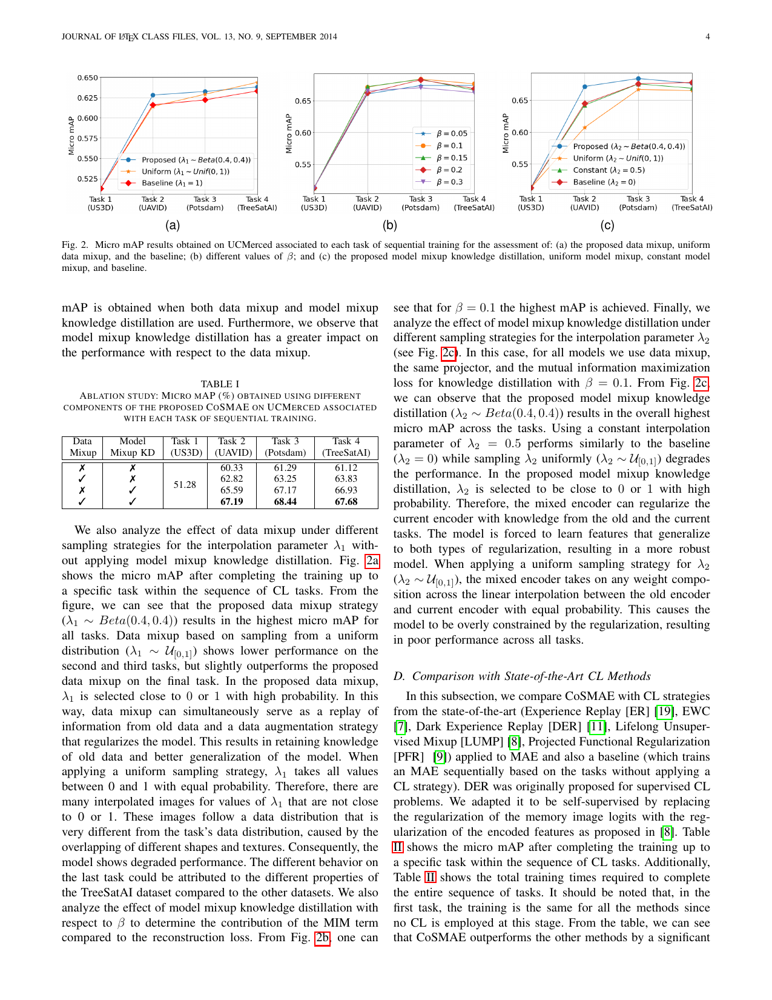

## 3. Pu and Xu：LoRA-Det

- **出处**：Xinyang Pu, Feng Xu. *Low-Rank Adaption on Transformer-based Oriented Object Detector for Satellite Onboard Processing of Remote Sensing Images*, arXiv:2406.02385, 2024。[原文](https://arxiv.org/abs/2406.02385)
- **任务**：在上行带宽受限时，为卫星遥感有向目标检测器更新新数据分布。
- **基础模型 / 硬件**：Transformer-based oriented detector；论文讨论卫星在板处理需求，但不报告飞行平台训练实测。
- **训练 / 更新方式**：冻结原权重，训练低秩矩阵；并以低秩近似选择 LoRA rank。
- **数据与场景**：遥感有向目标检测及分布适配。
- **输入 / 输出**：遥感图像输入；输出旋转目标框和类别；传输/保存对象为低秩参数增量。
- **Pipeline**：地面或本地标注/新分布数据 → LoRA 更新 → rank 选择 → 下发/合并低秩权重 → 目标检测推理。
- **主实验 / 指标**：仅更新约 12.4% 的总参数，即达到全量微调约 97%–100% 的性能。
- **硬件证据**：带宽动机明确，但没有在轨训练时间、峰值内存、能耗、热状态或版本回滚实验。
- **局限**：判别式检测器不等同于包含视觉编码器、连接器和语言解码器的 RS-VLM；参数比例也不能直接外推为 VLM 更新包大小。
- **对本综述用途**：Ch.6 最直接的“星载任务优先传输参数增量而非全模型”证据，但必须补充资源与安全发布门控。

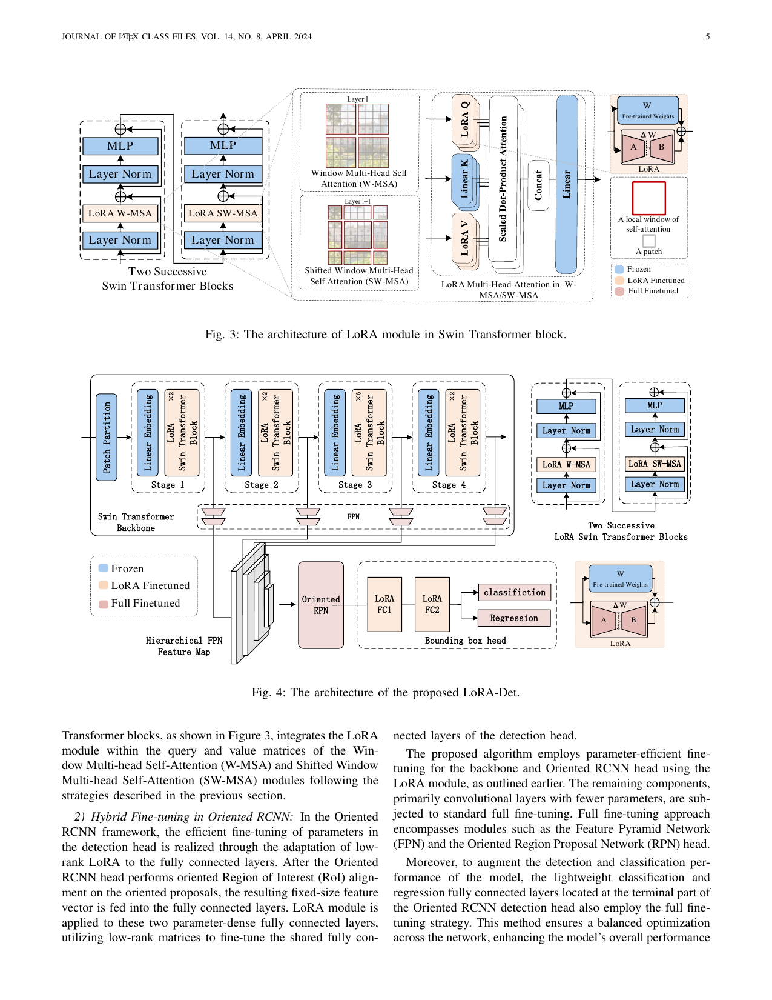

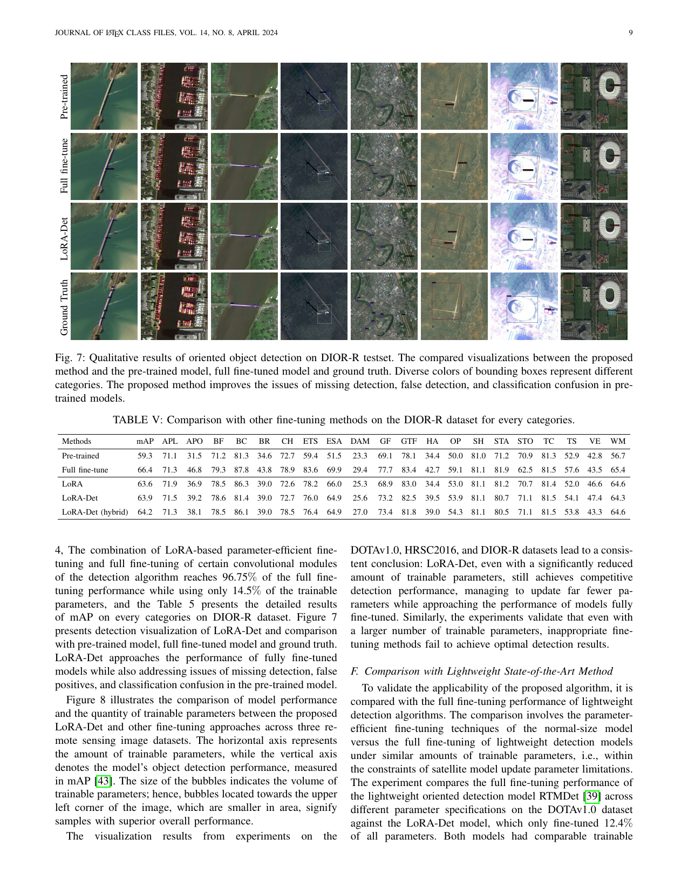

## 4. Marti-Escofet et al.：Geospatial Foundation Model PEFT

- **出处**：Francesc Marti-Escofet et al. *Fine-tune Smarter, Not Harder: Parameter-Efficient Fine-Tuning for Geospatial Foundation Models*, arXiv:2504.17397, 2025。[原文](https://arxiv.org/abs/2504.17397)
- **任务**：比较不同地理空间基础模型架构和 PEFT 方法在 EO 任务上的性能、训练资源与空间泛化。
- **基础模型 / 硬件**：多类地理空间基础模型与解码器；地面训练实验。
- **训练 / 更新方式**：比较多种 PEFT 与全量微调，同时考察解码器和元数据使用选择。
- **数据与场景**：5 个 EO 数据集，并检验未见地理区域的泛化。
- **输入 / 输出**：EO 图像及可选元数据输入；输出下游地理空间任务预测。
- **Pipeline**：冻结/部分冻结 GeoFM → 选择 PEFT 与解码器 → 任务训练 → 已见/未见区域评测 → 资源比较。
- **主实验 / 指标**：PEFT 可匹配或超过全量微调，降低训练时间与内存需求，并改善未见区域泛化；作者建议优先考察 UNet 解码器和不使用元数据的配置，但该结论受其模型/任务设定约束。
- **硬件证据**：没有星载平台、功耗、热与通信窗口测试。
- **局限**：是 EO 视觉基础模型适配，不涵盖 VLM 生成、在轨训练或星间协同。
- **对本综述用途**：支持“冻结基座 + 小模块适配”不仅节省通信，也可降低全量微调损害已有表征和空间泛化的风险。

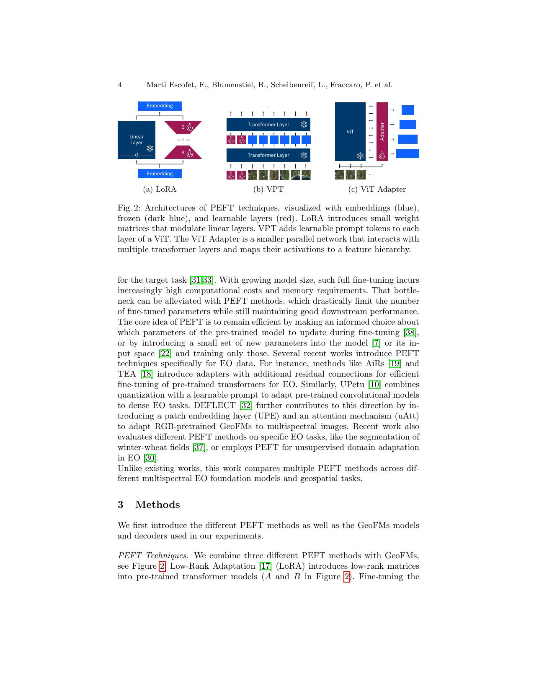

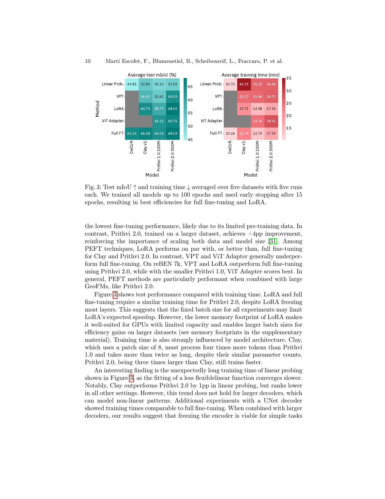

## 5. Ligan et al.：SpectralGPT PEFT

- **出处**：Bernardin Ligan, Khalide Jbilou, Fahd Kalloubi, Ahmed Ratnani. *Parameter-Efficient Fine-Tuning of Multispectral Foundation Models for Hyperspectral Image Classification*, arXiv:2505.15334, 2025。[原文](https://arxiv.org/abs/2505.15334)
- **任务**：将多光谱基础模型 SpectralGPT 参数高效地适配到高光谱分类。
- **基础模型 / 硬件**：SpectralGPT 多光谱基础模型；地面高光谱分类实验。
- **训练 / 更新方式**：比较 LoRA、LoRA+、KronA、LoKr，并提出以差异学习率训练 Kronecker 因子的 KronA+。
- **数据与场景**：5 个来自不同传感器的高光谱数据集。
- **输入 / 输出**：高光谱影像输入；输出像素/样本分类；模型增量为 PEFT 模块。
- **Pipeline**：多光谱预训练表征 → 高光谱输入适配 → PEFT/全量微调对比 → 跨传感器分类评测。
- **主实验 / 指标**：KronA+ 在相同训练轮次下以约 0.056% 可训练参数、约 0.2 MB 增量存储取得接近全量微调的表现。
- **硬件证据**：未报告在板训练、热/能耗或在轨链路实验。
- **局限**：高光谱分类并非 VLM；极小增量不包含优化器状态、激活、回放缓存与验证数据的资源代价。
- **对本综述用途**：支撑新谱段、新载荷或跨传感器变化时，为视觉/模态模块配置比统一 LoRA 更小的更新预算。

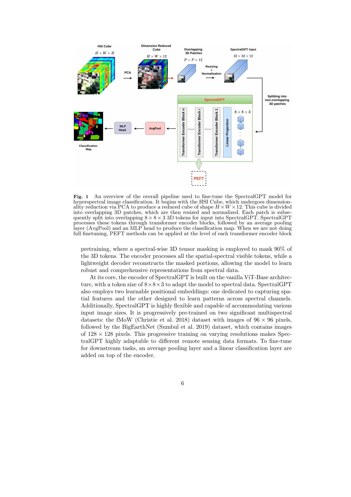

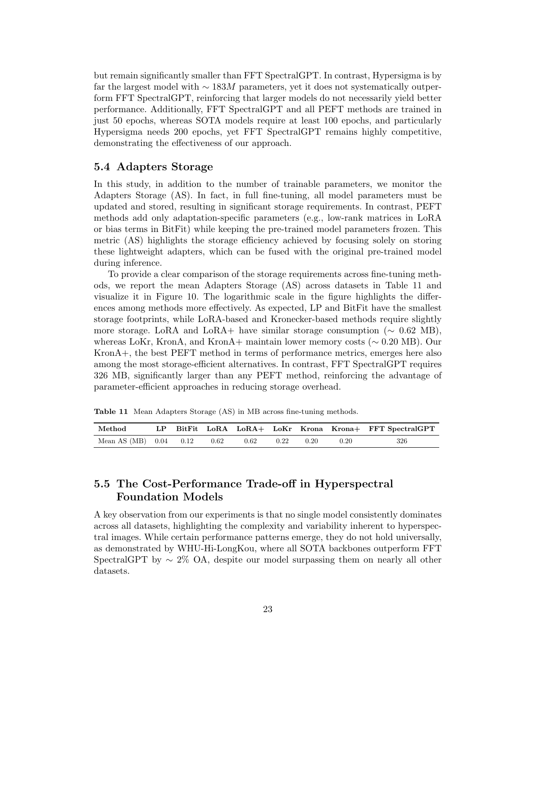

## 6. Wen et al.：RS-RAG

- **出处**：Congcong Wen et al. *RS-RAG: Bridging Remote Sensing Imagery and Comprehensive Knowledge with a Multi-Modal Dataset and Retrieval-Augmented Generation Model*, arXiv:2504.04988, 2025。[原文](https://arxiv.org/abs/2504.04988)
- **任务**：让 RS-VLM 使用外部世界知识和领域知识，减少仅依赖封闭集场景理解的局限。
- **基础模型 / 硬件**：多模态遥感检索与 VLM 生成框架；无星载硬件报告。
- **训练 / 更新方式**：构建图文统一向量库，在推理时检索、重排序并将证据写入 knowledge-augmented prompt。
- **数据与场景**：RSWK 数据集包含 175 个国家的 14,141 个著名地标及高分辨率卫星图像和详细文本说明。
- **输入 / 输出**：图像和/或文本查询输入；输出描述、分类或 VQA 回答及其检索证据。
- **Pipeline**：图文知识编码 → 向量库 → 图像/文本查询 → 检索与重排 → 证据增强 Prompt → VLM 回答。
- **主实验 / 指标**：在图像描述、图像分类和 VQA 上优于论文所比较的基线。
- **硬件证据**：无星上索引增量、检索时延、向量库存储、冲突处理或离线更新验证。
- **局限**：检索质量不是参数能力的替代指标；知识过期、相邻区域混淆和证据冲突仍可能导致错误输出。
- **对本综述用途**：形成“知识变化优先更新向量库、摘要和证据 Prompt；仅在检索无法恢复能力时升级到 PEFT”的低风险路径。

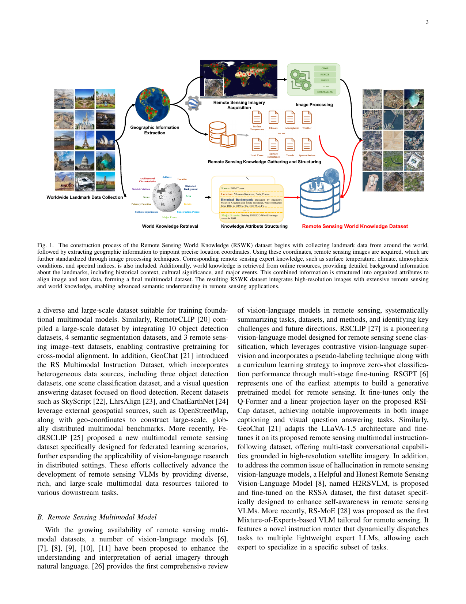

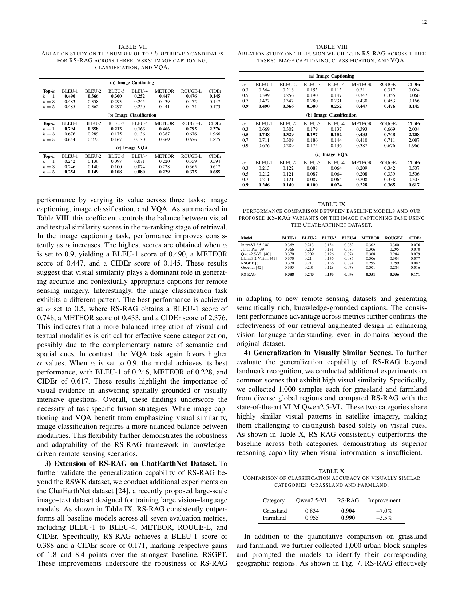

## 7. Ramirez et al.：SAR-RAG

- **出处**：David F. Ramirez et al. *SAR-RAG: ATR Visual Question Answering by Semantic Search, Retrieval, and MLLM Generation*, arXiv:2602.04712, 2026。[原文](https://arxiv.org/abs/2602.04712)
- **任务**：通过检索历史 SAR 目标案例提升 ATR 相关问答、分类和尺寸估计。
- **基础模型 / 硬件**：MLLM + 语义向量数据库；无星载硬件/在轨实验。
- **训练 / 更新方式**：对带已知属性的历史目标样本建立语义 embedding，以相似案例增强 MLLM 的视觉问答。
- **数据与场景**：SAR 自动目标识别，重点是外观相近车辆类别的区分。
- **输入 / 输出**：当前 SAR 图像与查询输入；输出检索到的案例、目标类别、解释和数值属性预测。
- **Pipeline**：已标注 SAR 案例 → 向量化记忆库 → 当前样本语义搜索 → 相似案例检索 → MLLM 生成 ATR 回答。
- **主实验 / 指标**：作者以检索指标、分类准确率与目标尺寸数值回归评估，报告加入记忆库后相对 MLLM 基线有改善。
- **硬件证据**：没有星上向量索引更新、内存、功耗、对抗性案例或发布回滚测试。
- **局限**：面向特定 SAR ATR；案例库的标签正确性、来源追溯和地域/时相失效在在轨应用中必须单独治理。
- **对本综述用途**：把“记忆”具体化为带来源和传感器元数据的目标案例，而非仅更新开放世界文本知识。

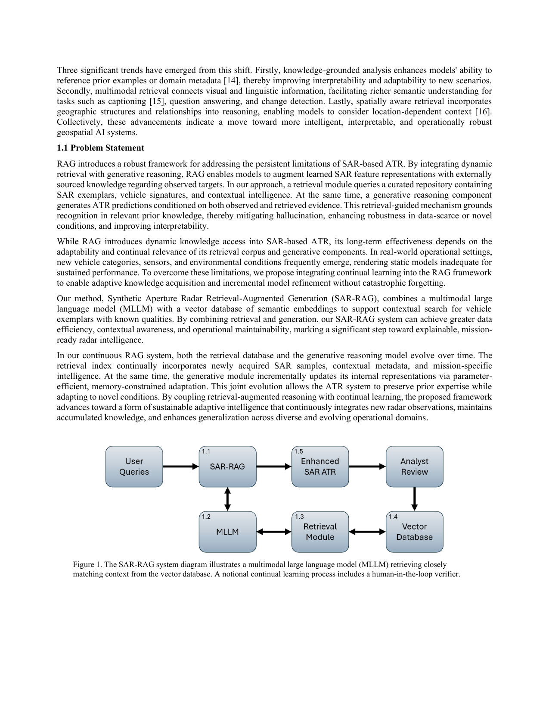

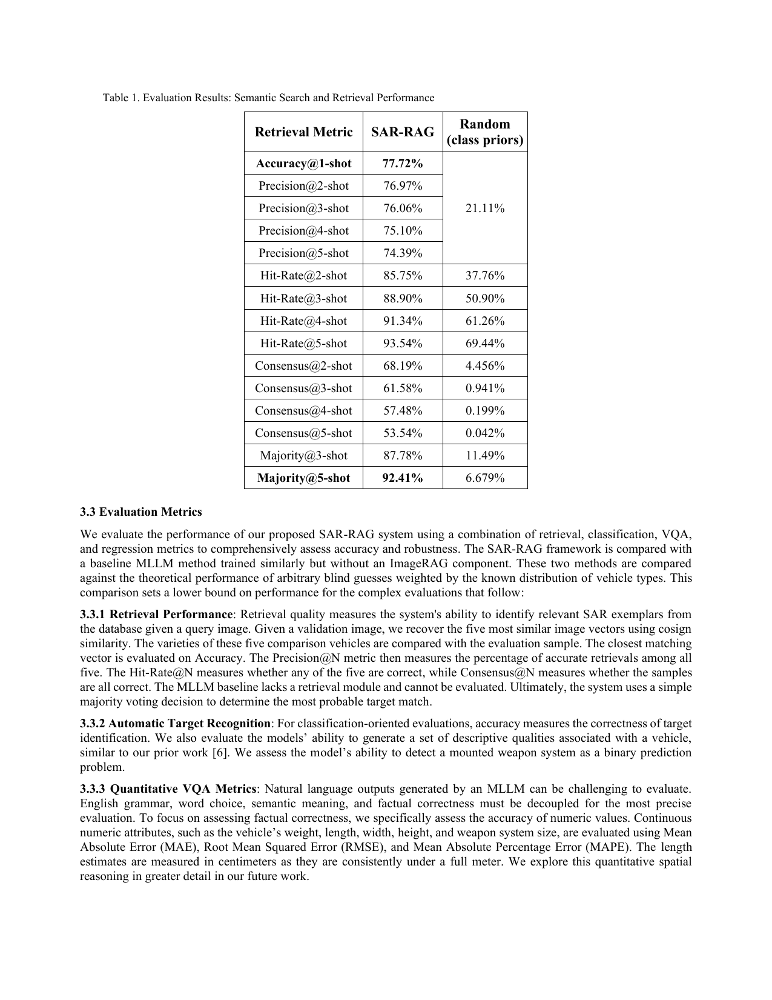

## 8. Zhu et al.：Satellite Federated Fine-Tuning

- **出处**：Yan Zhu et al. *Satellite Federated Fine-Tuning for Foundation Models in Space Computing Power Networks*, arXiv:2504.10403, 2025。[原文](https://arxiv.org/abs/2504.10403)
- **任务**：在单星算力不足、星地窗口短且 ISL 不稳定的情况下，支持基础模型的卫星—地面协同微调。
- **基础模型 / 硬件**：以遥感基础模型为对象；论文将冻结的嵌入层和可训练任务头放在卫星，将约占主要计算负担的冻结骨干放在地面。未报告真实在轨设备训练。
- **训练 / 更新方式**：卫星—地面协同的 **head-only** 联邦微调；卫星与地面交换嵌入/特征向量，轨内聚合任务头；提出并行轨内、拓扑感知星地和跨轨通信策略。
- **数据与场景**：空间算力网络与 LEO 通信拓扑仿真。
- **输入 / 输出**：卫星本地影像输入；星地交换嵌入/特征向量，卫星间交换并聚合任务头状态，而非只交换独立 LoRA delta。
- **Pipeline**：影像 → 卫星嵌入层 → 轨内嵌入向量广播/星地传输 → 地面冻结骨干提取特征 → 特征回传 → 卫星任务头更新 → 轨内/跨轨 head 聚合。
- **主实验 / 指标**：仿真中，所提框架的训练时间降至“完全板上训练”时间的约 33%，而非已在轨实测吞吐。
- **硬件证据**：显式建模了时变拓扑与窗口，但不是对真实 VLM 在轨训练内存、功耗、热或链路可靠性的实测。
- **局限**：该方案仅训练任务头，且星地传输的嵌入/特征向量可能超过 PEFT 参数增量；系统结论不能替代针对具体 VLM 层切分点的资源 profiling。
- **对本综述用途**：当单星无法完成完整 PEFT 时，作为“冻结骨干 + 卫星任务头”的拆分训练备选；需先比较 `embedding/feature bytes` 与 `adapter delta bytes`，而非默认采用切分训练。

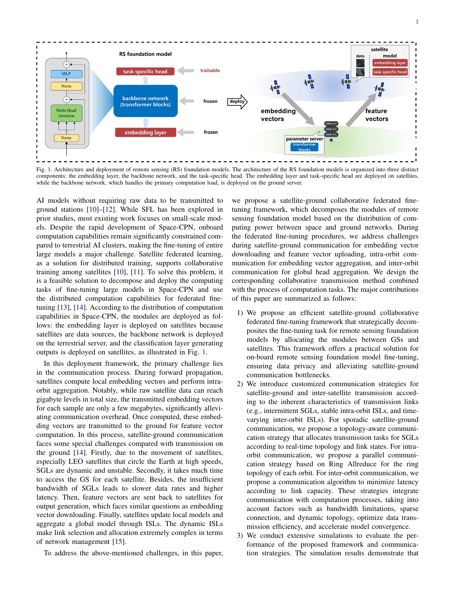

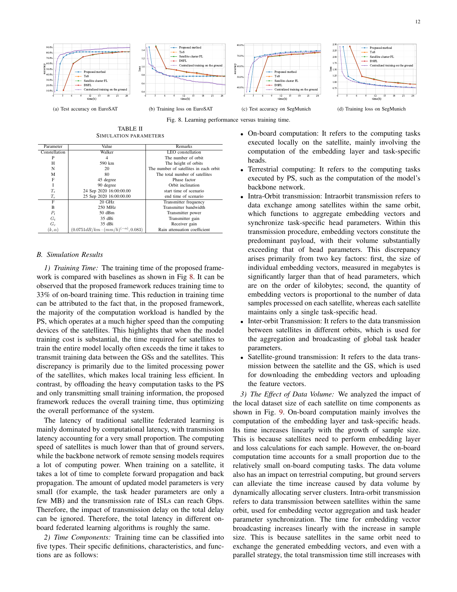

## 9. Razmi et al.：On-board Federated Learning for Satellite Clusters

- **出处**：Nasrin Razmi, Bho Matthiesen, Armin Dekorsy, Petar Popovski. *On-board Federated Learning for Satellite Clusters with Inter-Satellite Links*, arXiv:2307.08346, 2023。[原文](https://arxiv.org/abs/2307.08346)
- **任务**：利用同轨星间链路缓解传统卫星联邦学习对短暂星地可见窗口的依赖。
- **基础模型 / 硬件**：通用联邦学习模型和 LEO 星座通信系统；非 VLM、非真实飞行训练。
- **训练 / 更新方式**：按照可预测的卫星访问安排模型分发和轨内增量聚合；对稀疏访问扩展异步方案。
- **数据与场景**：低轨星座与星间链路的数值评估。
- **输入 / 输出**：各星本地数据训练；沿轨传输/聚合模型更新，向参数服务器回传已聚合状态。
- **Pipeline**：可见卫星接收全局模型 → 轨内 ISL 分发 → 各星局部训练 → 邻星逐跳增量聚合 → 可见卫星回传参数服务器。
- **主实验 / 指标**：论文数值结果报告，相对其比较方法收敛速度可提高约 7×，通信负载可降低约 10×。
- **硬件证据**：是网络与学习仿真；不提供星载训练性能、实际 ISL 协议实现或 VLM 模型更新包实测。
- **局限**：模型更新被当作一般向量；LoRA 的非唯一分解、不同 rank 和多模态缺失在本文中未处理。
- **对本综述用途**：提供“轨道接触计划是训练调度输入，而非通信细节”的系统基线。

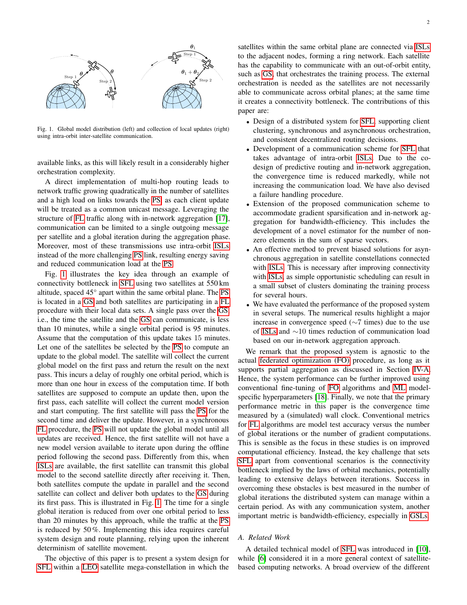

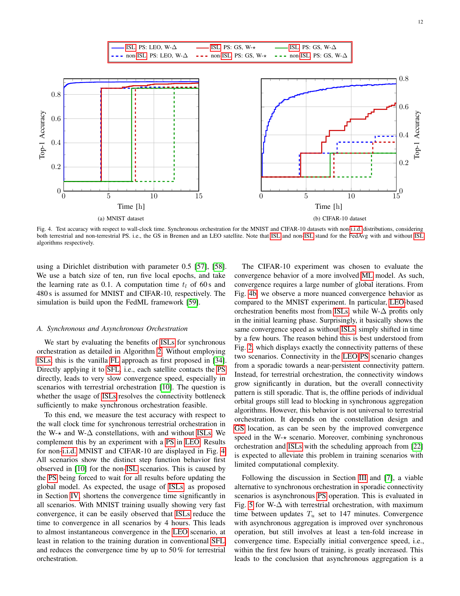

## 10. Shi et al.：FEDMEGA

- **出处**：Yuanming Shi et al. *Satellite Federated Edge Learning: Architecture Design and Convergence Analysis*, arXiv:2404.01875, 2024。[原文](https://arxiv.org/abs/2404.01875)
- **任务**：减少 LEO mega-constellation 中反复通过低速、间歇性星地链路传递全局模型的等待。
- **基础模型 / 硬件**：LEO 联邦边缘学习网络；通用学习任务与仿真。
- **训练 / 更新方式**：同一轨道内 ring all-reduce 聚合，利用网络流方案进行全局聚合；同时给出收敛分析。
- **数据与场景**：LEO 星座网络的数值仿真。
- **输入 / 输出**：各星本地模型更新输入；输出轨内聚合结果和全局模型状态。
- **Pipeline**：局部训练 → 轨内 ring all-reduce → 选择星地传输流 → 全局聚合 → 模型广播。
- **主实验 / 指标**：论文报告相对既有卫星 FEEL 方法约 30% 的收敛速率改善。
- **硬件证据**：卫星拓扑是研究对象，但没有遥感 VLM、在轨训练或实际星间链路实验。
- **局限**：ring all-reduce 假设的更新尺寸、同步节奏与可靠链路需要为 adapter delta/异构 rank 重新设计。
- **对本综述用途**：支撑“单星验证通过后，先做轨内聚合、再做星地全局协调”的三级协同骨架。

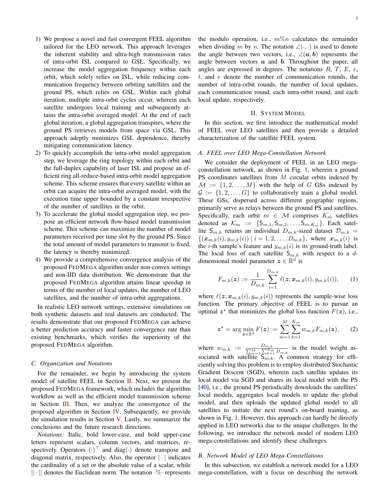

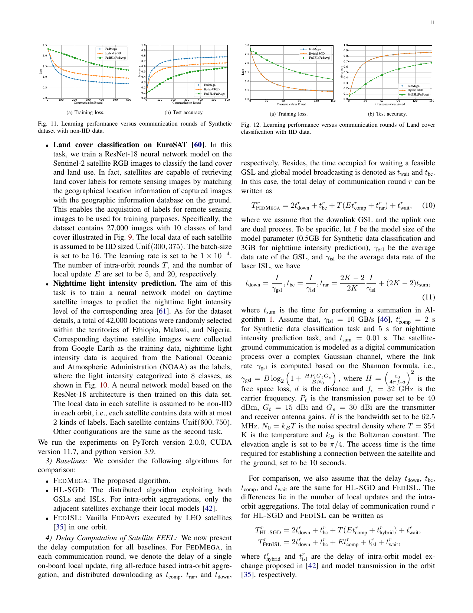

## 11. Elmahallawy and Luo：AsyncFLEO

- **出处**：Mohamed Elmahallawy, Tie Luo. *AsyncFLEO: Asynchronous Federated Learning for LEO Satellite Constellations with High-Altitude Platforms*, arXiv:2212.11522, 2022。[原文](https://arxiv.org/abs/2212.11522)
- **任务**：消除 LEO 同步联邦训练中由窗口错位和慢节点造成的长时间等待，并处理更新陈旧。
- **基础模型 / 硬件**：LEO 星座与 HAP 参数服务器的仿真系统；非 VLM。
- **训练 / 更新方式**：ring-of-stars 拓扑、模型传播、卫星分组与 staleness discounting。
- **数据与场景**：IID 与 non-IID 联邦学习数值评估。
- **输入 / 输出**：带版本年龄的客户端模型更新输入；输出按分组和陈旧度加权的全局模型。
- **Pipeline**：分组 → 轨道内模型传播 → 卫星异步上传 → HAP 依据版本年龄折扣聚合 → 新模型继续传播。
- **主实验 / 指标**：论文报告相对比较方法收敛时延降低 22×、准确率提高 40%；数值受其数据和网络设定约束。
- **硬件证据**：无在轨训练和大模型内存/能耗测试。
- **局限**：模型年龄并不等价于语义漂移程度；对 LoRA、检索索引和多版本适配器需分别定义 freshness。
- **对本综述用途**：为 adapter delta、索引差分和策略文件设计统一的版本年龄、接触窗口和失联节点处理原则。

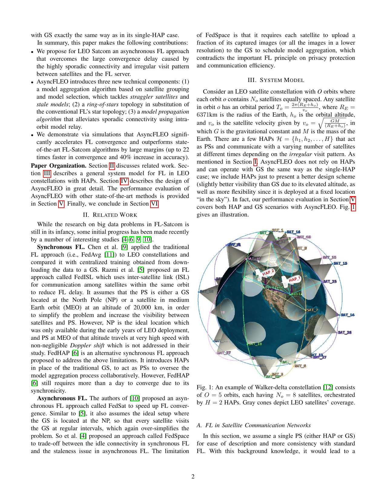

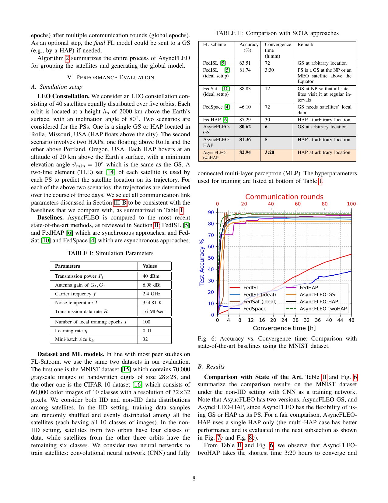

## 12. Wu et al.：SFL-LEO

- **出处**：Jiasheng Wu et al. *SFL-LEO: Asynchronous Split-Federated Learning Design for LEO Satellite-Ground Network Framework*, arXiv:2504.13479, 2025。[原文](https://arxiv.org/abs/2504.13479)
- **任务**：在 LEO 节点算力受限且网络动态变化时，联合 split learning 与联邦聚合扩展有效训练时段。
- **基础模型 / 硬件**：LEO—地面系统；实验使用 Starlink 卫星—地面带宽测量驱动，未针对 VLM 飞行平台实测。
- **训练 / 更新方式**：卫星在断连期继续局部训练；地面聚合 client-side 子模型并在后续窗口再下发。
- **数据与场景**：动态 LEO 网络下的分布式学习仿真/实验。
- **输入 / 输出**：卫星侧子模型和必要中间激活输入；输出地面聚合后的子模型状态。
- **Pipeline**：模型切分 → 星上断连期局部训练 → 连接窗口上传 client-side 状态 → 地面聚合 → 下次过站下发。
- **主实验 / 指标**：论文报告可取得与传统 SL 相近的准确率，原因是断连期也能继续本地更新。
- **硬件证据**：带宽测量增强了网络现实性，但没有评估高分辨率 VLM 激活流量与星上训练资源。
- **局限**：split point 若导致高维视觉激活跨链路传输，可能比 LoRA delta 更昂贵；不能将“可继续训练”视为“资源可接受”。
- **对本综述用途**：仅作为训练资源不足时的退路，并要求报告切分点前后激活、梯度、训练时间和窗口完成率。

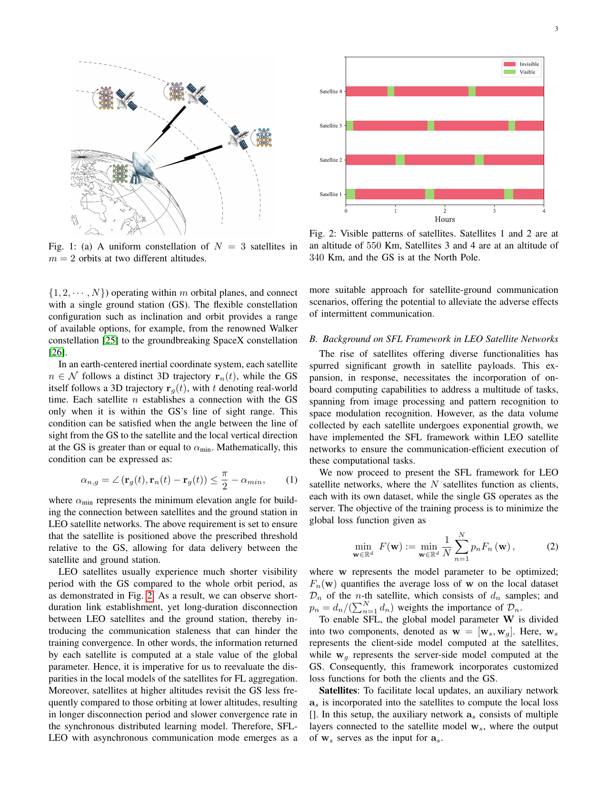

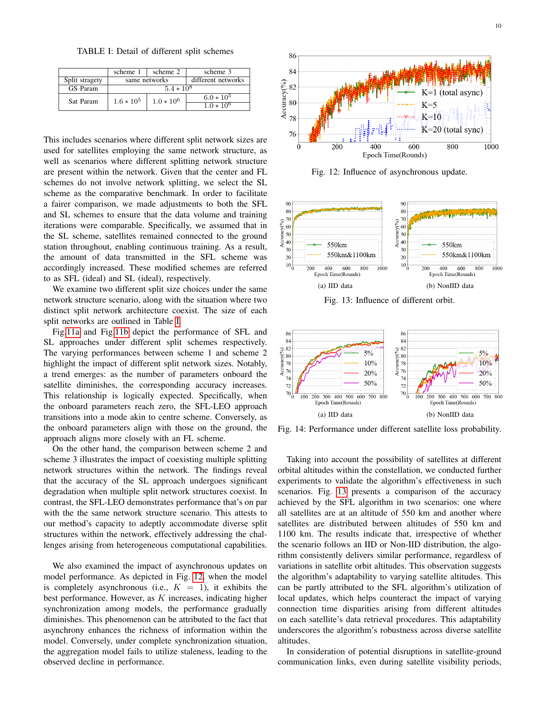

## 13. Razmi et al.：Sparse Incremental Aggregation

- **出处**：Nasrin Razmi et al. *Sparse Incremental Aggregation in Satellite Federated Learning*, arXiv:2501.11385, 2025。[原文](https://arxiv.org/abs/2501.11385)
- **任务**：在同轨 ISL 上提高联邦更新的带宽效率。
- **基础模型 / 硬件**：LEO 星座、相邻卫星 ISL 与参数服务器；网络仿真。
- **训练 / 更新方式**：将梯度稀疏化和逐跳 in-network incremental aggregation 结合。
- **数据与场景**：轨道内邻星转发的联邦训练数值实验。
- **输入 / 输出**：稀疏梯度/更新差分输入；输出沿轨累积的聚合梯度。
- **Pipeline**：本地训练 → Top-k 等稀疏化 → 邻星转发时累加 → 轨道汇聚节点回传参数服务器。
- **主实验 / 指标**：随着单轨卫星数量增加，论文数值结果显示带宽效率可提升 4×以上。
- **硬件证据**：未使用 LoRA/Adapter 更新包，也没有实际 ISL 吞吐、丢包和能耗测量。
- **局限**：对低秩因子直接稀疏化可能改变子空间语义；需要误差补偿和与 rank 对齐方法共同评估。
- **对本综述用途**：说明“PEFT 参数更小”不等于可以忽略星间通信设计；应评估差分编码、稀疏化与恢复误差。

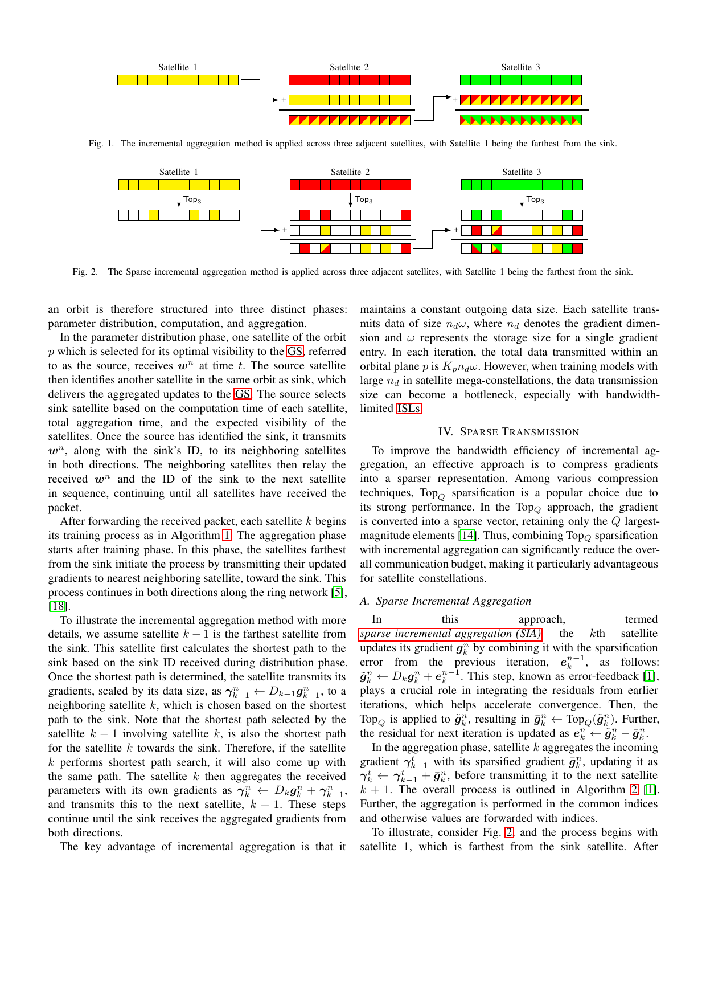

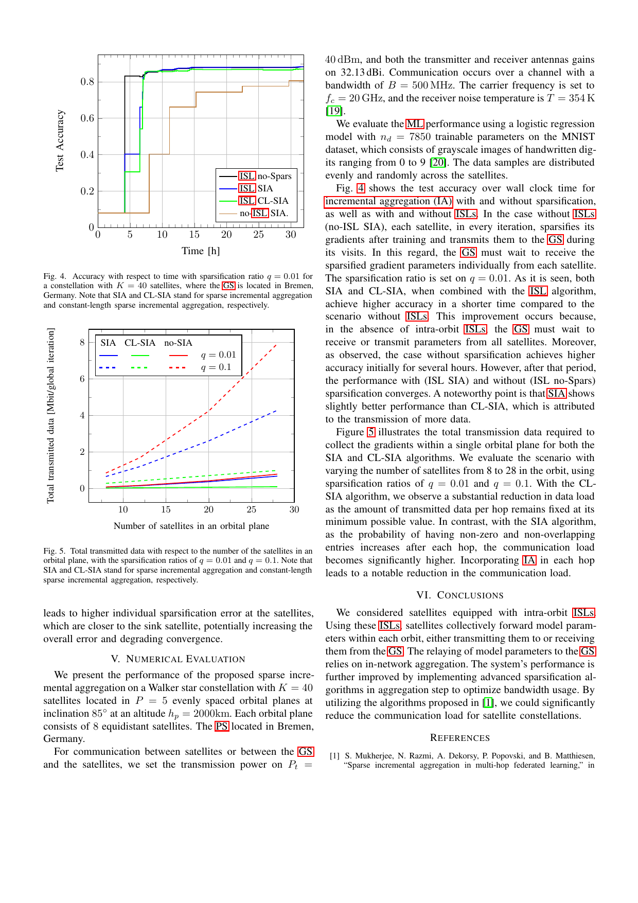

## 14. Yang et al.：FediLoRA

- **出处**：Lishan Yang et al. *FediLoRA: Heterogeneous LoRA for Federated Multimodal Fine-tuning under Missing Modalities*, arXiv:2509.06984, 2025。[原文](https://arxiv.org/abs/2509.06984)
- **任务**：在客户端 LoRA rank 不同且局部模态缺失时进行联邦多模态微调。
- **基础模型 / 硬件**：通用多模态基础模型和地面联邦学习环境。
- **训练 / 更新方式**：dimension-wise aggregation 重新加权各维更新，避免 zero padding 稀释；layer-wise model editing 选择性用全局层修复本地组件。
- **数据与场景**：3 个多模态 benchmark，包含不同程度的模态不完整和客户端异构。
- **输入 / 输出**：不同 rank 的 LoRA 状态、不同模态本地数据输入；输出全局和个性化本地 adapter。
- **Pipeline**：各客户端按资源配置 rank → 本地多模态 PEFT → 维度级重加权聚合 → 层级编辑 → 个性化下发。
- **主实验 / 指标**：在所评测的全局与个性化设置中优于比较基线，特别是在模态缺失条件下。
- **硬件证据**：无遥感、卫星、热/能耗或链路窗口实验。
- **局限**：不同卫星的传感器并不只是“缺失模态”；还包括谱段、分辨率、几何和噪声差异，需重定义对齐对象。
- **对本综述用途**：支持按卫星可用资源和载荷能力配置不同 rank，而不是强制统一 rank 或零填充后平均。

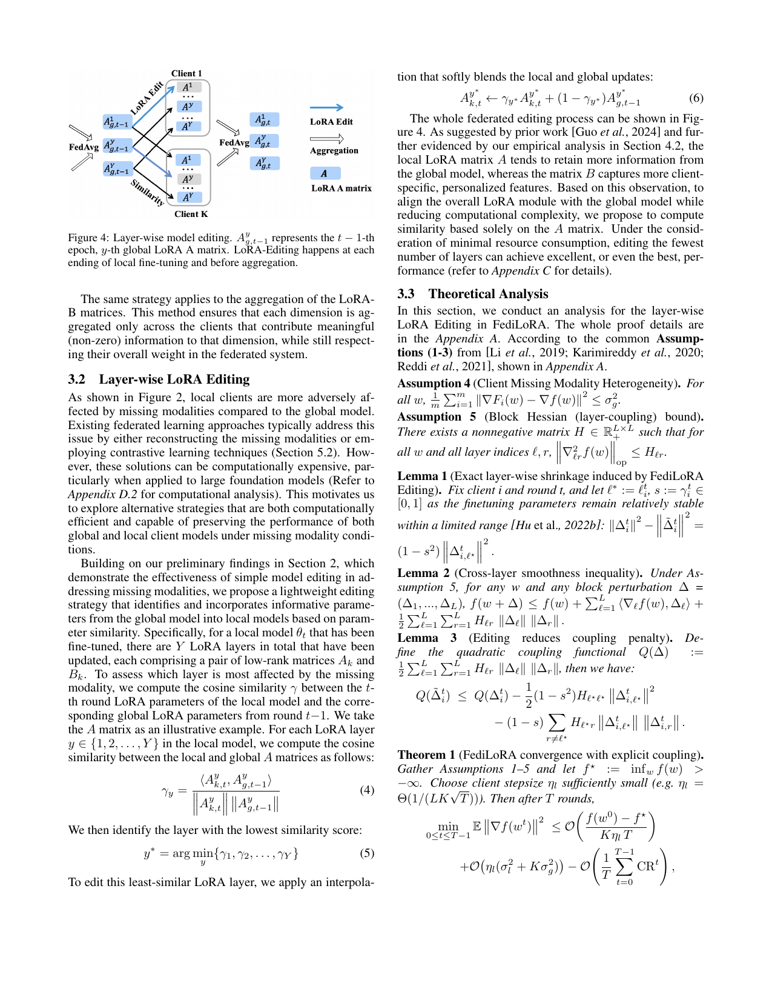

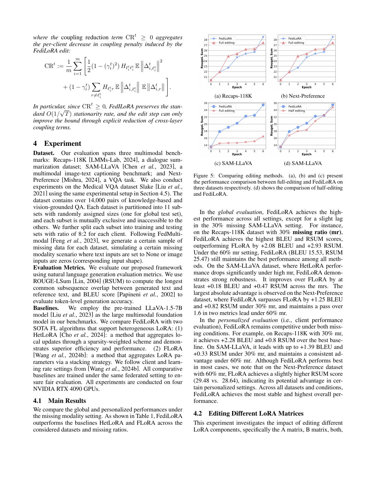

## 15. Zhou et al.：ILoRA

- **出处**：Junchao Zhou, Junkang Liu, Fanhua Shang. *ILoRA: Federated Learning with Low-Rank Adaptation for Heterogeneous Client Aggregation*, arXiv:2511.16069, 2025。[原文](https://arxiv.org/abs/2511.16069)
- **任务**：同时缓解随机初始化导致的子空间不齐、异构 rank 聚合误差和 non-IID client drift。
- **基础模型 / 硬件**：通用视觉/NLP 地面联邦实验。
- **训练 / 更新方式**：QR 正交初始化、Concatenated QR Aggregation 与带 rank-aware 控制变量的 AdamW。
- **数据与场景**：视觉和 NLP benchmark，含不同 rank、数据异构和客户端漂移。
- **输入 / 输出**：不同 rank 的 LoRA 因子与本地更新输入；输出对齐后的全局低秩更新。
- **Pipeline**：共享子空间初始化 → 本地 LoRA 训练 → 拼接不同 rank 更新 → QR 分解/聚合 → 控制变量校正 → 下发。
- **主实验 / 指标**：论文给出收敛理论，并报告在视觉/NLP 的异构设置中具有更好的准确率与收敛稳定性。
- **硬件证据**：无遥感或空间网络实验。
- **局限**：数学上的 rank 兼容并未解决不同载荷的语义任务冲突，也不自动处理更新陈旧和版本分叉。
- **对本综述用途**：将星座 LoRA 聚合的讨论从“参数量压缩”提升到“更新子空间对齐 + 时空 non-IID 漂移”的联合问题。

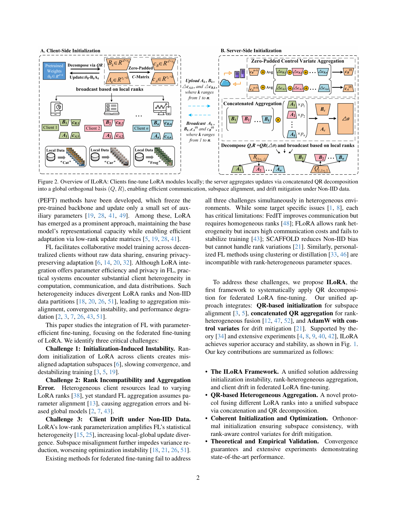

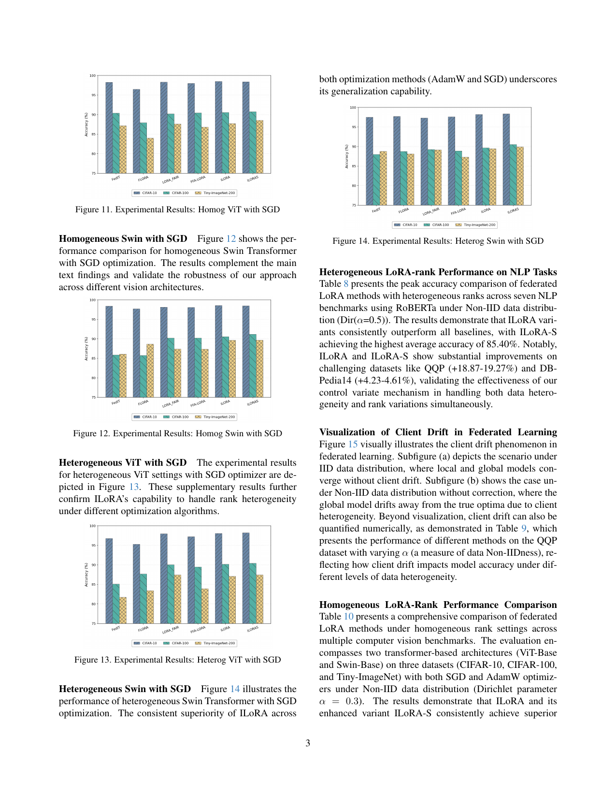

## 16. Chen et al.：GLoRA

- **出处**：Jinqian Chen, Chang Liu, Jihua Zhu. *Beyond Factor Aggregation: Gauge-Aware Low-Rank Server Representations for Federated LoRA*, arXiv:2605.06733, 2026。[原文](https://arxiv.org/abs/2605.06733)
- **任务**：解决联邦 LoRA 中直接平均低秩因子会依赖任意分解坐标、从而改变同一内在更新语义的问题。
- **基础模型 / 硬件**：LLM 的地面联邦设置，评测 GLUE 和 SuperNI；不含视觉或卫星硬件。
- **训练 / 更新方式**：服务器从客户端投影器估计共识更新子空间，在共享参考坐标中聚合，并用 rank-compatible readout 为不同能力客户端实例化 adapter。
- **数据与场景**：数据、资源、任务异构以及稀疏参与下的 NLP 基准。
- **输入 / 输出**：客户端低秩因子/投影器输入；输出紧凑的服务器低秩状态和不同 rank 的本地 readout。
- **Pipeline**：客户端 LoRA 更新 → 投影器/子空间抽取 → 共识子空间估计 → 共享坐标聚合 → 个性化 rank readout。
- **主实验 / 指标**：在 GLUE 和 SuperNI 的数据/资源/任务异构、稀疏参与和未见任务设置中，作者报告优于直接因子聚合类基线的效率—性能权衡。
- **硬件证据**：无 RS-VLM、卫星拓扑、通信窗口或飞行实测。
- **局限**：视觉编码器、跨模态连接器和遥感任务中的更新子空间是否同样可对齐仍未验证。
- **对本综述用途**：给出关键理论修正：星座联邦 LoRA 应聚合语义可对齐的更新表征，而不是朴素平均 `A/B` 因子。

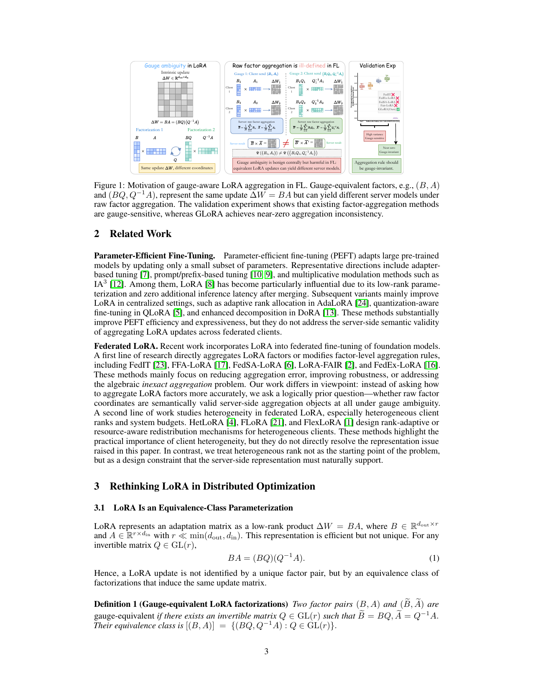

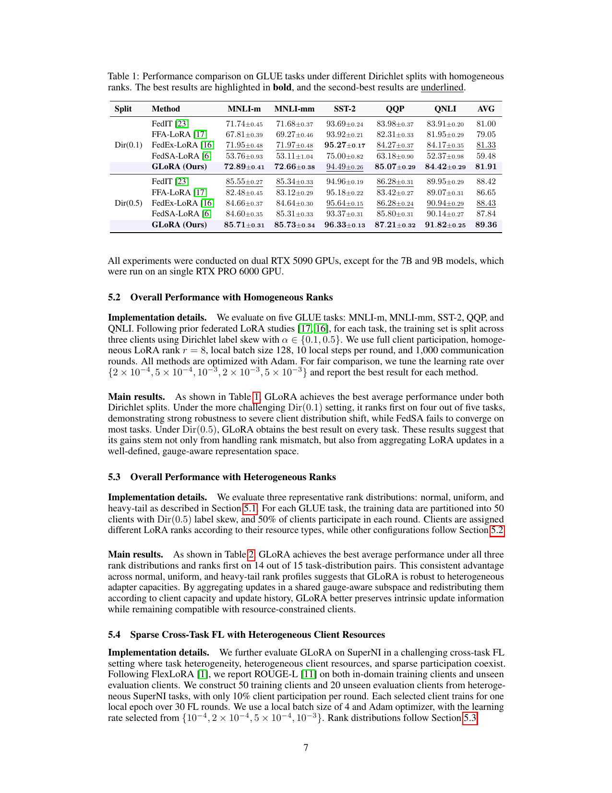

## 三、技术横向矩阵

| 技术路线 | 更新对象 | 交换对象 | 主要目标 | 星上迁移的关键问题 |
| --- | --- | --- | --- | --- |
| RS-VLM 持续评测 | 持续学习模块、VLM 状态 | 无固定通信机制 | 定义长时程、模态和任务遗忘 | 将基准协议映射到季节、地域、载荷和任务变化 |
| 自监督持续表征 | 视觉编码器或轻量视觉模块 | 局部模型/教师状态 | 减少人工标签依赖 | 回放缓存、蒸馏模型和训练激活的资源占用 |
| 单星 PEFT | Prompt、Adapter、LoRA、连接器、任务头 | 参数增量 | 降低训练与上行开销 | 训练内存、优化器状态、能耗、热状态和窗口 |
| RAG 与案例记忆 | 向量库、摘要、证据 Prompt | 索引差分、案例、可信度元数据 | 优先更新知识、不动参数 | 时空命名空间、过期/冲突识别、检索时延 |
| 卫星—地面协同微调 | 模型组件或子模型 | 参数状态、激活、梯度 | 扩展单星训练能力 | 激活/梯度是否大于 adapter delta；切分点资源画像 |
| 轨内分层联邦 | Adapter 或局部模型 | 轨内聚合状态 | 降低星地等待 | 接触计划、轨道分组、可靠 ISL 与版本年龄 |
| 异步联邦 | 带版本的客户端更新 | delta + version/staleness 元数据 | 降低同步等待 | 模型年龄不等于语义漂移；失联节点与版本分叉 |
| 稀疏增量聚合 | 梯度或更新差分 | 稀疏增量 | 提高轨内带宽效率 | 低秩结构保持、误差补偿和恢复误差 |
| 异构联邦 LoRA | 不同 rank 的低秩更新 | 子空间/对齐后的 adapter 状态 | 处理资源、模态和数据异构 | 不平均 A/B 因子；支持个性化 readout 和群组化 |

### 补充文献（不占 16 篇精读名额）

- **E1 Satellite Edge AI with Large Models**：Shi et al., arXiv:2504.01676, 2025。[原文](https://arxiv.org/abs/2504.01676) 提出卫星联邦微调与微服务化大模型推理的架构综述。它用于界定训练/推理模块拆分的系统空间，但不应替代 R8 的具体协同微调证据。
- **E2 FedMosaic**：Liang et al., arXiv:2602.05235, 2026。[原文](https://arxiv.org/abs/2602.05235) 以参数化 adapter 表示文档知识，并按语义相关性选择性聚合；实验报告相较基线有更高准确率及更低存储/通信成本。它是多星记忆合并的抽象参考，不是遥感或在轨证据。
- **E3 TPPT**：Lu et al., arXiv:2505.20680, 2025。[原文](https://arxiv.org/abs/2505.20680) 以文本原型锚定 CLIP 的视觉/视觉—文本增量 Prompt，可用于低成本任务语义更新与跨模态遗忘控制。
- **E4 FedDAA**：Peng and Tang, arXiv:2506.21054, 2025。[原文](https://arxiv.org/abs/2506.21054) 区分 real、virtual 和 label drift，并以动态客户端聚类采用不同适配策略；可作为“单星检测—轨道级分群—分组更新”的触发参考。
- **E5 Wireless Federated Multi-Task LLM Fine-Tuning via Sparse-and-Orthogonal LoRA**：Yang et al., arXiv:2602.20492, 2026。[原文](https://arxiv.org/abs/2602.20492) 用稀疏正交 LoRA、簇拓扑和隐式 MoE 处理多任务冲突；其最多 73% 的通信资源降低和 5% 平均性能提升来自无线地面仿真，适合补充“更新隔离与任务冲突”而非星座性能结论。

## 四、面向在轨持续适应的综合 Pipeline

```text
观测、任务、传感器、知识或资源状态变化
  → 本地漂移 / 不确定性 / 检索失效 / 资源预算检测
  → 变化归因：数据、模态、任务、知识或系统资源
  → 选择最小更新单位：记忆/RAG → Prompt → Adapter/LoRA/连接器/任务头
  → 单星局部训练或自监督预适应（资源门控）
  → 新旧任务联合验证、证据一致性检查、包完整性校验
  → 生成带版本的 adapter delta、索引差分或案例摘要
  → 按载荷/区域/季节/任务/rank 分组的轨内异步协同
  → 子空间/维度级选择性聚合、星地全局复核
  → 签名、影子推理、灰度发布、稳定版本保留和可回滚下发
  → 持续监测版本年龄、性能退化、资源余量和新漂移
```

### 更新策略原则

1. **先判断变化，后决定是否更新**：性能波动可能来自云雾、观测几何、检索失效、任务规则或资源降级；它们不都需要训练。
2. **知识变化优先进入记忆层**：区域规则、事件报告、目标案例和载荷元数据变化时，先更新带来源的索引、摘要和证据 Prompt。
3. **短期任务变化优先采用 Prompt/策略文件**：输出格式、告警阈值和临时任务说明变化时，避免不必要的权重更新。
4. **持续域失配或新模态再触发 PEFT**：仅当低风险层不足以恢复能力、监督可信且收益超过训练/验证/通信代价时，更新 LoRA、Adapter、连接器或任务头。
5. **局部验证先于星座共享**：未通过新旧任务、资源、版本和完整性检查的候选更新不得进入轨内聚合。
6. **异构性分组而非一刀切平均**：按载荷、地区、季节、任务、可用资源和 LoRA rank 形成协同组；聚合语义可对齐的更新子空间或选择性 adapter。
7. **所有可变对象均须可回滚**：基座、Prompt、Adapter/LoRA、索引、案例摘要、聚合状态和策略文件独立编号、签名、灰度和保留稳定版本。

## 五、验证与报告规范

| 维度 | 最低报告项 | 常见缺口 |
| --- | --- | --- |
| 变化与触发 | 漂移类型、检测信号、检测延迟、误报/漏报、阈值、触发收益/成本比 | 只报告最终精度，不报告何时和为何更新 |
| 更新对象 | RAG、Prompt、Adapter、LoRA、连接器、任务头；可训练比例、包大小和合并方式 | 将“参数比例”误当作完整训练成本 |
| 数据可信度 | 标签来源、伪标签阈值、回放样本策略、案例来源/过期/冲突标记 | 默认线上观测都可训练或可写入记忆 |
| 单星资源 | 峰值训练内存、优化器/激活/回放占用、训练/验证时长、能耗、热状态、窗口完成率 | 只测推理或只测参数存储 |
| 新旧能力 | 新任务与旧任务指标、平均准确率、forgetting、forward/backward transfer、置信度校准 | 仅报告新分布收益 |
| 检索可信度 | Recall@k、证据一致性、grounded answer accuracy、冲突率、索引刷新/检索时延 | 将“有检索”视为事实可靠 |
| 星座协同 | 星间/星地字节数、激活/梯度与 delta 的分别统计、staleness 分布、版本分叉、群组公平性、to-target-accuracy 时延 | 把卫星拓扑简化为同步 FedAvg |
| 发布安全 | 影子评测、灰度比例、验签/完整性、版本一致率、回滚时间、失败恢复率 | 把一次离线微调当作可部署更新 |

### 必要对比基线

1. 静态冻结模型；
2. 仅 RAG/案例记忆更新；
3. 仅 Prompt/策略文件更新；
4. 单星 Adapter/LoRA/连接器更新；
5. 单星 PEFT + 回放/蒸馏/隔离的遗忘控制；
6. 本地完整 PEFT 与 split-PEFT，并分别报告激活/梯度通信；
7. 同步、异步和轨内增量聚合；
8. 朴素 LoRA 因子平均与维度级/子空间/选择性聚合；
9. 直接发布与影子评测、灰度和回滚发布。

## 六、可直接写入 Ch.6 的结论

1. 在轨持续适应的最小更新单位不应是完整模型，而应按变化来源选择知识索引、案例记忆、Prompt、Adapter、LoRA、连接器或局部任务头。
2. 遥感 VLM 的连续变化同时包括时间/地域观测分布、传感器模态、任务指令、外部知识和系统资源；单一类别增量协议不足以代表在轨环境。
3. RAG 与案例记忆是低风险的优先更新层，但它们不能替代对持续域失配和跨模态对齐问题的参数适配；检索失效、冲突和过期是从记忆层升级到 PEFT 的明确门槛。
4. PEFT 只压缩可训练权重，并不自动解决优化器状态、激活、回放缓存、能耗、热状态、链路窗口和灾难性遗忘；飞行可用性必须以完整资源闭环验证。
5. 星座协同的关键不是减少模型字节数，而是使模型拆分、接触计划、陈旧度、时空 non-IID 数据、不同 rank、模态异构和更新语义共同进入聚合与调度决策。
6. 直接平均 LoRA `A/B` 因子既会产生异构 rank 问题，也可能受低秩分解坐标的不唯一性影响；更合理的研究方向是分组化、维度级或子空间级选择性聚合，并保留个性化 readout。
7. 当前证据仍主要来自地面遥感实验与卫星网络仿真。将漂移触发、在轨 PEFT、记忆治理、异步协同、验证、验签、灰度和回滚整合为可长期运行的飞行级闭环，仍是尚未解决的研究问题。

## 参考文献

[R1] Weng et al. *Continual Vision-Language Learning for Remote Sensing: Benchmarking and Analysis*. arXiv:2604.00820, 2026.

[R2] Möllenbrok et al. *Continual Self-Supervised Learning with Masked Autoencoders in Remote Sensing*. arXiv:2506.21312, 2025.

[R3] Pu and Xu. *Low-Rank Adaption on Transformer-based Oriented Object Detector for Satellite Onboard Processing of Remote Sensing Images*. arXiv:2406.02385, 2024.

[R4] Marti-Escofet et al. *Fine-tune Smarter, Not Harder: Parameter-Efficient Fine-Tuning for Geospatial Foundation Models*. arXiv:2504.17397, 2025.

[R5] Ligan et al. *Parameter-Efficient Fine-Tuning of Multispectral Foundation Models for Hyperspectral Image Classification*. arXiv:2505.15334, 2025.

[R6] Wen et al. *RS-RAG: Bridging Remote Sensing Imagery and Comprehensive Knowledge with a Multi-Modal Dataset and Retrieval-Augmented Generation Model*. arXiv:2504.04988, 2025.

[R7] Ramirez et al. *SAR-RAG: ATR Visual Question Answering by Semantic Search, Retrieval, and MLLM Generation*. arXiv:2602.04712, 2026.

[R8] Zhu et al. *Satellite Federated Fine-Tuning for Foundation Models in Space Computing Power Networks*. arXiv:2504.10403, 2025.

[R9] Razmi et al. *On-board Federated Learning for Satellite Clusters with Inter-Satellite Links*. arXiv:2307.08346, 2023.

[R10] Shi et al. *Satellite Federated Edge Learning: Architecture Design and Convergence Analysis*. arXiv:2404.01875, 2024.

[R11] Elmahallawy and Luo. *AsyncFLEO: Asynchronous Federated Learning for LEO Satellite Constellations with High-Altitude Platforms*. arXiv:2212.11522, 2022.

[R12] Wu et al. *SFL-LEO: Asynchronous Split-Federated Learning Design for LEO Satellite-Ground Network Framework*. arXiv:2504.13479, 2025.

[R13] Razmi et al. *Sparse Incremental Aggregation in Satellite Federated Learning*. arXiv:2501.11385, 2025.

[R14] Yang et al. *FediLoRA: Heterogeneous LoRA for Federated Multimodal Fine-tuning under Missing Modalities*. arXiv:2509.06984, 2025.

[R15] Zhou et al. *ILoRA: Federated Learning with Low-Rank Adaptation for Heterogeneous Client Aggregation*. arXiv:2511.16069, 2025.

[R16] Chen et al. *Beyond Factor Aggregation: Gauge-Aware Low-Rank Server Representations for Federated LoRA*. arXiv:2605.06733, 2026.

[E1] Shi et al. *Satellite Edge Artificial Intelligence with Large Models: Architectures and Technologies*. arXiv:2504.01676, 2025.

[E2] Liang et al. *FedMosaic: Federated Retrieval-Augmented Generation via Parametric Adapters*. arXiv:2602.05235, 2026.

[E3] Lu et al. *Continual Learning on CLIP via Incremental Prompt Tuning with Intrinsic Textual Anchors*. arXiv:2505.20680, 2025.

[E4] Peng and Tang. *FedDAA: Dynamic Client Clustering for Concept Drift Adaptation in Federated Learning*. arXiv:2506.21054, 2025.

[E5] Yang et al. *Wireless Federated Multi-Task LLM Fine-Tuning via Sparse-and-Orthogonal LoRA*. arXiv:2602.20492, 2026.
